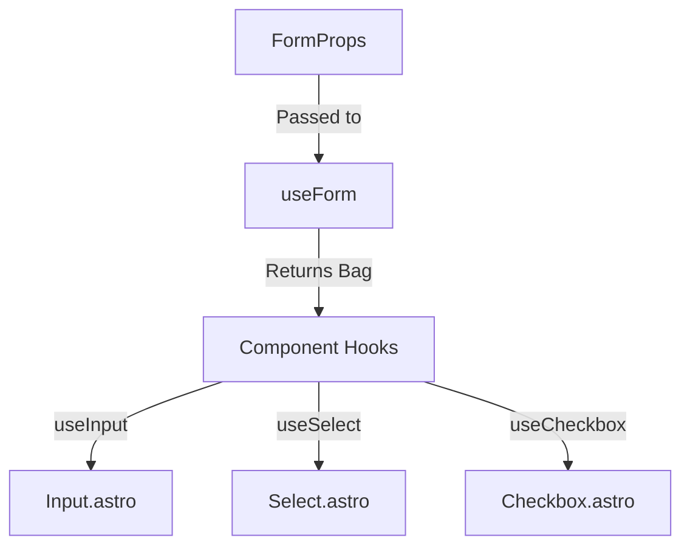

# content directory

This file is automatically generated for consumption by AI. It shows the file contents of all files in the content directory recursively.

## Table of Contents

- Line     70  docs/assets/assets.mdx
- Line    123  docs/assets/audio.mdx
- Line    343  docs/assets/avatar.mdx
- Line    500  docs/assets/file-preview.mdx
- Line    655  docs/assets/image.mdx
- Line    767  docs/data/data.mdx
- Line   1005  docs/data/table.mdx
- Line   1367  docs/feedback/alert.mdx
- Line   1550  docs/feedback/badge.mdx
- Line   1668  docs/feedback/banner.mdx
- Line   1807  docs/feedback/chip.mdx
- Line   1926  docs/feedback/feedback.mdx
- Line   2024  docs/feedback/progress.mdx
- Line   2129  docs/feedback/spinner.mdx
- Line   2252  docs/feedback/tag.mdx
- Line   2375  docs/forms/checkbox.mdx
- Line   2496  docs/forms/combobox.mdx
- Line   2650  docs/forms/composition.mdx
- Line   2791  docs/forms/field.mdx
- Line   2909  docs/forms/forms.mdx
- Line   3126  docs/forms/input.mdx
- Line   3335  docs/forms/radio.mdx
- Line   3434  docs/forms/search.mdx
- Line   3537  docs/forms/select.mdx
- Line   3828  docs/layout/box.mdx
- Line   3950  docs/layout/center.mdx
- Line   4029  docs/layout/container.mdx
- Line   4117  docs/layout/flex.mdx
- Line   4232  docs/layout/footer.mdx
- Line   4362  docs/layout/grid.mdx
- Line   4449  docs/layout/header.mdx
- Line   4597  docs/layout/layout.mdx
- Line   4635  docs/layout/separator.mdx
- Line   4735  docs/layout/spacer.mdx
- Line   4798  docs/layout/stack.mdx
- Line   5008  docs/nav/breadcrumbs.mdx
- Line   5122  docs/nav/menu.mdx
- Line   5243  docs/nav/nav.mdx
- Line   5356  docs/nav/navbar.mdx
- Line   5452  docs/nav/pagination.mdx
- Line   5553  docs/nav/stepper.mdx
- Line   5677  docs/nav/tabs.mdx
- Line   5811  docs/overlays/alert-dialog.mdx
- Line   6018  docs/overlays/modal.mdx
- Line   6192  docs/surfaces/card.mdx
- Line   6311  docs/surfaces/frame.mdx
- Line   6390  docs/surfaces/panel.mdx
- Line   6443  docs/surfaces/paper.mdx
- Line   6539  docs/surfaces/section.mdx
- Line   6615  docs/surfaces/surfaces.mdx
- Line   6718  docs/surfaces/tile.mdx
- Line   6807  docs/surfaces/well.mdx
- Line   6892  docs/triggers/button.mdx
- Line   7043  docs/triggers/link.mdx
- Line   7139  docs/triggers/theme-toggle.mdx
- Line   7314  docs/triggers/triggers.mdx
- Line   7336  docs/typography/heading.mdx
- Line   7386  docs/typography/label.mdx
- Line   7482  docs/typography/quote.mdx
- Line   7557  docs/typography/text.mdx
- Line   7717  docs/typography/typography.mdx

## docs/assets/assets.mdx


**Full path:** `/home/jk/Code/dezign8/src/content/docs/assets/assets.mdx`


```
---
title: Assets Category
description: Components for displaying media, icons, and visual assets.
category: Assets
status: stable
---

## Overview

The **Assets** category provides a comprehensive suite of components for handling visual media, audio, and iconography within your application. These components are designed to be fluid, accessible, and highly customizable.

**Components in this category:**

| Component | Element | Primary use |
|---|---|---|
| `Image` | `` | Responsive, optimized image rendering with skeleton loaders |
| `Icon` | `<svg>` / `<span>` | Scalable vector graphics and icon sets |
| `Avatar` | `` / `<div>` | User profile images or initials |
| `AvatarGroup` | `<div>` | Stacking and clustering multiple avatars |
| `Video` | `<video>` | Native video player with custom controls |
| `Audio` | `<audio>` | Audio playback interfaces |
| `Waveform` | `<canvas>` | Visual representation of audio tracks |
| `Carousel` | `<div>` | Swipeable media sliders |
| `Gallery` | `<div>` | Grid-based media collections |
| `Cropper` | `<div>` | Interactive image cropping and editing |
| `FilePreview` | `<div>` | Visual previews for uploaded files and documents |

## Architecture

Asset components generally focus on responsive sizing, aspect ratios, and media-specific behaviors (like loading states for images or playback controls for video). 

### Shared Patterns

Many visual assets share the following token behaviors:

| Prop | Mechanism | Effect |
|---|---|---|
| `radius` | `--asset--radius` | Corner roundness (often mapping to standard radii or `full` for avatars) |
| `aspectRatio` | `--asset--aspect` | Maintains proportions for images, videos, and frames |
| `loading` | `.asset--loading` | Triggers skeleton states or spinners while media buffers |

All components are fully accessible, requiring `alt` text for images and providing aria-labels for media controls.

```


## docs/assets/audio.mdx


**Full path:** `/home/jk/Code/dezign8/src/content/docs/assets/audio.mdx`


```
---
title: Audio Component
description: Custom audio player with seek, volume, and playback rate controls. Supports censor beep redaction, intercom filter, and native pitch preservation.
category: Assets
status: experimental
icon: player
version: 0.1.0
links:
  source: "https://github.com/jonk100/Dezign8/tree/main/src/design/assets/components/audio"
---
import Audio from "../../../design/assets/components/audio/Audio.astro";

export const DEMO_SRC = "https://www.soundhelix.com/examples/mp3/SoundHelix-Song-1.mp3";

## Overview

`Audio` wraps a native `<audio>` element with a fully custom UI. The browser owns all playback state — this component adds a styled seek bar, volume slider, playback rate picker, and an optional Web Audio effects chain.

**Creative modes:**

- **`redactSegments`** — mutes `[start, end]` second ranges and overlays a 1 kHz censor beep
- **`intercomMode`** — 3.4 kHz low-pass + soft-clip distortion for a walkie-talkie feel
- **`preservePitch`** — defaults `true` (native browser behaviour); set `false` for the chipmunk/slow-mo effect when changing speed

## Usage & Examples

### Basic Player

```astro
<Audio src="/audio/track.mp3" label="Track" />
```
<div style="border: 1px solid var(--border--default); padding: 1rem; border-radius: var(--radius--md); margin-bottom: 1rem; max-width: 480px;">
  <Audio src={DEMO_SRC} label="Demo track" />
</div>

### Sizes

```astro
<Audio src="/audio/track.mp3" size="sm" label="Small" />
<Audio src="/audio/track.mp3" size="md" label="Medium (default)" />
<Audio src="/audio/track.mp3" size="lg" label="Large" />
```
<div style="border: 1px solid var(--border--default); padding: 1.5rem; border-radius: var(--radius--md); margin-bottom: 1rem; display: flex; flex-direction: column; gap: 1.5rem; max-width: 480px;">
  <div>
    <p style="margin-bottom: 0.5rem; font-size: var(--fsf--xs); color: var(--text--muted);">sm</p>
    <Audio src={DEMO_SRC} size="sm" label="Small player" />
  </div>
  <div>
    <p style="margin-bottom: 0.5rem; font-size: var(--fsf--xs); color: var(--text--muted);">md (default)</p>
    <Audio src={DEMO_SRC} size="md" label="Medium player" />
  </div>
  <div>
    <p style="margin-bottom: 0.5rem; font-size: var(--fsf--xs); color: var(--text--muted);">lg</p>
    <Audio src={DEMO_SRC} size="lg" label="Large player" />
  </div>
</div>

### Visual Variants

`variant` controls the container chrome — mirrors the `solid / soft / outlined / ghost` vocabulary used across triggers and feedback components.

```astro
<Audio src="/audio/track.mp3" variant="soft"     label="Soft (default)" />
<Audio src="/audio/track.mp3" variant="outlined"  label="Outlined" />
<Audio src="/audio/track.mp3" variant="solid"     label="Solid" />
<Audio src="/audio/track.mp3" variant="ghost"     label="Ghost" />
```
<div style="border: 1px solid var(--border--default); padding: 1.5rem; border-radius: var(--radius--md); margin-bottom: 1rem; display: flex; flex-direction: column; gap: 1.5rem; max-width: 480px;">
  <div>
    <p style="margin-bottom: 0.5rem; font-size: var(--fsf--xs); color: var(--text--muted);">soft (default)</p>
    <Audio src={DEMO_SRC} variant="soft" label="Soft player" />
  </div>
  <div>
    <p style="margin-bottom: 0.5rem; font-size: var(--fsf--xs); color: var(--text--muted);">outlined</p>
    <Audio src={DEMO_SRC} variant="outlined" label="Outlined player" />
  </div>
  <div>
    <p style="margin-bottom: 0.5rem; font-size: var(--fsf--xs); color: var(--text--muted);">solid</p>
    <Audio src={DEMO_SRC} variant="solid" label="Solid player" />
  </div>
  <div>
    <p style="margin-bottom: 0.5rem; font-size: var(--fsf--xs); color: var(--text--muted);">ghost</p>
    <Audio src={DEMO_SRC} variant="ghost" label="Ghost player" />
  </div>
</div>

### Color

`color` tints the play button, seek bar, and volume thumb. Works across all variants.

```astro
<Audio src="/audio/track.mp3" color="primary"   label="Primary" />
<Audio src="/audio/track.mp3" color="success"   label="Success" />
<Audio src="/audio/track.mp3" color="danger"    label="Danger" />
<Audio src="/audio/track.mp3" color="secondary" label="Secondary" />
```
<div style="border: 1px solid var(--border--default); padding: 1.5rem; border-radius: var(--radius--md); margin-bottom: 1rem; display: flex; flex-direction: column; gap: 1.5rem; max-width: 480px;">
  <Audio src={DEMO_SRC} color="primary"   label="Primary" />
  <Audio src={DEMO_SRC} color="success"   label="Success" />
  <Audio src={DEMO_SRC} color="danger"    label="Danger" />
  <Audio src={DEMO_SRC} color="secondary" label="Secondary" />
</div>

### Layout

`layout` controls row arrangement without affecting the color treatment.

```astro
<Audio src="/audio/track.mp3" layout="minimal" label="Minimal" />
<Audio src="/audio/track.mp3" layout="compact" label="Compact" />
```
<div style="border: 1px solid var(--border--default); padding: 1.5rem; border-radius: var(--radius--md); margin-bottom: 1rem; display: flex; flex-direction: column; gap: 1.5rem; max-width: 480px;">
  <div>
    <p style="margin-bottom: 0.5rem; font-size: var(--fsf--xs); color: var(--text--muted);">minimal — seek only, no volume/rate</p>
    <Audio src={DEMO_SRC} layout="minimal" label="Minimal player" />
  </div>
  <div>
    <p style="margin-bottom: 0.5rem; font-size: var(--fsf--xs); color: var(--text--muted);">compact — single row</p>
    <Audio src={DEMO_SRC} layout="compact" label="Compact player" />
  </div>
</div>

### Redact Segments

Time ranges (seconds) to mute and replace with a 1 kHz censor beep. Useful for content moderation, bleeping profanity, or redacting sensitive information.

```astro
<Audio
  src="/audio/interview.mp3"
  label="Redacted interview"
  redactSegments={[[5, 8], [20, 23]]}
/>
```
<div style="border: 1px solid var(--border--default); padding: 1rem; border-radius: var(--radius--md); margin-bottom: 1rem; max-width: 480px;">
  <Audio src={DEMO_SRC} label="Redacted — beep at 0:05–0:08 and 0:20–0:23" redactSegments={[[5, 8], [20, 23]]} />
  <p style="margin-top: 0.75rem; font-size: var(--fsf--xs); color: var(--text--muted);">Seek to 0:05 or 0:20 to hear the beep.</p>
</div>

### Intercom Mode

Applies a telephone-band low-pass filter (3.4 kHz cutoff) and soft-clip distortion. The `INTERCOM` badge appears in the controls row when active.

```astro
<Audio src="/audio/voice.mp3" label="Radio transmission" intercomMode />
```
<div style="border: 1px solid var(--border--default); padding: 1rem; border-radius: var(--radius--md); margin-bottom: 1rem; max-width: 480px;">
  <Audio src={DEMO_SRC} label="Intercom transmission" intercomMode />
</div>

### Pitch & Speed

By default (`preservePitch={true}`) changing the rate slider keeps pitch constant — the browser handles this natively. Set `preservePitch={false}` to let pitch shift with speed (chipmunk at 2×, slow-mo drone at 0.5×).

```astro
{/* Default: pitch locked */}
<Audio src="/audio/voice.mp3" label="Pitch locked" />

{/* Chipmunk / slow-mo */}
<Audio src="/audio/voice.mp3" label="Raw pitch shift" preservePitch={false} />
```
<div style="border: 1px solid var(--border--default); padding: 1.5rem; border-radius: var(--radius--md); margin-bottom: 1rem; display: flex; flex-direction: column; gap: 1.5rem; max-width: 480px;">
  <div>
    <p style="margin-bottom: 0.5rem; font-size: var(--fsf--xs); color: var(--text--muted);">Pitch locked (default) — try 2× speed</p>
    <Audio src={DEMO_SRC} label="Pitch locked" />
  </div>
  <div>
    <p style="margin-bottom: 0.5rem; font-size: var(--fsf--xs); color: var(--text--muted);">Raw pitch shift — try 2× for chipmunk, 0.5× for drone</p>
    <Audio src={DEMO_SRC} label="Raw pitch shift" preservePitch={false} />
  </div>
</div>

### With Radius

```astro
<Audio src="/audio/track.mp3" radius="full" label="Pill player" />
```
<div style="border: 1px solid var(--border--default); padding: 1rem; border-radius: var(--radius--md); margin-bottom: 1rem; max-width: 480px;">
  <Audio src={DEMO_SRC} radius="full" label="Pill player" />
</div>

## Props API

| Prop | Type | Default | Description |
|---|---|---|---|
| `src` | `string` | — | Audio source URL. Required. |
| `label` | `string` | `"Audio player"` | Accessible `aria-label` for the player container. |
| `preload` | `"none" \| "metadata" \| "auto"` | `"metadata"` | Native preload hint. |
| `autoPlay` | `boolean` | — | Autoplay on load (requires `muted` on most browsers). |
| `loop` | `boolean` | — | Loop playback. |
| `muted` | `boolean` | — | Start muted. |
| `volume` | `number` | `1` | Initial volume 0–1. |
| `playbackRate` | `number` | `1` | Initial playback rate. |
| `size` | `"sm" \| "md" \| "lg"` | `"md"` | Size preset. |
| `variant` | `"soft" \| "outlined" \| "solid" \| "ghost"` | `"soft"` | Visual chrome treatment. |
| `layout` | `"default" \| "minimal" \| "compact"` | `"default"` | `minimal` hides volume + rate row; `compact` collapses to one row. |
| `color` | `ColorRole` | `"primary"` | Tints play button, seek bar, and volume thumb. |
| `radius` | `Radius` | — | Border radius override. |
| `redactSegments` | `[number, number][]` | — | Censor beep over these `[start, end]` second ranges. |
| `intercomMode` | `boolean` | — | Telephone low-pass + distortion filter. |
| `preservePitch` | `boolean` | `true` | Keep pitch constant as rate changes. `false` = chipmunk/slow-mo. |

*Inherits `BaseComponentProps`.*

## Design Notes

- **Lazy AudioContext** — the Web Audio graph is built on first play, inside the click handler. Browsers block `AudioContext` creation outside a user gesture (autoplay policy).
- **`redactSegments` + `intercomMode` are additive** — both can be active on the same player simultaneously.
- **`preservesPitch` is native** — `HTMLMediaElement.preservesPitch` defaults `true` in all modern browsers. The prop just surfaces that toggle; no custom pitch processing is needed.
- **View Transitions** — the player re-initialises on `astro:after-swap` so it survives client-side navigation.

```


## docs/assets/avatar.mdx


**Full path:** `/home/jk/Code/dezign8/src/content/docs/assets/avatar.mdx`


```
---
title: Avatar Component
description: Circular user representation with image, initials, or icon fallback and an optional status dot.
category: Assets
status: stable
icon: avatar
version: 0.1.0
links:
  source: "https://github.com/jonk100/Dezign8/tree/main/src/design/assets/components/avatar"
---
import Avatar from "../../../design/assets/components/avatar/Avatar.astro";

## Overview

`Avatar` represents a person or entity. It renders one of three modes, resolved in priority order:

1. **Image** — when `src` is provided.
2. **Initials** — when `initials` is provided (no `src`). Clipped to 2 characters.
3. **Icon** — generic silhouette when neither `src` nor `initials` is present.

An optional `status` prop overlays a colored dot (online / offline / away / busy) at the bottom-right.

---

## Usage

### Image Avatar

```astro
<Avatar src="/dezign83.png" alt="Jon K" size="md" />
```

<div style="display: flex; gap: 1rem; align-items: center; flex-wrap: wrap; padding: 1rem; border: 1px solid var(--border--default); border-radius: var(--radius--md); margin-bottom: 1rem;">
  <Avatar src="/dezign83.png" alt="Jon K" size="2xs" />
  <Avatar src="/dezign83.png" alt="Jon K" size="xs" />
  <Avatar src="/dezign83.png" alt="Jon K" size="sm" />
  <Avatar src="/dezign83.png" alt="Jon K" size="md" />
  <Avatar src="/dezign83.png" alt="Jon K" size="lg" />
  <Avatar src="/dezign83.png" alt="Jon K" size="xl" />
  <Avatar src="/dezign83.png" alt="Jon K" size="2xl" />
</div>

### Initials Fallback

When no image is available, pass `initials` to show a text placeholder. Only the first two characters are rendered.

```astro
<Avatar initials="JK" size="md" />
<Avatar initials="AB" size="lg" />
```

<div style="display: flex; gap: 1rem; align-items: center; flex-wrap: wrap; padding: 1rem; border: 1px solid var(--border--default); border-radius: var(--radius--md); margin-bottom: 1rem;">
  <Avatar initials="JK" size="2xs" />
  <Avatar initials="JK" size="xs" />
  <Avatar initials="JK" size="sm" />
  <Avatar initials="JK" size="md" />
  <Avatar initials="AB" size="lg" />
  <Avatar initials="AB" size="xl" />
  <Avatar initials="AB" size="2xl" />
</div>

### Icon Fallback

Omit both `src` and `initials` to get a generic silhouette.

```astro
<Avatar size="md" />
```

<div style="display: flex; gap: 1rem; align-items: center; flex-wrap: wrap; padding: 1rem; border: 1px solid var(--border--default); border-radius: var(--radius--md); margin-bottom: 1rem;">
  <Avatar size="sm" />
  <Avatar size="md" />
  <Avatar size="lg" />
  <Avatar size="xl" />
</div>

### Status Dot

Add a presence indicator with the `status` prop. The dot is positioned at the bottom-right and scales with `size`.

```astro
<Avatar src="/dezign83.png" alt="Jon" size="lg" status="online" />
<Avatar initials="AB" size="lg" status="away" />
<Avatar initials="XY" size="lg" status="busy" />
<Avatar size="lg" status="offline" />
```

<div style="display: flex; gap: 1.5rem; align-items: center; flex-wrap: wrap; padding: 1rem; border: 1px solid var(--border--default); border-radius: var(--radius--md); margin-bottom: 1rem;">
  <div style="display:flex;flex-direction:column;align-items:center;gap:0.5rem;">
    <Avatar src="/dezign83.png" alt="Jon" size="lg" status="online" />
    <span style="font-size:0.7rem;color:var(--text--muted)">online</span>
  </div>
  <div style="display:flex;flex-direction:column;align-items:center;gap:0.5rem;">
    <Avatar initials="AB" size="lg" status="away" />
    <span style="font-size:0.7rem;color:var(--text--muted)">away</span>
  </div>
  <div style="display:flex;flex-direction:column;align-items:center;gap:0.5rem;">
    <Avatar initials="XY" size="lg" status="busy" />
    <span style="font-size:0.7rem;color:var(--text--muted)">busy</span>
  </div>
  <div style="display:flex;flex-direction:column;align-items:center;gap:0.5rem;">
    <Avatar size="lg" status="offline" />
    <span style="font-size:0.7rem;color:var(--text--muted)">offline</span>
  </div>
</div>

### Radius

The default radius is `full` (circle). Use `radius="sm"` or `radius="md"` for a rounded-square shape — useful for brand/org avatars.

```astro
<Avatar src="/dezign83.png" alt="Dezign8" size="lg" radius="md" />
<Avatar initials="D8" size="lg" radius="sm" />
```

<div style="display: flex; gap: 1rem; align-items: center; flex-wrap: wrap; padding: 1rem; border: 1px solid var(--border--default); border-radius: var(--radius--md); margin-bottom: 1rem;">
  <Avatar src="/dezign83.png" alt="Dezign8" size="lg" radius="full" />
  <Avatar src="/dezign83.png" alt="Dezign8" size="lg" radius="xl" />
  <Avatar src="/dezign83.png" alt="Dezign8" size="lg" radius="md" />
  <Avatar src="/dezign83.png" alt="Dezign8" size="lg" radius="sm" />
  <Avatar src="/dezign83.png" alt="Dezign8" size="lg" radius="xs" />
  <Avatar src="/dezign83.png" alt="Dezign8" size="lg" radius="none" />
</div>

---

## Props API

| Prop | Type | Default | Description |
|---|---|---|---|
| `src` | `string` | — | Image URL. Triggers image mode. |
| `alt` | `string` | `""` | Alt text for the image; also used as `aria-label`. |
| `initials` | `string` | — | 1–2 character fallback text (auto-uppercased). |
| `size` | `AvatarSize` | `"md"` | `2xs` `xs` `sm` `md` `lg` `xl` `2xl` |
| `radius` | `AvatarRadius` | `"full"` | Any design-system radius token. |
| `status` | `AvatarStatus` | — | `online` `offline` `away` `busy` — shows a status dot. |

*Inherits all `BaseComponentProps`.*

---

## Accessibility

- The root `<span>` receives `aria-label` from `alt` or `initials` when provided.
- In icon-only mode with no `alt`, the SVG carries `aria-hidden="true"` — wrap in a labeled container if context is needed.
- Status dot color alone doesn't convey meaning to assistive tech — pair with an `aria-label` or visually-hidden text when status matters to the user.

```


## docs/assets/file-preview.mdx


**Full path:** `/home/jk/Code/dezign8/src/content/docs/assets/file-preview.mdx`


```
---
title: FilePreview Component
description: Compact file card showing a thumbnail or type badge, filename, and optional file size with a removable action.
category: Assets
status: stable
icon: file-magnifyer
version: 0.1.0
links:
  source: "https://github.com/jonk100/Dezign8/tree/main/src/design/assets/components/file-preview"
---
import FilePreview from "../../../design/assets/components/file-preview/FilePreview.astro";

## Overview

`FilePreview` renders a compact representation of a file. It operates in two visual modes:

- **Thumbnail** — when `src` is provided, renders an image preview.
- **Type badge** — when no `src`, shows a colored label derived from the file extension (e.g. `PDF`, `MP3`, `TSX`).

Both modes support two layout variants: **card** (vertical, equal-width tiles) and **strip** (horizontal row for list views). A `removable` flag optionally adds a dismiss button.

---

## Usage

### Type Badge (no image)

Pass `name` with an extension. The component auto-detects the type and applies an accent color.

```astro
<FilePreview name="report.pdf" fileSize="2.4 MB" />
<FilePreview name="data.csv" fileSize="84 KB" />
<FilePreview name="app.tsx" fileSize="12 KB" />
<FilePreview name="track.mp3" fileSize="5.1 MB" />
<FilePreview name="archive.zip" fileSize="32 MB" />
```

<div style="display: flex; gap: 1rem; flex-wrap: wrap; padding: 1rem; border: 1px solid var(--border--default); border-radius: var(--radius--md); margin-bottom: 1rem; align-items: flex-start;">
  <FilePreview name="report.pdf" fileSize="2.4 MB" />
  <FilePreview name="data.csv" fileSize="84 KB" />
  <FilePreview name="app.tsx" fileSize="12 KB" />
  <FilePreview name="track.mp3" fileSize="5.1 MB" />
  <FilePreview name="archive.zip" fileSize="32 MB" />
  <FilePreview name="photo.webp" fileSize="640 KB" />
</div>

### Thumbnail (image preview)

Provide `src` to render a cropped image thumbnail instead of the type badge.

```astro
<FilePreview name="shell_lounge.png" src="/shell_lounge.png" fileSize="1.1 MB" />
```

<div style="display: flex; gap: 1rem; flex-wrap: wrap; padding: 1rem; border: 1px solid var(--border--default); border-radius: var(--radius--md); margin-bottom: 1rem; align-items: flex-start;">
  <FilePreview name="shell_lounge.png" src="/shell_lounge.png" fileSize="1.1 MB" />
  <FilePreview name="king_kong_bar.png" src="/king_kong_bar.png" fileSize="892 KB" />
  <FilePreview name="mushrooms.webp" src="/design8_mushrooms1 (Edit).webp" fileSize="640 KB" />
</div>

### Sizes

The `size` prop scales the entire component — both the icon/thumb area and text.

```astro
<FilePreview name="document.pdf" size="xs" />
<FilePreview name="document.pdf" size="sm" />
<FilePreview name="document.pdf" size="md" />
<FilePreview name="document.pdf" size="lg" />
<FilePreview name="document.pdf" size="xl" />
```

<div style="display: flex; gap: 1rem; flex-wrap: wrap; padding: 1rem; border: 1px solid var(--border--default); border-radius: var(--radius--md); margin-bottom: 1rem; align-items: flex-end;">
  <FilePreview name="document.pdf" size="xs" />
  <FilePreview name="document.pdf" size="sm" />
  <FilePreview name="document.pdf" size="md" />
  <FilePreview name="document.pdf" size="lg" />
  <FilePreview name="document.pdf" size="xl" />
</div>

### Strip Layout

Use `layout="strip"` for list or table contexts where horizontal space is preferred.

```astro
<FilePreview name="report.pdf" fileSize="2.4 MB" layout="strip" />
<FilePreview name="shell_lounge.png" src="/shell_lounge.png" fileSize="1.1 MB" layout="strip" />
```

<div style="display: flex; flex-direction: column; gap: 0.5rem; padding: 1rem; border: 1px solid var(--border--default); border-radius: var(--radius--md); margin-bottom: 1rem; max-width: 360px;">
  <FilePreview name="report.pdf" fileSize="2.4 MB" layout="strip" />
  <FilePreview name="data.csv" fileSize="84 KB" layout="strip" />
  <FilePreview name="app.tsx" fileSize="12 KB" layout="strip" />
  <FilePreview name="shell_lounge.png" src="/shell_lounge.png" fileSize="1.1 MB" layout="strip" />
</div>

### Removable

Add `removable` to show a dismiss button that appears on hover. Wire up client-side behavior via `onRemove` (a JS expression string) or your own event delegation.

```astro
<FilePreview name="report.pdf" fileSize="2.4 MB" removable />
<FilePreview name="photo.webp" src="/shell_lounge.png" fileSize="1.1 MB" removable />
```

<div style="display: flex; gap: 1rem; flex-wrap: wrap; padding: 1rem; border: 1px solid var(--border--default); border-radius: var(--radius--md); margin-bottom: 1rem; align-items: flex-start;">
  <FilePreview name="report.pdf" fileSize="2.4 MB" removable />
  <FilePreview name="photo.webp" src="/shell_lounge.png" fileSize="1.1 MB" removable />
  <FilePreview name="track.mp3" fileSize="5.1 MB" removable layout="strip" />
</div>

---

## Props API

| Prop | Type | Default | Description |
|---|---|---|---|
| `name` | `string` | — | File name with extension. Used to derive the type label. **(Required)** |
| `src` | `string` | — | Image URL. Shows a thumbnail when provided. |
| `fileSize` | `string` | — | Human-readable size string (e.g. `"2.4 MB"`). |
| `layout` | `"card" \| "strip"` | `"card"` | Card stacks vertically; strip is a horizontal row. |
| `size` | `FilePreviewSize` | `"md"` | `xs` `sm` `md` `lg` `xl` |
| `radius` | `FilePreviewRadius` | `"md"` | Any design-system radius token. |
| `removable` | `boolean` | `false` | Shows a dismiss `×` button on hover. |
| `onRemove` | `string` | — | Inline JS expression for the dismiss button's `onclick`. |

*Inherits all `BaseComponentProps`.*

---

## File Type Colors

The component maps file extensions to one of five accent color classes:

| Category | Extensions | Color |
|---|---|---|
| Image | jpg, jpeg, png, gif, webp, svg, avif | info |
| Document | pdf, doc, docx, txt, md | danger |
| Spreadsheet | xls, xlsx, csv | success |
| Code | js, ts, jsx, tsx, html, css, json | accent |
| Media | mp3, wav, mp4, mov | warning |
| Archive | zip, gz, tar | neutral |

Unknown extensions render a neutral `FILE` badge.

```


## docs/assets/image.mdx


**Full path:** `/home/jk/Code/dezign8/src/content/docs/assets/image.mdx`


```
---
title: Image Component
description: Responsive image component with aspect ratio and object-fit controls.
category: Assets
status: stable
icon: image
version: 0.1.0
links:
  source: "https://github.com/jonk100/Dezign8/tree/main/src/design/assets/components/image"
---
import Image from "../../../design/assets/components/image/Image.astro";

## Overview

The `Image` component is a robust wrapper around the native HTML `` element. It provides a standardized way to handle aspect ratios, object fit, and border radii using design tokens.

## Usage & Examples

### Basic Usage

```astro
<Image src="/shell_lounge.png" alt="Shell Lounge" />
```
<div style="border: 1px solid var(--border--default); padding: 1rem; border-radius: var(--radius--md, 8px); margin-bottom: 1rem;">
  <Image src="/shell_lounge.png" alt="Shell Lounge" />
</div>

### Aspect Ratios

Use the `ratio` prop to constrain the image to a specific aspect ratio, combined with `fit` (defaulting to `cover`) to control how the image scales within its container.

```astro
<Image src="/king_kong_bar.png" alt="King Kong Bar" ratio="video" />
<Image src="/king_kong_bar.png" alt="King Kong Bar" ratio="square" />
<Image src="/king_kong_bar.png" alt="King Kong Bar" ratio="landscape" />
```
<div style="border: 1px solid var(--border--default); padding: 1rem; border-radius: var(--radius--md, 8px); margin-bottom: 1rem; display: grid; grid-template-columns: repeat(auto-fit, minmax(200px, 1fr)); gap: 1rem;">
  <div>
    <p style="margin-bottom: 0.5rem; font-size: 0.875rem; color: var(--text--muted, #666);">Video (16:9)</p>
    <Image src="/king_kong_bar.png" alt="King Kong Bar" ratio="video" />
  </div>
  <div>
    <p style="margin-bottom: 0.5rem; font-size: 0.875rem; color: var(--text--muted, #666);">Square (1:1)</p>
    <Image src="/king_kong_bar.png" alt="King Kong Bar" ratio="square" />
  </div>
  <div>
    <p style="margin-bottom: 0.5rem; font-size: 0.875rem; color: var(--text--muted, #666);">Landscape (4:3)</p>
    <Image src="/king_kong_bar.png" alt="King Kong Bar" ratio="landscape" />
  </div>
</div>

### Border Radius

Apply border radius tokens directly to the image using the `radius` prop.

```astro
<Image src="/design8_mushrooms1 (Edit).webp" alt="Mushrooms" ratio="square" radius="md" />
<Image src="/design8_mushrooms1 (Edit).webp" alt="Mushrooms" ratio="square" radius="full" />
```
<div style="border: 1px solid var(--border--default); padding: 1rem; border-radius: var(--radius--md, 8px); margin-bottom: 1rem; display: flex; gap: 1rem;">
  <div style="width: 200px;">
    <Image src="/design8_mushrooms1 (Edit).webp" alt="Mushrooms" ratio="square" radius="md" />
  </div>
  <div style="width: 200px;">
    <Image src="/design8_mushrooms1 (Edit).webp" alt="Mushrooms" ratio="square" radius="full" />
  </div>
</div>

### Object Fit

You can control how the image content should be resized to fit its container using the `fit` prop. The default is `cover`.

```astro
<Image src="/weed_bar.jpeg" alt="Weed Bar" ratio="square" fit="cover" />
<Image src="/weed_bar.jpeg" alt="Weed Bar" ratio="square" fit="contain" style="background-color: var(--bg--muted, #f3f4f6);" />
```
<div style="border: 1px solid var(--border--default); padding: 1rem; border-radius: var(--radius--md, 8px); margin-bottom: 1rem; display: flex; gap: 1rem;">
  <div style="width: 200px;">
    <p style="margin-bottom: 0.5rem; font-size: 0.875rem; color: var(--text--muted, #666);">Cover (Default)</p>
    <Image src="/weed_bar.jpeg" alt="Weed Bar" ratio="square" fit="cover" />
  </div>
  <div style="width: 200px;">
    <p style="margin-bottom: 0.5rem; font-size: 0.875rem; color: var(--text--muted, #666);">Contain</p>
    <Image src="/weed_bar.jpeg" alt="Weed Bar" ratio="square" fit="contain" style="background-color: var(--bg--muted, #f3f4f6);" />
  </div>
</div>

## Props API

| Prop | Type | Description |
|---|---|---|
| `src` | `string` | Image source URL. (Required) |
| `alt` | `string` | Alt text. Pass empty string for decorative images. (Required) |
| `ratio` | `ImageRatio` | Aspect ratio preset (e.g., `square`, `landscape`, `video`, `portrait`, `wide`). |
| `fit` | `ImageFit` | object-fit behaviour (e.g., `cover`, `contain`, `fill`, `none`). Defaults to `cover`. |
| `loading` | `"lazy" \| "eager"` | Native loading strategy. Defaults to `lazy`. |
| `radius` | `ImageRadius` | Border radius token. |
| `width` | `number \| string` | Intrinsic width. |
| `height` | `number \| string` | Intrinsic height. |

*Inherits all `BaseComponentProps`.*

```


## docs/data/data.mdx


**Full path:** `/home/jk/Code/dezign8/src/content/docs/data/data.mdx`


```
---
title: Data Category
description: Token-driven data display components with shared color channel architecture, density scaling, and a delegating hook model built for tabular and metric data.
category: Data
status: stable
---

## Overview

The Data category provides components for displaying structured information: tables, lists, feeds, and standalone metrics. Every component inherits the same color channel system, density scale, and state props through a shared category hook — `useData` — which handles the common ground while each component hook layers its own structure on top.

**Components in this category:**

| Component | Element | Primary use |
|---|---|---|
| `Table` | `<div> + <table>` | Tabular data with rows and columns |
| `List` | `<ul>` / `<ol>` | Ordered or unordered item collections |
| `Feed` | `<section>` | Chronological stream of items |
| `Stat` | `<figure>` | Single standalone metric with label |
| `Metric` | `<figure>` | Metric with trend and comparison value |

**Deferred to a future data extension:** bar-chart, line-chart, pie-chart, sparkline, description-list, key-value-list, timeline. See `data/_roadmap.md`.

---

## Architecture

### The delegating hook model

Every data component follows the same hook chain:

```
useData(DataProps)
       ↓
useTable / useList / useFeed / useStat / useMetric
       ↓
{ wrapperProps, [element props], caption, [structural data] }
```

`useData` owns everything shared: color channel resolution, density token, variant class, all boolean modifier classes (striped, bordered), all data attributes (data-loading, data-empty, data-interactive, data-selectable, data-scrollable), and base component concerns. Component hooks destructure their own props first, then delegate the rest to `useData`.

No component hook calls `resolveTokens` on `DATA_TOKENS` directly for the shared dimensions — they all go through `useData`.

### Color channel system

The data category introduces a three-channel color architecture — `color`, `bg`, `highlight` — that maps the same color role differently per component. Setting `color="primary"` on a Table tints cell borders; on a Stat it tints the value text. The underlying mechanism is the same: `resolveColorRole` fans each role out into a full shade family of CSS custom properties.

```
color="primary"  →  resolveColorRole("primary", "data--color")
                 →  --data--color--subtle:  var(--primary--subtle)
                    --data--color--muted:   var(--primary--muted)
                    --data--color--base:    var(--primary--base)
                    --data--color--vivid:   var(--primary--vivid)
                    --data--color--deep:    var(--primary--deep)
                    --data--color--border:  var(--primary--border)
                    --data--color--text:    var(--primary--text)
```

Component CSS then reads **whichever shade makes semantic sense** for that element:

```css
/* table.css — border uses --border shade */
.table thead th { border-bottom: 2px solid var(--data--color--border); }

/* table.css — hover uses --subtle shade */
.data[data-interactive] .table tbody tr:hover { background-color: var(--data--color--subtle); }

/* stat.css (future) — value text uses --text shade */
.stat__value { color: var(--data--color--text); }
```

The same `color` prop, three components, three different visual effects — all driven by the shade chosen in CSS, not the prop value.

`bg` and `highlight` follow the same pattern with `--data--bg--*` and `--data--highlight--*` channel families.

---

## Shared Token Dimensions

All data components accept these props, resolved by `useData`:

| Prop | Mechanism | Effect |
|---|---|---|
| `color` | `resolveColorRole` → `--data--color--*` | Primary accent: borders, separators, hover states, text accents |
| `bg` | `resolveColorRole` → `--data--bg--*` | Background tinting: container fill, row tints, card backgrounds |
| `highlight` | `resolveColorRole` → `--data--highlight--*` | Featured items: pinned rows, current events, emphasis values |
| `variant` | class modifier | Container decoration: `plain` `outlined` `soft` `elevated` |
| `size` | `--data--size` channel | Row/item density: `compact` `comfortable` `spacious` |

### Color roles

All eight color roles are valid for `color`, `bg`, and `highlight`:

| Role | Typical use |
|---|---|
| `primary` | Default accent, interactive highlights |
| `secondary` | Supporting accent, alternative highlights |
| `tertiary` | Neutral-adjacent accent |
| `accent` | High-visibility callouts |
| `success` | Positive states, growth indicators |
| `danger` | Error states, negative indicators |
| `warning` | Caution states, at-risk indicators |
| `neutral` | No-emphasis styling, muted tables |

### Variant

Controls the outer container decoration. Rules live in `data.css` and apply to the wrapper element.

| Value | Appearance |
|---|---|
| `plain` | No border, no background (default) |
| `outlined` | 1px border using `--data--color--border` |
| `soft` | Subtle tinted fill using `--data--bg--subtle` |
| `elevated` | Box shadow, no border |

### Size / density

One value drives the entire component's spatial scale via `calc()`:

| Value | `--data--size` | Approx. row height | Use case |
|---|---|---|---|
| `compact` | `var(--space-xs)` | ~32px | Dense dashboards, data grids |
| `comfortable` | `var(--space-sm)` | ~44px | Default for most interfaces |
| `spacious` | `var(--space-md)` | ~56px | Readability-focused layouts |

---

## Shared Behavioral Props

Resolved by `useData` into class modifiers and data attributes. None of these write CSS channels — they're all structural signals.

| Prop | Output | CSS hook |
|---|---|---|
| `loading` | `data-loading="true"` | `.data[data-loading]` — disables interaction; component CSS adds skeleton |
| `empty` | `data-empty=""` or `data-empty="message"` | `.data[data-empty]` — component renders `.data__empty` element |
| `striped` | class `.data--striped` | Component CSS stripes own rows/items |
| `bordered` | class `.data--bordered` | Component CSS adds grid lines to own cells |
| `interactive` | `data-interactive="true"` | Component CSS adds hover + cursor to own rows/items |
| `selectable` | `data-selectable="true"` | Component CSS reserves checkbox column; component renders inputs |
| `scrollable` | `data-scrollable="true"` | `data.css` sets `overflow: auto`; Table overrides to `overflow-x` |

---

## CSS Architecture

### Two-element structure (Table)

Table uses a wrapper `<div>` containing the `<table>`. This is required because `overflow: auto` on `<table>` is ignored by all browsers — horizontal scroll must be on a block container.

```html
<div class="data data--outlined data--striped"
     style="--data--color--border: var(--primary--border); --data--size: var(--space-sm);"
     data-scrollable>
  <table class="table table--fixed table--sortable">
    <thead>…</thead>
    <tbody>…</tbody>
  </table>
</div>
```

The wrapper carries `.data` and all category-level classes, style channels, and data attributes. CSS custom properties cascade from the wrapper into the table and all descendants — `var(--data--color--border)` in `thead th` reads the value set on the `<div>`.

### Single-element structure (List, Feed, Stat, Metric)

Other data components render a single semantic element with `.data` as a root class:

```html
<ul class="data data--striped" style="--data--color--base: var(--primary--base);">
  <li class="list__item">…</li>
</ul>
```

### CSS file ownership

| File | Owns |
|---|---|
| `data.css` | `.data` base, variant rules, scrollable, loading base (pointer-events), `.data__empty` |
| `table.css` | `.table` structure, thead/tbody/tfoot, sticky header, sortable, striped/bordered (descendant selectors), skeleton shimmer, interactive/selectable rows |
| `list.css` | `.list` structure, item borders, striped items, interactive items |

Striped, bordered, interactive and selectable CSS uses **descendant selectors** because the modifier class is on the wrapper while the targets are inside the component element:

```css
/* .data--striped is on the wrapper; .table tbody tr is inside */
.data--striped .table tbody tr:nth-child(even) {
  background-color: var(--data--bg--subtle);
}
```

---

## Adding a New Data Component

The pattern for any new data component is the same files:

```
data/components/<name>/
  <name>.tokens.ts   — table-specific token dimensions only; useData handles shared ones
  <name>.props.ts    — extends DataProps; add component-specific props
  <name>.hook.ts     — destructures own props, delegates to useData
  <name>.css         — component structure; uses descendant selectors for shared modifiers
  <Name>.astro       — template; imports data.css + own css
  <Name>.client.ts   — client-side JS if the component needs interactivity
```

If the component needs no new token dimensions, `tokens.ts` is minimal:
```ts
// No new dimensions — useData handles all shared token resolution.
// This file exists for type exports and defaults only.
export const FEED_DEFAULTS = { ... } as const;
```

If it needs new dimensions, use `defineTokens`:
```ts
export const LIST_TOKENS = defineTokens({
  orientation: dimension("orientation", LIST_ORIENTATION, { modifier: true }),
});
```

The hook always calls `useData` first:
```ts
export function useList(props: ListProps) {
  const { ordered, orientation, ...dataProps } = props;
  const { dataClass, dataStyle, dataAttrs, caption, rest } = useData(dataProps);
  // … compose list-specific classes on top
}
```

```


## docs/data/table.mdx


**Full path:** `/home/jk/Code/dezign8/src/content/docs/data/table.mdx`


```
---
title: Table Component
description: A flexible data table with data-driven and compound rendering modes, full color channel support, sorting, sticky headers, selection, and loading states.
category: Data
status: stable
icon: table
version: 0.1.0
links:
  source: "https://github.com/jonk100/Dezign8/tree/main/src/design/data/table"
---
import Table     from "/home/jk/Code/dezign8/src/design/data/components/table/Table.astro";
import TableHead from "/home/jk/Code/dezign8/src/design/data/components/table/parts/TableHead.astro";
import TableBody from "/home/jk/Code/dezign8/src/design/data/components/table/parts/TableBody.astro";
import TableFoot from "/home/jk/Code/dezign8/src/design/data/components/table/parts/TableFoot.astro";
import TableRow  from "/home/jk/Code/dezign8/src/design/data/components/table/parts/TableRow.astro";
import TableCell from "/home/jk/Code/dezign8/src/design/data/components/table/Table.astro";

export const regions = [
  { region: "North", q1: 84200, q2: 91400, status: "On track" },
  { region: "South", q1: 61800, q2: 58200, status: "Behind"   },
  { region: "East",  q1: 92400, q2: 97100, status: "Ahead"    },
  { region: "West",  q1: 78900, q2: 83600, status: "On track" },
];

export const cols = [
  { key: "region", heading: "Region",    width: "160px" },
  { key: "q1",     heading: "Q1 Revenue", align: "end", format: v => `$${Number(v).toLocaleString()}` },
  { key: "q2",     heading: "Q2 Revenue", align: "end", format: v => `$${Number(v).toLocaleString()}` },
  { key: "status", heading: "Status",    align: "center" },
];

## Overview

`Table` is the primary data display component for tabular information. It supports two rendering modes — data-driven for the common case and compound for full structural control — and inherits all data category props: color channels, density, variants, and behavioral states.

## Usage & Examples

### Basic data-driven

Pass `data` and `columns` to let Table handle all rendering. Always include `caption` for screen reader support.

```astro
<Table
  data={regions}
  columns={cols}
  caption="Regional sales by quarter"
/>
```
<div style="border: 1px solid var(--border--default); padding: 1rem; border-radius: var(--radius--md); margin-bottom: 1rem;">
  <Table data={regions} columns={cols} caption="Regional sales by quarter" />
</div>

### Color & variant

```astro
<Table data={regions} columns={cols} caption="Sales" color="primary" variant="outlined" />
```
<div style="border: 1px solid var(--border--default); padding: 1rem; border-radius: var(--radius--md); margin-bottom: 1rem;">
  <Table data={regions} columns={cols} caption="Sales" color="primary" variant="outlined" />
</div>

### Striped & bordered

```astro
<Table data={regions} columns={cols} caption="Sales" color="primary" striped />
<Table data={regions} columns={cols} caption="Sales" bordered />
```
<div style="border: 1px solid var(--border--default); padding: 1rem; border-radius: var(--radius--md); margin-bottom: 1rem; display: flex; flex-direction: column; gap: 1.5rem;">
  <Table data={regions} columns={cols} caption="Striped" color="primary" striped />
  <Table data={regions} columns={cols} caption="Bordered" bordered />
</div>

### Density

```astro
<Table data={regions} columns={cols} caption="Compact" size="compact" />
<Table data={regions} columns={cols} caption="Comfortable" size="comfortable" />
<Table data={regions} columns={cols} caption="Spacious" size="spacious" />
```
<div style="border: 1px solid var(--border--default); padding: 1rem; border-radius: var(--radius--md); margin-bottom: 1rem; display: flex; flex-direction: column; gap: 1.5rem;">
  <Table data={regions} columns={cols} caption="Compact"     size="compact"     variant="outlined" />
  <Table data={regions} columns={cols} caption="Comfortable" size="comfortable" variant="outlined" />
  <Table data={regions} columns={cols} caption="Spacious"    size="spacious"    variant="outlined" />
</div>

### Sortable

Pass `sortable` to enable sort indicators on all columns. Pass `sort` to show the current active sort. Sort state is consumer-managed — listen for the column header click in a client script and update the URL or re-fetch.

```astro
<Table
  data={regions}
  columns={cols}
  caption="Sales — sorted by Q2"
  color="primary"
  sortable
  sort={{ key: "q2", direction: "desc" }}
/>
```
<div style="border: 1px solid var(--border--default); padding: 1rem; border-radius: var(--radius--md); margin-bottom: 1rem;">
  <Table
    data={regions}
    columns={cols}
    caption="Sales — sorted by Q2"
    color="primary"
    sortable
    sort={{ key: "q2", direction: "desc" }}
  />
</div>

### Sticky header

Requires `scrollable={true}` and a constrained height on the wrapper or parent. Best combined with `layout="fixed"`.

```astro
<div style="max-height: 160px;">
  <Table
    data={regions}
    columns={cols}
    caption="Sales"
    color="primary"
    stickyHeader
    scrollable
    layout="fixed"
  />
</div>
```
<div style="border: 1px solid var(--border--default); padding: 1rem; border-radius: var(--radius--md); margin-bottom: 1rem;">
  <div style="max-height: 160px; overflow: auto;">
    <Table data={regions} columns={cols} caption="Sales" color="primary" stickyHeader scrollable layout="fixed" />
  </div>
</div>

### Interactive rows

```astro
<Table data={regions} columns={cols} caption="Sales" color="primary" interactive />
```
<div style="border: 1px solid var(--border--default); padding: 1rem; border-radius: var(--radius--md); margin-bottom: 1rem;">
  <Table data={regions} columns={cols} caption="Sales" color="primary" interactive />
</div>

### Selectable rows

Checkboxes are rendered automatically. Wire selection state via `table:selectionchange` event on the wrapper.

```astro
<Table data={regions} columns={cols} caption="Sales" color="primary" selectable />
```
<div style="border: 1px solid var(--border--default); padding: 1rem; border-radius: var(--radius--md); margin-bottom: 1rem;">
  <Table data={regions} columns={cols} caption="Sales" color="primary" selectable />
</div>

```js
// Listen for selection changes on the wrapper element
document.querySelector('[data-selectable]')
  .addEventListener('table:selectionchange', e => {
    const { selected, all, none } = e.detail;
    // selected → number[] of selected row indices
    const selectedRows = selected.map(i => regions[i]);
  });
```

### Loading state

When `loading` is true, the header stays visible (column context remains) and tbody rows are replaced with a skeleton shimmer. The skeleton column count matches `columns` if provided.

```astro
<Table columns={cols} caption="Sales" color="primary" loading />
```
<div style="border: 1px solid var(--border--default); padding: 1rem; border-radius: var(--radius--md); margin-bottom: 1rem;">
  <Table columns={cols} caption="Sales" color="primary" loading />
</div>

### Empty state

```astro
<Table data={[]} columns={cols} caption="Sales" empty="No results match your filters" />
```
<div style="border: 1px solid var(--border--default); padding: 1rem; border-radius: var(--radius--md); margin-bottom: 1rem;">
  <Table data={[]} columns={cols} caption="Sales" empty="No results match your filters" />
</div>

Use the `empty` slot for a custom empty state with richer content:

```astro
<Table data={[]} columns={cols} caption="Sales">
  <div slot="empty" style="padding: 2rem; text-align: center;">
    <p>No results</p>
    <a href="/reset">Clear filters</a>
  </div>
</Table>
```

### Compound mode

Use `<TableHead>`, `<TableBody>`, `<TableFoot>`, `<TableRow>`, `<TableCell>` for full structural control. All data category props (`color`, `variant`, `striped`, etc.) still apply to the outer `<Table>`.

```astro
<Table caption="Team members" color="primary" striped variant="outlined">
  <TableHead slot="head">
    <TableRow>
      <TableCell as="th" scope="col">Name</TableCell>
      <TableCell as="th" scope="col">Role</TableCell>
      <TableCell as="th" scope="col" align="end">Joined</TableCell>
    </TableRow>
  </TableHead>
  <TableBody slot="body">
    <TableRow highlighted>
      <TableCell>Alice Chen</TableCell>
      <TableCell>Design Lead</TableCell>
      <TableCell align="end">Jan 2022</TableCell>
    </TableRow>
    <TableRow>
      <TableCell>Marcus Webb</TableCell>
      <TableCell>Engineer</TableCell>
      <TableCell align="end">Apr 2022</TableCell>
    </TableRow>
    <TableRow>
      <TableCell>Priya Nair</TableCell>
      <TableCell>Product</TableCell>
      <TableCell align="end">Sep 2023</TableCell>
    </TableRow>
  </TableBody>
  <TableFoot slot="foot">
    <TableRow>
      <TableCell colspan={2}>Total</TableCell>
      <TableCell align="end">3 members</TableCell>
    </TableRow>
  </TableFoot>
</Table>
```
<div style="border: 1px solid var(--border--default); padding: 1rem; border-radius: var(--radius--md); margin-bottom: 1rem;">
  <Table caption="Team members" color="primary" striped variant="outlined">
    <TableHead slot="head">
      <TableRow>
        <TableCell as="th" scope="col">Name</TableCell>
        <TableCell as="th" scope="col">Role</TableCell>
        <TableCell as="th" scope="col" align="end">Joined</TableCell>
      </TableRow>
    </TableHead>
    <TableBody slot="body">
      <TableRow highlighted>
        <TableCell>Alice Chen</TableCell>
        <TableCell>Design Lead</TableCell>
        <TableCell align="end">Jan 2022</TableCell>
      </TableRow>
      <TableRow>
        <TableCell>Marcus Webb</TableCell>
        <TableCell>Engineer</TableCell>
        <TableCell align="end">Apr 2022</TableCell>
      </TableRow>
      <TableRow>
        <TableCell>Priya Nair</TableCell>
        <TableCell>Product</TableCell>
        <TableCell align="end">Sep 2023</TableCell>
      </TableRow>
    </TableBody>
    <TableFoot slot="foot">
      <TableRow>
        <TableCell colspan={2}>Total</TableCell>
        <TableCell align="end">3 members</TableCell>
      </TableRow>
    </TableFoot>
  </Table>
</div>

---

## Props API

### Table Props

| Prop | Type | Default | Description |
|---|---|---|---|
| `data` | `RowData[]` | — | Row records. Omit for compound mode. |
| `columns` | `ColumnDef[]` | — | Column definitions. Required when `data` is provided for meaningful output. |
| `layout` | `"auto" \| "fixed"` | `"auto"` | CSS `table-layout` algorithm. Use `"fixed"` for sticky headers and reliable column widths. |
| `stickyHeader` | `boolean` | `false` | Pins `<thead>` to top of scroll container. Requires `scrollable` + a constrained height. |
| `sortable` | `boolean` | `false` | Enables sort indicators on all columns. Per-column override via `ColumnDef.sortable`. |
| `sort` | `TableSort` | — | Current sort state. Table renders indicators only — sort is always consumer-managed. |

### Inherited Data Props

| Prop | Type | Default | Description |
|---|---|---|---|
| `color` | `ColorRole` | — | Primary accent: thead border, hover bg, sort indicators. |
| `bg` | `ColorRole` | — | Background tint: header fill, striped rows. |
| `highlight` | `ColorRole` | — | Highlighted row accent (left border + subtle bg). |
| `variant` | `"plain" \| "outlined" \| "soft" \| "elevated"` | `"plain"` | Container decoration. |
| `size` | `"compact" \| "comfortable" \| "spacious"` | — | Row density. Scales cell padding proportionally. |
| `caption` | `string` | — | Semantic `<caption>` element. Always provide when no heading precedes the table. |
| `loading` | `boolean` | — | Shows skeleton shimmer. Header stays visible; tbody shows animated placeholder rows. |
| `empty` | `boolean \| string` | — | Empty state. String overrides default message. Use `empty` slot for rich content. |
| `striped` | `boolean` | — | Alternating even-row background tint. |
| `bordered` | `boolean` | — | Borders between all cells. |
| `interactive` | `boolean` | — | Hover bg + pointer cursor on tbody rows. |
| `selectable` | `boolean` | — | Renders checkbox column. Fires `table:selectionchange` on the wrapper. |
| `scrollable` | `boolean` | — | Enables horizontal scroll (`overflow-x: auto`) on the wrapper. |

### ColumnDef

| Field | Type | Required | Description |
|---|---|---|---|
| `key` | `string` | ✓ | Property key in the row record. |
| `heading` | `string` | ✓ | Column header label. |
| `align` | `"start" \| "center" \| "end"` | — | Text alignment. Use `"end"` for numeric columns. |
| `width` | `string` | — | CSS width on `<th>`. Effective with `layout="fixed"`. |
| `sortable` | `boolean` | — | Per-column override of the table-level `sortable` prop. |
| `format` | `(value, row) => string` | — | String transformation for display. For rich content, use compound mode. |

### TableSort

```ts
{ key: string; direction: "asc" | "desc" }
```

### Slots

| Slot | Replaces | Notes |
|---|---|---|
| `head` | Data-driven `<thead>` | Use `<TableHead>` + `<TableRow>` + `<TableCell as="th">` |
| `body` | Data-driven `<tbody>` | Use `<TableBody>` + `<TableRow>` + `<TableCell>` |
| `foot` | — (appended) | Use `<TableFoot>` + `<TableRow>` + `<TableCell>` |
| `empty` | Default empty message | Any content; shown when `data.length === 0` |

### `table:selectionchange` event

Fired on the wrapper `<div>` when any checkbox changes state.

```ts
event.detail: {
  selected: number[];  // 0-based indices of selected rows
  all:  boolean;       // true when every row is selected
  none: boolean;       // true when no rows are selected
}
```

---

## Design Decisions

**Wrapper div for scrollability.** `overflow: auto` on `<table>` is ignored by all browsers. The wrapper `<div>` carries the `.data` class and all category-level styles; CSS vars cascade down into the table naturally.

**Sort state is always consumer-managed.** The component renders sort indicators from the `sort` prop but never reads or stores state itself. For SSR, derive sort from URL params and re-render. For client-side, manage in a script or island.

**No fallback when `columns` is omitted with `data`.** An empty `<tbody>` is rendered rather than guessing column structure from `Object.keys()`. The failure is immediate and visible.

**Checkboxes render automatically with `selectable`.** The selection UI is part of the component contract. Selection state management is handled via the `table:selectionchange` event — the component emits, the consumer stores.

**`_highlighted` key in data-driven mode.** Adding `_highlighted: true` to a row record marks that row with `data-highlighted`, which table.css styles using the `--data--highlight--*` channels. In compound mode, pass the `highlighted` prop to `<TableRow>` directly.

```


## docs/feedback/alert.mdx


**Full path:** `/home/jk/Code/dezign8/src/content/docs/feedback/alert.mdx`


```
---
title: Alert Component
description: An inline block-level status message with optional icon, title, actions, and dismiss button.
category: Feedback
status: stable
icon: alert
---
import Alert from "../../../design/feedback/components/alert/Alert.astro";

## Overview

`Alert` is a contained status message box that sits in content flow. It uses `role="alert"` (assertive live region) for `color="danger"` and `color="warning"`, and `role="status"` (polite) for all other colors — so screen readers announce appropriately without configuration.

Defaults: `variant="soft"`, `color="neutral"`, `radius="md"`.

---

## Usage

### Default

```astro
<Alert>Your changes have been saved.</Alert>
```

<Alert>Your changes have been saved.</Alert>

### Colors

```astro
<Alert color="neutral">Neutral info message.</Alert>
<Alert color="info">New features are available in this release.</Alert>
<Alert color="success">Your account has been verified.</Alert>
<Alert color="warning">Your trial expires in 3 days.</Alert>
<Alert color="danger">Payment failed. Please update your billing details.</Alert>
```

<Alert color="neutral">Neutral info message.</Alert>
<Alert color="info">New features are available in this release.</Alert>
<Alert color="success">Your account has been verified.</Alert>
<Alert color="warning">Your trial expires in 3 days.</Alert>
<Alert color="danger">Payment failed. Please update your billing details.</Alert>

### Variants

```astro
<Alert color="danger" variant="soft">Soft (default)</Alert>
<Alert color="danger" variant="solid">Solid</Alert>
<Alert color="danger" variant="outlined">Outlined</Alert>
```

<Alert color="danger" variant="soft">Soft (default)</Alert>
<Alert color="danger" variant="solid">Solid</Alert>
<Alert color="danger" variant="outlined">Outlined</Alert>

### With title

```astro
<Alert color="warning">
  <Fragment slot="title">Storage almost full</Fragment>
  You've used 90% of your storage quota. Delete files or upgrade your plan.
</Alert>
```

<Alert color="warning">
  <Fragment slot="title">Storage almost full</Fragment>
  You've used 90% of your storage quota. Delete files or upgrade your plan.
</Alert>

### With icon

```astro
<Alert color="success">
  <svg slot="icon" width="16" height="16" viewBox="0 0 16 16" fill="none" aria-hidden="true">
    <path d="M3 8l3.5 3.5L13 4" stroke="currentColor" stroke-width="1.5" stroke-linecap="round" stroke-linejoin="round"/>
  </svg>
  Profile updated successfully.
</Alert>
```

<Alert color="success">
  <svg slot="icon" width="16" height="16" viewBox="0 0 16 16" fill="none" aria-hidden="true">
    <path d="M3 8l3.5 3.5L13 4" stroke="currentColor" stroke-width="1.5" stroke-linecap="round" stroke-linejoin="round"/>
  </svg>
  Profile updated successfully.
</Alert>

### With actions

```astro
<Alert color="info">
  <Fragment slot="title">Update available</Fragment>
  A new version of the app is ready to install.
  <a slot="actions" href="#">Install now</a>
  <a slot="actions" href="#">Release notes</a>
</Alert>
```

<Alert color="info">
  <Fragment slot="title">Update available</Fragment>
  A new version of the app is ready to install.
  <a slot="actions" href="#">Install now</a>
  <a slot="actions" href="#">Release notes</a>
</Alert>

### Dismissible

The dismiss button is rendered but you must wire up the hide behavior in your own script (e.g. `btn.closest('.alert').remove()`).

```astro
<Alert color="neutral" dismissible>
  This alert can be dismissed.
</Alert>
```

<Alert color="neutral" dismissible>
  This alert can be dismissed.
</Alert>

### Full example

```astro
<Alert color="danger" dismissible>
  <svg slot="icon" width="16" height="16" viewBox="0 0 16 16" fill="none" aria-hidden="true">
    <circle cx="8" cy="8" r="6" stroke="currentColor" stroke-width="1.5"/>
    <path d="M8 5v3M8 10.5v.5" stroke="currentColor" stroke-width="1.5" stroke-linecap="round"/>
  </svg>
  <Fragment slot="title">Action required</Fragment>
  Your payment method is invalid. Update it to keep your subscription active.
  <a slot="actions" href="#">Update billing</a>
</Alert>
```

<Alert color="danger" dismissible>
  <svg slot="icon" width="16" height="16" viewBox="0 0 16 16" fill="none" aria-hidden="true">
    <circle cx="8" cy="8" r="6" stroke="currentColor" stroke-width="1.5"/>
    <path d="M8 5v3M8 10.5v.5" stroke="currentColor" stroke-width="1.5" stroke-linecap="round"/>
  </svg>
  <Fragment slot="title">Action required</Fragment>
  Your payment method is invalid. Update it to keep your subscription active.
  <a slot="actions" href="#">Update billing</a>
</Alert>

---

## Props API

| Prop | Type | Default | Description |
|---|---|---|---|
| `variant` | `FeedbackVariant` | `"soft"` | Visual treatment. |
| `color` | `FeedbackColor` | `"neutral"` | Color role. Affects ARIA role. |
| `radius` | `FeedbackRadius` | `"md"` | Border radius. |
| `dismissible` | `boolean` | `false` | Renders a dismiss button. Wire up click behavior in your script. |
| `dismissLabel` | `string` | `"Dismiss"` | `aria-label` for the dismiss button. |

## Slots

| Slot | Description |
|---|---|
| default | Main message body. |
| `icon` | Leading status icon (16–20px SVG). Wrapped in `aria-hidden`. |
| `title` | Bold heading rendered above the body. |
| `actions` | Row of links or buttons below the body. |

---

## Accessibility

- `role="alert"` is used for `color="danger"` and `color="warning"` — these trigger an assertive screen reader announcement when the alert is injected into the DOM.
- `role="status"` is used for all other colors — polite announcement, non-interrupting.
- If you render an alert server-side (present on page load), the live region announcement does not fire — that's browser behavior, not a bug.
- The dismiss button always has an `aria-label` (default: `"Dismiss"`). Override with `dismissLabel` if the context is ambiguous.

```


## docs/feedback/badge.mdx


**Full path:** `/home/jk/Code/dezign8/src/content/docs/feedback/badge.mdx`


```
---
title: Badge Component
description: A small indicator rendered as a pill, count, or dot. Supports absolute placement.
category: Feedback
status: stable
icon: badge
---
import Badge from "../../../design/feedback/components/badge/Badge.astro";

## Overview

`Badge` is a small visual indicator. It operates in one of three rendering modes depending on the props provided:
1. **Count mode**: Displays a numeric value capped by a maximum.
2. **Label mode**: Displays arbitrary text content via the default slot.
3. **Dot mode**: Renders an empty circular indicator (presence or status dot).

All token dimensions (`size`, `variant`, `color`, `radius`) and behavioral props (`pulse`, `placement`) are inherited from `FeedbackProps` and resolved by the shared `useFeedback` hook.

---

## Usage

### Basic Count

```astro
<Badge count={5} />
<Badge count={12} color="danger" />
```

  <Badge size="xs" count={5} color="secondary" />
  <Badge size="sm" count={12} color="danger" />
  <Badge size="md" count={56} color="success" variant="outlined" />
  <Badge size="lg" count={123} color="warning" variant="soft" />
  <Badge size="xl" color="info" variant="ghost" >Info</Badge>

### Capped Count

By default, the `max` prop is 99. Values exceeding the max render with a `+`.

```astro
<Badge count={150} />           <!-- "99+" -->
<Badge count={200} max={150} /> <!-- "150+" -->
```
  <Badge count={150} />
  <Badge count={200} max={150} />

### Label (Slot)

Omit `count` and `dot` to render slotted content.

```astro
<Badge variant="soft" color="info">Beta</Badge>
<Badge variant="outlined" color="success">Verified</Badge>
```
  <Badge variant="soft" color="info">Beta</Badge>
  <Badge variant="outlined" color="success">Verified</Badge>

### Dot Indicator

Use `dot={true}` to render a presence or status indicator. The slot and `count` props are ignored.

```astro
<Badge dot color="success" />
<Badge dot color="danger" pulse />
```
  <Badge dot color="success" />
  <Badge dot color="danger" pulse />

### Placement (Overlay)

Use the `placement` prop to position the badge as an absolute overlay on the nearest `position: relative` ancestor.

```astro
  <button>Messages</button>
  <Badge count={3} placement="top-end" />
```
    <button style="padding: 0.5rem 1rem; background: var(--bg--2); border: 1px solid var(--border--default); border-radius: var(--radius--md);">Messages</button>
    <Badge count={3} placement="top-end" />

---

## Props API

### Badge-specific Props

| Prop | Type | Default | Description |
|---|---|---|---|
| `count` | `number` | — | Numeric value to display. Triggers Count mode. |
| `max` | `number` | `99` | Maximum value before capping (e.g. `99+`). |
| `dot` | `boolean` | `false` | Renders an empty circle indicator. Triggers Dot mode. |

### Inherited Feedback Props

| Prop | Type | Default | Description |
|---|---|---|---|
| `size` | `FeedbackSize` | `"sm"` | Overrides the category default `"md"` for a smaller default fit. |
| `variant` | `FeedbackVariant` | `"solid"` | Overrides the category default `"soft"` for stronger contrast. |
| `color` | `FeedbackColor` | `"danger"` | Overrides the category default `"neutral"` for notification styles. |
| `radius` | `FeedbackRadius` | `"full"` | Pill/circular shape. |
| `pulse` | `boolean` | `false` | Loops an opacity animation. |
| `placement` | `FeedbackPlacement`| — | Absolute positioning offset (`"top-start"`, `"top-end"`, `"bottom-start"`, `"bottom-end"`). |

---

## Accessibility

When using **Dot mode**, provide an `aria-label` or visually hidden text elsewhere if the color alone conveys meaning (e.g., online status), as the empty `<span aria-hidden="true">` is ignored by screen readers unless explicitly labeled.

```


## docs/feedback/banner.mdx


**Full path:** `/home/jk/Code/dezign8/src/content/docs/feedback/banner.mdx`


```
---
title: Banner Component
description: A full-width page-level announcement strip with optional actions and dismiss.
category: Feedback
status: stable
---
import Banner from "../../../design/feedback/components/banner/Banner.astro";

## Overview

`Banner` is a full-bleed announcement strip, typically placed at the top of a page or layout region. It renders as a `role="region"` landmark with an `aria-label` so screen reader users can navigate to or skip it.

Defaults: `variant="soft"`, `color="neutral"`, `radius="none"` (edge-to-edge, no rounding).

---

## Usage

### Default

```astro
<Banner>Scheduled maintenance on Saturday at 2 AM UTC.</Banner>
```

<Banner>Scheduled maintenance on Saturday at 2 AM UTC.</Banner>

### Colors

```astro
<Banner color="neutral">Neutral announcement.</Banner>
<Banner color="info">New features are live — check the changelog.</Banner>
<Banner color="success">All systems operational.</Banner>
<Banner color="warning">Degraded performance in the EU region.</Banner>
<Banner color="danger">Critical: service outage in progress.</Banner>
```

<Banner color="neutral">Neutral announcement.</Banner>
<Banner color="info">New features are live — check the changelog.</Banner>
<Banner color="success">All systems operational.</Banner>
<Banner color="warning">Degraded performance in the EU region.</Banner>
<Banner color="danger">Critical: service outage in progress.</Banner>

### Variants

```astro
<Banner color="primary" variant="soft">Soft (default)</Banner>
<Banner color="primary" variant="solid">Solid</Banner>
<Banner color="primary" variant="outlined">Outlined</Banner>
```

<Banner color="primary" variant="soft">Soft (default)</Banner>
<Banner color="primary" variant="solid">Solid</Banner>
<Banner color="primary" variant="outlined">Outlined</Banner>

### With action

```astro
<Banner color="warning">
  Your plan is expiring in 3 days.
  <a slot="actions" href="#">Upgrade now</a>
</Banner>
```

<Banner color="warning">
  Your plan is expiring in 3 days.
  <a slot="actions" href="#">Upgrade now</a>
</Banner>

### Dismissible

The dismiss button is rendered but you must wire up the hide behavior in your own script (e.g. `btn.closest('.banner').remove()`).

```astro
<Banner color="info" dismissible>
  We use cookies to improve your experience.
  <a slot="actions" href="#">Learn more</a>
</Banner>
```

<Banner color="info" dismissible>
  We use cookies to improve your experience.
  <a slot="actions" href="#">Learn more</a>
</Banner>

### Sticky

Sticks to the top of the viewport on scroll via `position: sticky; top: 0` and `z-index: var(--z--sticky)`.

```astro
<Banner color="primary" variant="solid" sticky aria-label="Promotional offer">
  Get 20% off — use code LAUNCH20 at checkout.
  <a slot="actions" href="#">Shop now</a>
</Banner>
```

<Banner color="primary" variant="solid" sticky aria-label="Promotional offer">
  Get 20% off — use code LAUNCH20 at checkout.
  <a slot="actions" href="#">Shop now</a>
</Banner>

---

## Props API

| Prop | Type | Default | Description |
|---|---|---|---|
| `variant` | `FeedbackVariant` | `"soft"` | Visual treatment. |
| `color` | `FeedbackColor` | `"neutral"` | Color role. |
| `radius` | `FeedbackRadius` | `"none"` | Border radius. `"none"` = edge-to-edge. |
| `sticky` | `boolean` | `false` | Sticks to viewport top on scroll. |
| `dismissible` | `boolean` | `false` | Renders a dismiss button. Wire up click in your script. |
| `dismissLabel` | `string` | `"Dismiss"` | `aria-label` for the dismiss button. |
| `aria-label` | `string` | `"Page notification"` | Landmark label for screen readers. Override when purpose is specific. |

## Slots

| Slot | Description |
|---|---|
| default | Main announcement text. |
| `actions` | CTA links or buttons placed after the message. |

---

## Accessibility

- `role="region"` makes the banner a named landmark. Override `aria-label` when the default `"Page notification"` isn't specific enough (e.g. `aria-label="Cookie consent"`).
- The dismiss button always has an `aria-label` (default: `"Dismiss"`). Override with `dismissLabel` when context is ambiguous.
- For cookie consent or legal notices, consider whether the banner should be announced immediately — if so, add `aria-live="polite"` directly via the `class` passthrough.

```


## docs/feedback/chip.mdx


**Full path:** `/home/jk/Code/dezign8/src/content/docs/feedback/chip.mdx`


```
---
title: Chip Component
description: An interactive inline element for selections, filters, and toggleable options. Renders as a button by default.
category: Feedback
status: stable
---
import Chip from "../../../design/feedback/components/chip/Chip.astro";

## Overview

`Chip` is an interactive feedback element, typically used for filter toggles, tags a user can dismiss, or multi-select options. It defaults to a `<button>` so it is keyboard-accessible out of the box. Use the `as` prop to render it as an anchor when navigation is the intent.

All token dimensions (`size`, `variant`, `color`, `radius`) are inherited from `FeedbackProps` and resolved by `useFeedback`. Chip-specific defaults are `variant="outlined"`, `color="neutral"`, `size="md"`, and `radius="full"`.

---

## Usage

### Default

```astro
<Chip>JavaScript</Chip>
<Chip color="primary">React</Chip>
```

<Chip>JavaScript</Chip>
<Chip color="primary">React</Chip>

### Variants

```astro
<Chip variant="outlined">Outlined</Chip>
<Chip variant="soft">Soft</Chip>
<Chip variant="solid" color="primary">Solid</Chip>
<Chip variant="ghost">Ghost</Chip>
```

<Chip variant="outlined">Outlined</Chip>
<Chip variant="soft">Soft</Chip>
<Chip variant="solid" color="primary">Solid</Chip>
<Chip variant="ghost">Ghost</Chip>

### Sizes

```astro
<Chip size="xs">xs</Chip>
<Chip size="sm">sm</Chip>
<Chip size="md">md</Chip>
<Chip size="lg">lg</Chip>
<Chip size="xl">xl</Chip>
```

<Chip size="xs">xs</Chip>
<Chip size="sm">sm</Chip>
<Chip size="md">md</Chip>
<Chip size="lg">lg</Chip>
<Chip size="xl">xl</Chip>

### Colors

```astro
<Chip color="neutral">Neutral</Chip>
<Chip color="primary">Primary</Chip>
<Chip color="success">Success</Chip>
<Chip color="danger">Danger</Chip>
<Chip color="warning">Warning</Chip>
<Chip color="info">Info</Chip>
```

<Chip color="neutral">Neutral</Chip>
<Chip color="primary">Primary</Chip>
<Chip color="success">Success</Chip>
<Chip color="danger">Danger</Chip>
<Chip color="warning">Warning</Chip>
<Chip color="info">Info</Chip>

### As Anchor

```astro
<Chip as="a" href="/tags/css">CSS</Chip>
```

<Chip as="a" href="/tags/css">CSS</Chip>

---

## Props API

### Chip-specific Props

| Prop | Type | Default | Description |
|---|---|---|---|
| `as` | `string` | `"button"` | The HTML element to render. Use `"a"` for navigation chips. |

### Inherited Feedback Props

| Prop | Type | Default | Description |
|---|---|---|---|
| `variant` | `FeedbackVariant` | `"outlined"` | Visual treatment. |
| `color` | `FeedbackColor` | `"neutral"` | Color role. |
| `size` | `FeedbackSize` | `"md"` | Size scale. |
| `radius` | `FeedbackRadius` | `"full"` | Border radius. |

---

## Accessibility

`Chip` renders as a `<button>` by default, which is keyboard-focusable and activatable with `Enter`/`Space`. If used for toggle selections, manage `aria-pressed` state from your own script. If used as a link (`as="a"`), ensure `href` is always set.

```


## docs/feedback/feedback.mdx


**Full path:** `/home/jk/Code/dezign8/src/content/docs/feedback/feedback.mdx`


```
---
title: Feedback Category
description: Token-driven feedback controls with shared size, variant, color, and positioning architecture built on a delegating hook model.
category: Feedback
status: stable
---

## Overview

The Feedback category provides non-interactive visual indicators (`<Badge>`, `<Progress>`, `<Spinner>`) wrapped in a consistent, token-driven architecture. Every component inherits the same token dimensions — `size`, `variant`, `color`, `radius` — and behavioral props — `pulse`, `placement` — through a shared category hook.

This category focuses strictly on display semantics. Unlike forms or triggers, feedback components are typically non-interactive, though they may animate or update dynamically based on application state.

---

## Architecture

### The delegating hook model

Every component in this category follows the same hook chain:

```
useFeedback(FeedbackProps)
        ↓
useBadge / useProgress / useSpinner
        ↓
{ Tag, props, [component-specific properties] }
```

`useFeedback` owns everything shared: token resolution (`size`, `variant`, `color`, `radius` → CSS channels and class modifiers), pulse animations (`data-pulse`), and absolute overlay positioning (`data-placement`). Component hooks destructure their own props first, delegate the rest to `useFeedback`, then compose the final return shape.

---

## Shared Token Dimensions

All feedback components accept these four props, resolved by `useFeedback` into CSS channels and class modifiers:

| Prop | Output | Description |
|---|---|---|
| `size` | class: `feedback--md` | Component-specific spatial scale (font-size, padding, diameter) |
| `variant` | class: `feedback--soft` | Visual chrome: `solid`, `soft`, `outlined`, `ghost`, `dashed` |
| `color` | class: `feedback--primary` + channels | Semantic role (`danger`, `success`, `neutral`, etc.) |
| `radius` | `--feedback--radius: var(--radius--full)` | Border radius. Defaults to pill/circle (`"full"`) |

### Size

Unlike form controls where `size` dictates a shared physical height, feedback elements map `size` to **different physical meanings per component**. 
- Badge maps `size` to font-size and padding.
- Progress maps `size` to track height or ring diameter.
- Spinner maps `size` to arc diameter and stroke width.

Because of this, `size` is emitted as a **modifier class only** (e.g. `feedback--md`), and each component provides a lookup table in its own CSS to translate that class into specific CSS custom properties.

### Variant

Controls the visual treatment. All variant rules live in `feedback.css`.

| Value | Appearance | Best for |
|---|---|---|
| `solid` | Opaque filled background, high contrast text | Strong notification badges |
| `soft` | Light tinted background, subtle border | Chips, tags, standard status indicators |
| `outlined`| Transparent background, solid border | Low-weight labels |
| `ghost` | No border, no background | Spinners, minimal dot indicators |
| `dashed` | Transparent background, dashed border | Skeleton loaders |

---

## Shared Behavioral Props

### Pulse Animation

The `pulse={true}` prop adds a looping CSS animation to draw attention to the component. It emits the class `feedback--pulse`. Useful for live indicators like recording dots or system outage badges. Respects `prefers-reduced-motion` settings.

### Placement (Overlays)

Feedback components often need to overlay other elements (e.g. a notification count on a button). The `placement` prop on `FeedbackProps` enables zero-CSS absolute positioning:

```astro
<div style="position: relative; display: inline-flex;">
  <Button>Messages</Button>
  <Badge count={3} placement="top-end" />
</div>
```

Valid values: `"top-start"`, `"top-end"`, `"bottom-start"`, `"bottom-end"`.

This applies `position: absolute` and translates the component to sit naturally overlapping the corner of the nearest `position: relative` ancestor. Not all components use this in practice (e.g., Progress ignores it contextually), but it is available on the base interface for consistent overlay behaviour.

```


## docs/feedback/progress.mdx


**Full path:** `/home/jk/Code/dezign8/src/content/docs/feedback/progress.mdx`


```
---
title: Progress Component
description: Displays completion state across four visual types (bar, ring, number, percent) with indeterminate loading support.
category: Feedback
status: stable
---
import Progress from "../../../design/feedback/components/progress/Progress.astro";

## Overview

`Progress` communicates the completion state of a task or process. It uses a single component with a `type` discriminator to render one of four distinct visual styles: `bar`, `ring`, `number`, or `percent`. 

All types share the same value logic, computing a fill percentage from `value / max`. The component automatically sets appropriate ARIA attributes for accessibility (`role="progressbar"`, `aria-valuenow`, `aria-valuemax`).

---

## Usage

### Display Types

Use the `type` prop to switch rendering strategies.

```astro
<!-- Horizontal track with fill (default) -->
<Progress value={60} type="bar" />

<!-- Circular SVG stroke -->
<Progress value={60} type="ring" />

<!-- Large typographic display: "6/10" -->
<Progress value={6} max={10} type="number" />

<!-- Large typographic display: "60%" -->
<Progress value={60} type="percent" />
```

### Indeterminate State

When progress is active but the amount is unknown, use `indeterminate={true}`. The component hides the explicit fill and renders an animated shimmer (for `bar`) or an infinite spin (for `ring`).

```astro
<Progress indeterminate type="bar" />
<Progress indeterminate type="ring" />
```

### Showing Values alongside Indicators

For `bar` and `ring` types, set `showValue={true}` to render the computed percentage alongside the track.

```astro
<Progress value={45} type="bar" showValue />
<Progress value={3} max={10} type="ring" showValue />
```

### Adding Labels

Progress has no dedicated `label` prop. Instead, provide markup in the default slot to render text above the progress indicator.

```astro
<Progress value={84}>
  <span>Uploading files…</span>
</Progress>
```

---

## Props API

### Progress-specific Props

| Prop | Type | Default | Description |
|---|---|---|---|
| `value` | `number` | — | Current progress value (0 to `max`). Empty track if undefined. |
| `max` | `number` | `100` | Maximum value. Determines the denominator for fill calculations. |
| `type` | `ProgressType` | `"bar"` | Visual style: `bar`, `ring`, `number`, or `percent`. |
| `showValue` | `boolean` | `false` | Displays the computed percentage next to `bar` and `ring` types. |
| `indeterminate` | `boolean` | `false` | Unknown progress state. Overrides `value` with loading animations. |

### Inherited Feedback Props

| Prop | Type | Default | Description |
|---|---|---|---|
| `size` | `FeedbackSize` | `"md"` | Scales track height (`bar`), diameter (`ring`), or font-size (`number`/`percent`). |
| `variant` | `FeedbackVariant` | `"soft"` | Used for the track background (varies by type). |
| `color` | `FeedbackColor` | `"primary"` | Color role applied to the progress fill or text. |
| `radius` | `FeedbackRadius` | `"full"` | Border radius (applies mainly to `bar`). |

---

## Architecture details

- **`value` / `max` computation**: The hook computes `Math.min(value / max, 1) * 100` and writes it as a CSS custom property `--progress--fill: X%`. CSS applies this to `width` for `bar` and `stroke-dashoffset` for `ring`.
- **Ring Geometry**: The ring uses an SVG viewBox of `0 0 36 36` with a radius of `15.9155`. This creates a circumference of exactly `100`, making dash offset percentage calculations direct and precise.
- **Accessibility**: When `indeterminate` is true, the `aria-valuenow` is removed and `aria-busy="true"` is added.

```


## docs/feedback/spinner.mdx


**Full path:** `/home/jk/Code/dezign8/src/content/docs/feedback/spinner.mdx`


```
---
title: Spinner Component
description: A rotating loading indicator with configurable speed, direction, and icon substitutions.
category: Feedback
status: stable
icon: spinner
---
import Spinner from "../../../design/feedback/components/spinner/Spinner.astro";

## Overview

`Spinner` is a rotating loading indicator. It provides a highly configurable CSS-animated rotation around a central SVG. By default it uses a built-in SVG arc, but it directly integrates with the design system's icon registry to allow swapping the internal visual with any icon (`spinner-two`, `spinner-three`, or custom SVGs).

It renders as an accessible `role="status"` element with a visually-hidden label for screen readers.

---

## Usage

### Basic

```astro
<Spinner color="secondary" size="2xl" />
<Spinner color="success" size="xl" />
<Spinner size="lg" />
<Spinner size="md" />
<Spinner size="sm" />
<Spinner size="xs" />
<Spinner size="2xs" />
```
<div class="not-content" style={{ display: 'flex', gap: '1rem', alignItems: 'center', marginBottom: '2rem' }}>
  <Spinner color="secondary" size="2xl" />
  <Spinner color="success" size="xl" />
  <Spinner size="lg" />
  <Spinner size="md" />
  <Spinner size="sm" />
  <Spinner size="xs" />
  <Spinner size="2xs" />
</div>

### Speed and Direction

Use the `speed` and `direction` props to modify the CSS animation.

```astro
<Spinner speed="fast" direction="counterclockwise" />
<Spinner direction="counterclockwise" />
<Spinner speed="slow" direction="counterclockwise" />
<Spinner speed="slow" />
<Spinner />
<Spinner speed="fast" />
```
<Spinner speed="fast" direction="counterclockwise" />
<Spinner direction="counterclockwise" />
<Spinner speed="slow" direction="counterclockwise" />
<Spinner speed="slow" />
<Spinner />
<Spinner speed="fast" />


### Icon Registry Integration

Spinner accepts an `icon` prop that looks up any SVG from `shared/icons` and rotates it. The system provides three spinner-specific icons out of the box:

```astro
<Spinner icon="spinner" />       <!-- Default single arc -->
<Spinner icon="spinner-two" />   <!-- Dual arc with opacity contrast -->
<Spinner icon="spinner-three" /> <!-- Triple arc -->
```
<Spinner icon="spinner-three" /> 

You can pass any icon name here (e.g., `"zap"`, `"refresh"`) for creative loading states.

### Inline Alignment

Spinners are `inline-flex` and easily align with surrounding text:

```astro
<span style="display: inline-flex; gap: 0.5rem; align-items: center;">
  <Spinner size="sm" />
  Saving changes…
</span>
```

---

## Props API

### Spinner-specific Props

| Prop | Type | Default | Description |
|---|---|---|---|
| `speed` | `SpinnerSpeed` | `"normal"` | Rotation duration: `slow` (1.4s), `normal` (0.8s), `fast` (0.4s). |
| `direction` | `SpinnerDirection` | `"clockwise"` | Spin direction. `counterclockwise` uses `animation-direction: reverse`. |
| `icon` | `SvgName` | `"spinner"` | Loads the specified SVG from the icon registry to rotate. |
| `label` | `string` | `"Loading"` | Visually hidden text announced by screen readers. |

### Inherited Feedback Props

| Prop | Type | Default | Description |
|---|---|---|---|
| `size` | `FeedbackSize` | `"md"` | Sets the `--spinner--size` (diameter) from `xs` (14px) to `xl` (48px). |
| `color` | `FeedbackColor` | `"primary"` | Color role applied via `currentColor` to the SVG. |
| `variant` | `FeedbackVariant` | `"ghost"` | Overrides the default to remove background/borders. |

---

## Accessibility and Performance

- **Reduced Motion**: Respects `prefers-reduced-motion: reduce`. The spinning animation is disabled and replaced with a gentle, non-disruptive opacity pulse.
- **Screen Readers**: The wrapping element uses `role="status"` which is an implicit live region. The SVG itself is `aria-hidden="true"`, and a `.sr-only` span contains the `label` text.

```


## docs/feedback/tag.mdx


**Full path:** `/home/jk/Code/dezign8/src/content/docs/feedback/tag.mdx`


```
---
title: Tag Component
description: A non-interactive inline label for metadata, categories, and status annotations. Renders as a span.
category: Feedback
status: stable
---
import Tag from "../../../design/feedback/components/tag/Tag.astro";

## Overview

`Tag` is a purely presentational feedback element for displaying labels, categories, and metadata. Unlike `Chip`, it has no interactive affordance — it always renders as a `<span>` and carries no click semantics. Use it for read-only classification (e.g., "New", "Deprecated", category names on a post).

All token dimensions (`size`, `variant`, `color`, `radius`) are inherited from `FeedbackProps`. Tag-specific defaults are `variant="soft"`, `color="neutral"`, `size="md"`, and `radius="sm"`.

---

## Usage

### Default

```astro
<Tag>Design</Tag>
<Tag color="primary">Featured</Tag>
```

<Tag>Design</Tag>
<Tag color="primary">Featured</Tag>

### Variants

```astro
<Tag variant="soft">Soft</Tag>
<Tag variant="solid" color="primary">Solid</Tag>
<Tag variant="outlined">Outlined</Tag>
<Tag variant="dashed">Dashed</Tag>
<Tag variant="ghost">Ghost</Tag>
```

<Tag variant="soft">Soft</Tag>
<Tag variant="solid" color="primary">Solid</Tag>
<Tag variant="outlined">Outlined</Tag>
<Tag variant="dashed">Dashed</Tag>
<Tag variant="ghost">Ghost</Tag>

### Sizes

```astro
<Tag size="xs">xs</Tag>
<Tag size="sm">sm</Tag>
<Tag size="md">md</Tag>
<Tag size="lg">lg</Tag>
<Tag size="xl">xl</Tag>
```

<Tag size="xs">xs</Tag>
<Tag size="sm">sm</Tag>
<Tag size="md">md</Tag>
<Tag size="lg">lg</Tag>
<Tag size="xl">xl</Tag>

### Colors

```astro
<Tag color="neutral">Neutral</Tag>
<Tag color="primary">Primary</Tag>
<Tag color="success">Success</Tag>
<Tag color="danger">Danger</Tag>
<Tag color="warning">Warning</Tag>
<Tag color="info">Info</Tag>
```

<Tag color="neutral">Neutral</Tag>
<Tag color="primary">Primary</Tag>
<Tag color="success">Success</Tag>
<Tag color="danger">Danger</Tag>
<Tag color="warning">Warning</Tag>
<Tag color="info">Info</Tag>

### Status labels

A common pattern — pair `color` and `variant` for semantic meaning:

```astro
<Tag color="success" variant="soft">Stable</Tag>
<Tag color="warning" variant="soft">Experimental</Tag>
<Tag color="danger" variant="soft">Deprecated</Tag>
<Tag color="neutral" variant="outlined">Draft</Tag>
```

<Tag color="success" variant="soft">Stable</Tag>
<Tag color="warning" variant="soft">Experimental</Tag>
<Tag color="danger" variant="soft">Deprecated</Tag>
<Tag color="neutral" variant="outlined">Draft</Tag>

---

## Props API

### Inherited Feedback Props

| Prop | Type | Default | Description |
|---|---|---|---|
| `variant` | `FeedbackVariant` | `"soft"` | Visual treatment. |
| `color` | `FeedbackColor` | `"neutral"` | Color role. |
| `size` | `FeedbackSize` | `"md"` | Size scale. |
| `radius` | `FeedbackRadius` | `"sm"` | Border radius. Slightly rounded rather than pill. |

---

## Accessibility

`Tag` is a `<span>` with no role. Screen readers will read the text content inline. If a tag conveys critical status information (e.g., "Deprecated"), ensure the surrounding context makes that meaning clear, or supplement with an `aria-label` on the parent element.

```


## docs/forms/checkbox.mdx


**Full path:** `/home/jk/Code/dezign8/src/content/docs/forms/checkbox.mdx`


```
---
title: Checkbox Component
description: A boolean toggle rendered as a custom styled indicator square with an optional label slot.
category: Forms
status: experimental
icon: checkbox
version: 0.2.0
links:
  source: "https://github.com/jonk100/Dezign8/tree/main/src/design/forms/components/checkbox"
---
import Checkbox from "../../../design/forms/components/checkbox/Checkbox.astro";

## Overview

The `Checkbox` component is a boolean toggle rendered as a custom styled indicator square with an optional label slot. 

The root element is a `<label>` that wraps both the hidden native `<input type="checkbox">` and the custom indicator, ensuring the entire component area is clickable without requiring `for` or `id` wiring.

**DOM Structure:**
```html
<label class="form checkbox …">
  <input class="checkbox__control" type="checkbox" />   <!-- hidden -->
  <span  class="checkbox__indicator" aria-hidden></span> <!-- custom visual -->
  <span  class="checkbox__label"><slot /></span>         <!-- label content -->
</label>
```

## Usage & Examples

### Basic Usage

The default variant is `"ghost"` (no wrapper border — traditional checkbox).

```astro
<Checkbox name="agree">I accept the terms and conditions</Checkbox>
```
<div style="border: 1px solid var(--border--default); padding: 1rem; border-radius: var(--radius--md); margin-bottom: 1rem;">
  <Checkbox name="agree">I accept the terms and conditions</Checkbox>
</div>

### Controlled / Checked State

Use the `checkState` prop to control the state.

```astro
<Checkbox name="newsletter" value="subscribed" checkState="checked">
  Receive updates
</Checkbox>
```
<div style="border: 1px solid var(--border--default); padding: 1rem; border-radius: var(--radius--md); margin-bottom: 1rem;">
  <Checkbox name="newsletter" value="subscribed" checkState="checked">
    Receive updates
  </Checkbox>
</div>

### Indeterminate State

Indeterminate is a DOM property, not an HTML attribute. Passing `checkState="indeterminate"` handles adding the appropriate `data-indeterminate` attribute, which a bundled script then picks up to set the actual DOM property.

```astro
<Checkbox name="select-all" checkState="indeterminate">Select all</Checkbox>
```
<div style="border: 1px solid var(--border--default); padding: 1rem; border-radius: var(--radius--md); margin-bottom: 1rem;">
  <Checkbox name="select-all" checkState="indeterminate">Select all</Checkbox>
</div>

### Chip / Pill Style

Pass `variant="outlined"` or `variant="soft"` for a bordered/filled "selectable chip" where the entire label and indicator have visual chrome.

```astro
<Checkbox name="tag" value="ts" variant="outlined" color="primary">
  TypeScript
</Checkbox>
```
<div style="border: 1px solid var(--border--default); padding: 1rem; border-radius: var(--radius--md); margin-bottom: 1rem;">
  <Checkbox name="tag" value="ts" variant="outlined" color="primary">
    TypeScript
  </Checkbox>
</div>

### Label Position

Use `labelPosition="start"` to place the label to the left of the indicator. The DOM order is preserved for CSS sibling combinator rules, while the visual layout is handled via flex-direction.

```astro
<Checkbox name="visible" labelPosition="start">Show in menu</Checkbox>
```
<div style="border: 1px solid var(--border--default); padding: 1rem; border-radius: var(--radius--md); margin-bottom: 1rem;">
  <Checkbox name="visible" labelPosition="start">Show in menu</Checkbox>
</div>

## Props API

`Checkbox` extends `FormProps` with specific checkbox attributes.

| Prop | Type | Default | Description |
|---|---|---|---|
| `id` | `string` | | The `id` placed on the inner `<input type="checkbox">`. |
| `checkState` | `"checked" \| "unchecked" \| "indeterminate"` | `"unchecked"` | The visual and submitted state of the checkbox. |
| `value` | `string` | | The string submitted under `name` when checked. Defaults to `"on"` in HTML. |
| `labelPosition` | `"start" \| "end"` | `"end"` | Position of the label slot relative to the indicator. |

*Inherits all `FormProps` (size, variant, color, radius, disabled, required, invalid, name, fullWidth) and `BaseComponentProps`.*

## Design Decisions

- **Single checkState Prop:** A single `checkState?: CheckState` prop replaces the traditional two-boolean pattern (`checked` + `indeterminate`). This eliminates the footgun of `checked={true} indeterminate={true}` being simultaneously valid.
- **Indeterminate Script:** An inline script is bundled with the component to set `.indeterminate = true` on the DOM elements, bypassing SSR limitations with the indeterminate state. Astro automatically deduplicates it to one execution per page.
- **Slot Limitations:** Avoid placing interactive elements (links, buttons) inside the default label slot. Native browser behaviour dictates that interacting with elements inside a `<label>` triggers the wrapping input.

```


## docs/forms/combobox.mdx


**Full path:** `/home/jk/Code/dezign8/src/content/docs/forms/combobox.mdx`


```
---
title: Combobox Component
description: An accessible autocomplete combobox with a text filter input and a custom dropdown listbox.
category: Forms
status: stable
icon: combobox
---
import Combobox from "../../../design/forms/components/combobox/Combobox.astro";

## Overview

`Combobox` provides an accessible autocomplete experience. It features a visible text filter input and a custom `<ul role="listbox">` dropdown. 

All options are rendered server-side; a vanilla JS controller filters them client-side in real-time as the user types, without requiring a network round-trip.

---

## Usage

### Basic

```astro
<Combobox
  name="country"
  placeholder="Select a country…"
  options={[
    { value: "us", label: "United States" },
    { value: "uk", label: "United Kingdom" },
    { value: "ca", label: "Canada" },
  ]}
/>
```
<div style="border: 1px solid var(--border--default); padding: 1rem; border-radius: var(--radius--md); margin-bottom: 1rem;">
  <Combobox
    name="country"
    placeholder="Select a country…"
    options={[
      { value: "us", label: "United States" },
      { value: "uk", label: "United Kingdom" },
      { value: "ca", label: "Canada" },
    ]}
  />
</div>

### With Pre-selected Value

```astro
<Combobox
  name="theme"
  value="dark"
  options={[
    { value: "light", label: "Light" },
    { value: "dark", label: "Dark" },
    { value: "system", label: "System Default" },
  ]}
/>
```
<div style="border: 1px solid var(--border--default); padding: 1rem; border-radius: var(--radius--md); margin-bottom: 1rem;">
  <Combobox
    name="theme"
    value="dark"
    options={[
      { value: "light", label: "Light" },
      { value: "dark", label: "Dark" },
      { value: "system", label: "System Default" },
    ]}
  />
</div>

### Disabled Options

```astro
<Combobox
  name="plan"
  options={[
    { value: "basic", label: "Basic" },
    { value: "pro", label: "Pro" },
    { value: "enterprise", label: "Enterprise (Contact Sales)", disabled: true },
  ]}
/>
```
<div style="border: 1px solid var(--border--default); padding: 1rem; border-radius: var(--radius--md); margin-bottom: 1rem;">
  <Combobox
    name="plan"
    options={[
      { value: "basic", label: "Basic" },
      { value: "pro", label: "Pro" },
      { value: "enterprise", label: "Enterprise (Contact Sales)", disabled: true },
    ]}
  />
</div>

### Case Sensitive Filtering

```astro
<Combobox name="token" caseSensitive options={[{ value: "a", label: "Apple" }, { value: "b", label: "Banana" }]} />
```
<div style="border: 1px solid var(--border--default); padding: 1rem; border-radius: var(--radius--md); margin-bottom: 1rem;">
  <Combobox name="token" caseSensitive options={[{ value: "a", label: "Apple" }, { value: "b", label: "Banana" }]} />
</div>

---

## Props API

### Combobox-specific Props

| Prop | Type | Default | Description |
|---|---|---|---|
| `options` | `Array<{ value, label, disabled?, selected? }>` | `[]` | The list of options to render in the dropdown. |
| `value` | `string` | — | The currently selected option's `value`. Matches the `value` of the underlying hidden input. |
| `placeholder` | `string` | — | Placeholder for the visible text filter. |
| `caseSensitive` | `boolean` | `false` | Whether text filtering should be case-sensitive. |

### Inherited Form Props

Inherits standard form props from `FormProps` (`size`, `variant`, `color`, `radius`, `invalid`, `disabled`, `fullWidth`). 

---

## Architecture details

### Two Input Structure

Combobox renders two `<input>` elements to handle both display and submission correctly:

1. **Text input** (`type="text"`): The visible control the user interacts with. It handles filtering and displays the `label` of the selected option. It has *no name attribute* and its value is not submitted with the form.
2. **Hidden input** (`type="hidden"`): Carries the `name` attribute and the `value` of the selected option for form submission.

When an option is selected, the JS controller updates the text input with the label, and the hidden input with the value. It also dispatches a `change` event on the hidden input so reactive frameworks can detect the change.

### Client-side Interactivity

The JS controller fully supports ARIA 1.2 Combobox practices:
- **Typing** filters options and opens the listbox.
- **ArrowDown / ArrowUp** opens the listbox and moves the active highlight.
- **Enter** selects the highlighted option.
- **Escape** closes the listbox and resets the text to the currently selected option's label.
- **Tab** closes the listbox.
- **Clicking** an option selects it.
- **Clicking outside** closes the listbox.

The filtering is handled via CSS `hidden` attributes on the options, avoiding DOM recreation.

```


## docs/forms/composition.mdx


**Full path:** `/home/jk/Code/dezign8/src/content/docs/forms/composition.mdx`


```
---
title: Component Composition
description: Architecture and composition patterns for the Forms category.
category: Forms
status: experimental
version: 0.2.0
---

## Overview

The forms component category uses a unified composition model to ensure visual consistency, maintainable CSS, and bulletproof accessibility across all form controls.

This document details the delegation model, prop sharing, and wrapper patterns used to build components like `Input`, `Select`, `Checkbox`, and `Radio`.

---

## 1. The Delegation Model

All form components delegate their category-level prop resolution (size, variant, color, radius) and shared behavior to a single hook: `useForm()`. 

**No component hook calls the token resolver directly.** They all delegate to `useForm`, which acts as the single source of truth for the entire category.



### The "Resolved Bag"

`useForm` does NOT return the final `{ Tag, props }` object that Astro components spread. Instead, it returns a "bag of resolved material":

```ts
{
  formClass: string,           // e.g. "form form--outlined form--primary"
  formStyle: string,           // e.g. "--form--size: …; --form--radius: …"
  formAttrs: Record<…>,        // aria-disabled, aria-invalid, data-*, etc.
  disabled:  boolean,          // passed through for native hook usage
  required:  boolean,          // passed through for native hook usage
  invalid:   boolean,          // passed through for conditional logic
  rest:      Record<…>,        // remaining un-consumed props to forward
}
```

Component hooks compose `formClass` with their own specific classes, spread `formAttrs`, and add native HTML attributes selectively before returning the final `{ Tag, props }`.

---

## 2. Prop Responsibility Split

To keep interfaces clean, props are strictly segregated by their architectural responsibility.

| Category              | Lives in          | Resolved by                       |
|-----------------------|-------------------|-----------------------------------|
| **Token dimensions**  | `FormProps`       | `resolveTokens` via `useForm`     |
| **Shared ARIA**       | `FormProps`       | `useForm` → `formAttrs`           |
| **Values / States**   | component props   | component hook (e.g. `checkState`)|
| **onChange handlers** | component props   | component hook                    |
| **Element-specific**  | component props   | component hook (e.g. `type`)      |

### What is intentionally NOT in FormProps

- `value` — type varies wildly across elements: `string` (Input), `boolean` (Checkbox), `string | string[]` (Select).
- `placeholder` — not valid on Checkbox or Radio.
- `onChange` — event payload varies per element.

---

## 3. Native Attributes vs. ARIA

`useForm` safely emits ARIA and data attributes that are universally applicable to **all** form controls, regardless of their underlying DOM element (e.g. `<input>` vs `<div>` wrapper):

- `aria-disabled="true"` + `data-disabled`
- `aria-required="true"`
- `aria-invalid="true"` + `data-invalid`

However, native HTML attributes like `disabled` and `required` are only strictly valid on elements like `<input>`, `<select>`, and `<textarea>`. For this reason, `useForm` passes `disabled` and `required` booleans back to the component hooks, which are responsible for attaching them to the correct nested native element.

---

## 4. Wrapper Strategy (Slot Composition)

Form elements like `Input` and `Select` often need leading/trailing icons or custom styling that native elements do not support. 

To achieve this, the component root is typically a wrapper element (e.g. a `<div>` or `<label>`), and the native element is visually stripped of borders/backgrounds to appear invisible within the wrapper.

### Input Example
The visual border and background belong to the wrapper `Tag` element. The inner `<input>` is styled to be completely transparent.

```html
<div class="form form--outlined form--md ..."> <!-- Root receives category styles -->
  <div class="input__start"> <!-- Leading slot (e.g. search icon) -->
    <slot name="start" />
  </div>

  <input class="input__control" ... /> <!-- Transparent native input -->

  <div class="input__end"> <!-- Trailing slot (e.g. clear button) -->
    <slot name="end" />
  </div>
</div>
```

---

## 5. Field Coordination Pattern

Complex form layouts require coordination between a label, an input, and validation errors. This is handled by the `Field` component pattern, which connects related elements using `id` and `aria-describedby` automatically.

```astro
<Field id="email" invalid={!isValid}>
  <Label slot="label" for="email" required>Email</Label>
  
  <Input
    id="email"
    name="email"
    type="email"
    invalid={!isValid}
    aria-describedby="email-error"
    fullWidth
  />
  
  <span slot="error" id="email-error">Enter a valid email address.</span>
</Field>
```

By ensuring that `invalid`, `disabled`, and `required` states are exposed cleanly via `FormProps`, wrapper components like `Field` can efficiently coordinate complex visual and accessible states across nested controls.

```


## docs/forms/field.mdx


**Full path:** `/home/jk/Code/dezign8/src/content/docs/forms/field.mdx`


```
---
title: Field Component
description: Accessibility wrapper that binds a Label, a form control, and optional hint/error/success messages into one accessible unit.
category: Forms
status: stable
---
import Field from "../../../design/forms/components/field/Field.astro";
import Label from "../../../design/forms/components/label/Label.astro";
import Input from "../../../design/forms/components/input/Input.astro";

## Overview

`Field` is a structural accessibility wrapper. It renders no form elements of its own, but instead organizes a Label, a form control, and helper messages into a single stacked layout with correct ARIA wiring.

The component guarantees proper spacing between form elements and provides named slots for labels, hints, and error messages.

---

## Usage

### Basic

```astro
<Field>
  <Label slot="label" for="firstName">First name</Label>
  <Input id="firstName" name="firstName" />
</Field>
```
<div style="border: 1px solid var(--border--default); padding: 1rem; border-radius: var(--radius--md); margin-bottom: 1rem;">
  <Field>
    <Label slot="label" for="firstName">First name</Label>
    <Input id="firstName" name="firstName" />
  </Field>
</div>

### Full Accessibility Wiring

`Field` cannot automatically wire `aria-describedby` because Astro named slots do not support passing runtime values into slotted content. The consumer connects the pieces manually using the `id` prop as a base:

```astro
<Field id="email" invalid={!emailValid} required>
  <Label slot="label" for="email" required>Email address</Label>
  
  <Input
    id="email"
    name="email"
    type="email"
    invalid={!emailValid}
    required
    aria-describedby="email-hint email-error"
  />
  
  <span slot="hint" id="email-hint">We'll never share your email.</span>
  
  {!emailValid && (
    <span slot="error" id="email-error">Enter a valid email address.</span>
  )}
</Field>
```
<div style="border: 1px solid var(--border--default); padding: 1rem; border-radius: var(--radius--md); margin-bottom: 1rem;">
  <Field id="email" invalid={true} required>
    <Label slot="label" for="email" required>Email address</Label>
    <Input
      id="email"
      name="email"
      type="email"
      invalid={true}
      required
      aria-describedby="email-hint email-error"
    />
    <span slot="hint" id="email-hint">We'll never share your email.</span>
    <span slot="error" id="email-error">Enter a valid email address.</span>
  </Field>
</div>

---

## Props API

### Field-specific Props

| Prop | Type | Default | Description |
|---|---|---|---|
| `id` | `string` | — | Base ID used to generate standard IDs for the hint and error slots (`{id}-hint`, `{id}-error`). |
| `invalid` | `boolean` | `false` | Sets invalid styling context for the hint and error slots (dims the hint). Note: You still must pass `invalid` to the control itself. |
| `required` | `boolean` | `false` | Semantics only. Pass `required` to both the `<Label>` and the form control. |

### Inherited Base Props

Inherits `BaseComponentProps` (`class`, `style`, `bg`, etc.).

### Slots

| Slot | Description |
|---|---|
| `label` | The field label. Rendered above the control. Use `<Label for="…">` here. |
| `default` | The form control (`Input`, `Select`, `Combobox`, etc.). Rendered between the label and hint/error messages. |
| `hint` | Helper text. Shown below the control in secondary color. Always rendered when the slot has content. |
| `error` | Validation error message. Rendered with danger color and `role="alert"`. Consumers should conditionally render this slot's content. |
| `success` | Confirmation message. Rendered with success color. |

---

## Architecture details

- **Structural layout**: `Field` uses `display: flex; flex-direction: column;` with a gap to separate the label, control, and message slots.
- **`role="alert"`**: The `error` slot wrapper includes `role="alert"` so screen readers immediately announce validation errors when they appear.

```


## docs/forms/forms.mdx


**Full path:** `/home/jk/Code/dezign8/src/content/docs/forms/forms.mdx`


```
---
title: Forms Category
description: Token-driven form controls with shared size, variant, color, and accessibility architecture built on a delegating hook model.
category: Forms
status: stable
---

## Overview

The Forms category provides native HTML form controls (`<input>`, `<select>`, `<textarea>`, `<checkbox>`, `<radio>`) as well as advanced composite controls (`<Search>`, `<Combobox>`) wrapped in a consistent, token-driven visual shell. Every control inherits the same four token dimensions — `size`, `variant`, `color`, `radius` — and the same behavioral props — `disabled`, `required`, `invalid`, `fullWidth` — through a shared category hook.

The category is built for **progressive enhancement**: all controls render valid, semantic HTML with zero JavaScript required. Client-side interactivity (controlled inputs, validation, character counters) is layered on via Astro `<script>` tags or framework islands.

---

## Architecture

### The delegating hook model

Every form control in this category follows the same hook chain:

```
useForm(FormProps)
       ↓
useInput / useSelect / useCheckbox / useRadio
       ↓
{ Tag, props, [element-specific attrs] }
```

`useForm` owns everything shared: token resolution (`size`, `variant`, `color`, `radius` → CSS channels and class modifiers), ARIA attribute emission (`aria-disabled`, `aria-invalid`, `aria-required`), and the `data-*` hooks that CSS uses for state styling. Component hooks destructure their own props first, then delegate the rest to `useForm`, then compose the final return shape.

No component hook calls `resolveTokens` on `FORM_TOKENS` directly — they all go through `useForm`.

### Two-element structure

Most form controls render as a wrapper `<div>` containing the native element:

```html
<div class="form input form--outlined form--primary"
     style="--form--size: …; --form--radius: …;"
     data-invalid>
  <!-- start slot (optional) -->
  <input class="input__control" type="text" aria-invalid="true" />
  <!-- end slot (optional) -->
</div>
```

The wrapper `<div>` carries all visual chrome — border, background, radius, focus ring — via the shared `.form` variant rules in `forms.css`. The native element inside is reset to transparent with no border or outline. This architecture enables start/end slot content (icons, prefixes, suffixes, action buttons) to appear **inside** the visual boundary of the field.

---

## Shared Token Dimensions

All form controls accept these four props, resolved by `useForm` into CSS channels and class modifiers:

| Prop | Channel / Class | Default |
|---|---|---|
| `size` | `--form--size: var(--form--md)` | `"md"` |
| `variant` | class: `form--outlined` | `"outlined"` |
| `color` | class: `form--primary` + color channels | `"primary"` |
| `radius` | `--form--radius: var(--radius--md)` | `"md"` |

### Size

A compound prop — one value drives the entire control's spatial scale proportionally via `calc()` in `forms.css`. Changing `size` scales font-size, padding, gap, and min-height together.

| Value | Approx. height | Use case |
|---|---|---|
| `sm` | 32px | Compact/dense interfaces, inline filters |
| `md` | 40px | Default for most forms |
| `lg` | 48px | Comfortable, touch-friendly |
| `xl` | 56px | Hero inputs, large-print contexts |

### Variant

Controls the visual treatment at rest and on focus. All variant rules live in `forms.css`; the value emits a class modifier only (no CSS variable).

| Value | Rest appearance | Focus appearance |
|---|---|---|
| `outlined` | Transparent bg, `border--default` border | Role-colored border + subtle glow ring |
| `soft` | Muted fill (`--bg--2`), transparent border | Lighter bg + role-colored border |
| `solid` | Role-color fill, no border | Slightly more vivid fill |
| `ghost` | No border, no bg | Subtle role-tinted bg |
| `dashed` | Transparent bg, dashed border | Role-colored dashed border |

### Color

One of the system's color roles (`primary`, `secondary`, `accent`, `danger`, `warning`, `success`, `neutral`). Emits a class modifier for variant-state CSS rules and, once `resolveColorChannels` is implemented, will write the seven `--form--color-*` channels that variant rules consume.

> **Note:** The `resolveColorChannels` call in `useForm` is currently stubbed. Color variant rules fall back to `var(--primary--*)` until it is wired up. See the `@todo` in `forms.hook.ts`.

### Radius

Maps to the shared `RADIUS_DIM` token scale. Writes `--form--radius` which `forms.css` reads as `border-radius`. The same scale used by Box, Button, and every other component with a rounded corner.

---

## Shared Behavioral Props

These are resolved by `useForm` into ARIA attributes and data attributes, not CSS tokens:

| Prop | ARIA output | Data attribute | CSS hook |
|---|---|---|---|
| `disabled` | `aria-disabled="true"` | `data-disabled` | `.form[data-disabled]` |
| `required` | `aria-required="true"` | — | — |
| `invalid` | `aria-invalid="true"` | `data-invalid` | `.form[data-invalid]` |
| `fullWidth` | — | — | `.form--full-width` |

**Why `disabled` does not emit the native `disabled` attribute here:** Native `disabled` is only valid on `<input>`, `<select>`, `<textarea>`, and `<button>` — not on structural wrapper `<div>` elements. Each component hook adds the native attribute to the inner control element. `useForm` handles only the safe-everywhere ARIA variant.

---

## CSS Architecture

`forms.css` contains the base `.form` rule and all variant + state rules. Each component imports it alongside its own component CSS:

```astro
import "../forms.css";
import "./input.css";
```

The component CSS (`input.css`, `select.css`, etc.) handles only the inner control reset and component-specific structural elements (start/end slots, custom arrow). It does not redefine variant or state rules.

### Focus ring

Focus is indicated on the **wrapper `<div>`** using `:focus-within`, which fires when any descendant receives focus. The inner native element suppresses its own `outline`. This means the focus ring always appears on the visual boundary of the field, regardless of whether the user clicks the wrapper, a slot icon, or tabs to the native input.

### Invalid state

`.form--invalid` and `.form[data-invalid]` use `!important` on `border-color` to override all variant rules. This guarantees the error ring is always visible, regardless of which variant is active. The box-shadow on focused-invalid uses `--danger--base`.

---

## Composition with `Field`

For full accessibility compliance, form controls should be wrapped in the `<Field>` component. This structural wrapper handles layout spacing and named slots for labels, hints, and errors. The `<Label>` component from the `typography` category provides the styled label element.

- `<Label>` via the `label` slot with `for` matching the control's `id`
- Hint text via the `hint` slot with `id="{id}-hint"`
- Error text via the `error` slot with `id="{id}-error"`
- `aria-describedby` propagation to the control

```astro
import Field from "~/forms/components/field/Field.astro";
import Label from "~/typography/components/label/Label.astro";
import Input from "~/forms/components/input/Input.astro";

<Field id="email" invalid={!isEmailValid}>
  <Label slot="label" for="email" required>Email address</Label>
  <Input
    id="email"
    name="email"
    type="email"
    invalid={!isEmailValid}
    aria-describedby="email-error"
    fullWidth
  />
  <span slot="error" id="email-error">Enter a valid email address.</span>
</Field>
```

---

## Adding a New Form Control

The pattern for any new control is the same five files:

```
forms/components/<name>/
  <name>.tokens.ts   — re-export FORM_TOKENS or composeTokens for extensions
  <name>.props.ts    — extends FormProps; add component-specific props
  <name>.hook.ts     — destructures own props, delegates to useForm
  <name>.css         — inner element reset and structural extras only
  <name>.astro       — two-element template; imports forms.css + own css
```

If the control needs no new token dimensions, `tokens.ts` is a re-export:
```ts
export { FORM_TOKENS as TEXTAREA_TOKENS } from "~/forms/forms.tokens";
```

If it needs new dimensions (e.g. `resize` for Textarea), use `composeTokens`:
```ts
export const TEXTAREA_TOKENS = composeTokens(FORM_TOKENS, {
  resize: dimension("resize", RESIZE_SCALE, { scope: "textarea" }),
});
```

---

## Excluded Input Types

Specialised `<input>` types are excluded from `Input` and handled by dedicated components:

| Type | Use instead |
|---|---|
| `search` | `Search` |
| `date`, `datetime-local` | `DatePicker` |
| `time` | `TimePicker` |
| `color` | `ColorPicker` |
| `file` | `FileUpload` |
| `range` | `Slider` |
| `checkbox` | `Checkbox` |
| `radio` | `Radio` |
| `hidden` | Plain `<input type="hidden">` |
| `button`, `submit`, `reset` | `Button` |

```


## docs/forms/input.mdx


**Full path:** `/home/jk/Code/dezign8/src/content/docs/forms/input.mdx`


```
---
title: Input Component
description: Single-line text input with optional leading and trailing slot content. Supports text, email, password, tel, url, number, and search types.
category: Forms
status: stable
icon: input
---
import Input from "../../../design/forms/components/input/Input.astro";

## Overview

`Input` is a single-line text input control. It wraps a native `<input>` in a styled `<div>` that carries the visual chrome (border, background, radius, focus ring) while the inner control itself is transparent. This two-element structure allows icons, prefixes, and action buttons to appear **inside** the visual field boundary via the `start` and `end` named slots.

All token dimensions (`size`, `variant`, `color`, `radius`) and behavioral props (`disabled`, `required`, `invalid`, `fullWidth`) are inherited from `FormProps` and resolved by the shared `useForm` hook. See the [Forms category doc](/forms/forms) for the full shared architecture.

---

## Usage

### Basic

```astro
<Input name="username" placeholder="Username" />
```
<Input name="username" placeholder="Username" />

### Types

```astro
<Input name="email" type="email" placeholder="you@example.com" />
<Input name="password" type="password" placeholder="Password" />
<Input name="phone" type="tel" placeholder="+1 (555) 000-0000" />
<Input name="q" type="search" placeholder="Search…" />
```
<div style="display: flex; flex-direction: column; gap: 0.5rem;">
  <Input name="email" type="email" placeholder="you@example.com" />
  <Input name="password" type="password" placeholder="Password" />
  <Input name="phone" type="tel" placeholder="+1 (555) 000-0000" />
  <Input name="q" type="search" placeholder="Search…" />
</div>

### Sizes

```astro
<Input name="sm" size="sm" placeholder="Small" />
<Input name="md" size="md" placeholder="Medium (default)" />
<Input name="lg" size="lg" placeholder="Large" />
<Input name="xl" size="xl" placeholder="Extra large" />
```
<div style="display: flex; flex-direction: column; gap: 0.5rem;">
  <Input name="sm" size="sm" placeholder="Small" />
  <Input name="md" size="md" placeholder="Medium (default)" />
  <Input name="lg" size="lg" placeholder="Large" />
  <Input name="xl" size="xl" placeholder="Extra large" />
</div>

### Variants

```astro
<Input name="outlined" variant="outlined" placeholder="Outlined (default)" />
<Input name="soft"     variant="soft"     placeholder="Soft" />
<Input name="ghost"    variant="ghost"    placeholder="Ghost" />
<Input name="dashed"   variant="dashed"   placeholder="Dashed" />
```
<div style="display: flex; flex-direction: column; gap: 0.5rem;">
  <Input name="outlined" variant="outlined" placeholder="Outlined (default)" />
  <Input name="soft"     variant="soft"     placeholder="Soft" />
  <Input name="ghost"    variant="ghost"    placeholder="Ghost" />
  <Input name="dashed"   variant="dashed"   placeholder="Dashed" />
</div>

### States

```astro
<Input name="disabled" placeholder="Disabled" disabled />
<Input name="readonly" value="Read-only value" readonly />
<Input name="invalid"  placeholder="Invalid field" invalid />
```
<div style="display: flex; flex-direction: column; gap: 0.5rem;">
  <Input name="disabled" placeholder="Disabled" disabled />
  <Input name="readonly" value="Read-only value" readonly />
  <Input name="invalid"  placeholder="Invalid field" invalid />
</div>

### With Start / End Slots

The `start` and `end` named slots render inside the visual field boundary. Non-interactive content (icons, labels) has `pointer-events: none` by default. Buttons and links inside slots have `pointer-events: auto` restored automatically.

```astro
<!-- Leading icon -->
<Input name="search" type="search" placeholder="Search…">
  <span slot="start">🔍</span>
</Input>

<!-- Trailing action button -->
<Input name="password" type="password" placeholder="Password">
  <button slot="end" type="button" aria-label="Toggle password visibility">
    👁
  </button>
</Input>

<!-- Both slots -->
<Input name="price" type="number" placeholder="0.00">
  <span slot="start">$</span>
  <span slot="end">USD</span>
</Input>
```
<div style="display: flex; flex-direction: column; gap: 0.5rem;">
  <Input name="search-demo" type="search" placeholder="Search…">
    <span slot="start">🔍</span>
  </Input>
  <Input name="price-demo" type="number" placeholder="0.00">
    <span slot="start">$</span>
    <span slot="end">USD</span>
  </Input>
</div>

---

## Props API

### Input-specific Props

| Prop | Type | Default | Description |
|---|---|---|---|
| `type` | `InputType` | `"text"` | Native input type. One of `text`, `email`, `password`, `tel`, `url`, `number`, `search`. |
| `id` | `string` | — | ID for the inner `<input>`. Required when using `<label for>` or `aria-describedby`. |
| `value` | `string` | — | Initial or controlled value. |
| `placeholder` | `string` | — | Placeholder text. Not a substitute for a label. |
| `readonly` | `boolean` | `false` | Focusable, submittable, but not editable. Distinct from `disabled`. |
| `minLength` | `number` | — | Minimum character count for native browser validation. |
| `maxLength` | `number` | — | Maximum character count. Browser prevents additional input. |
| `pattern` | `string` | — | Regex pattern for native validation. Implicitly anchored (`^…$`). |
| `autocomplete` | `string` | — | Browser autofill hint. E.g. `"email"`, `"current-password"`, `"off"`. |

### Inherited Form Props

| Prop | Type | Default | Description |
|---|---|---|---|
| `size` | `FormSize` | `"md"` | Control height tier. Scales font, padding, and height proportionally. |
| `variant` | `FormVariant` | `"outlined"` | Visual treatment: `outlined`, `soft`, `solid`, `ghost`, `dashed`. |
| `color` | `FormColor` | `"primary"` | Color role for focus and interactive states. |
| `radius` | `FormRadius` | `"md"` | Border radius from the shared `RADIUS` token scale. |
| `name` | `string` | — | Form field name for submission. |
| `disabled` | `boolean` | `false` | Inert control. Emits `aria-disabled` + `data-disabled`. |
| `required` | `boolean` | `false` | Mandatory field. Emits `aria-required`. |
| `invalid` | `boolean` | `false` | Validation error state. Emits `aria-invalid` + `data-invalid`. Error border overrides all variants. |
| `fullWidth` | `boolean` | `false` | Stretches the control to fill its container inline axis. |

### Slots

| Slot | Description |
|---|---|
| `start` | Leading content inside the field boundary. Icons, dial codes, currency prefixes. Non-interactive by default. |
| `end` | Trailing content inside the field boundary. Password-reveal buttons, clear buttons, character counts. Buttons/links are automatically interactive. |

---

## Structure

The hook returns a two-object shape rather than the standard `{ Tag, props }`:

```ts
const { Tag, props, inputAttrs } = useInput(Astro.props);
//      ^^^  ^^^^^^  ^^^^^^^^^^
//      "div" wrapper  inner <input>
```

`Tag` and `props` target the wrapper `<div>` which carries visual chrome and CSS state hooks. `inputAttrs` targets the inner `<input>` with `id`, `name`, `type`, native `disabled`/`required`, and ARIA attributes.

**Why `id` lives on the inner element:** `<label for="…">` must match the `id` of the actual form control, not a wrapper `<div>`. The hook intercepts `id` before delegating to `useForm` so it never reaches `rest` and never lands on the wrapper.

---

## Accessibility

- Always provide a visible `<label>` via a `<Field>` wrapper. `placeholder` alone fails WCAG 1.4.3 (low contrast, disappears on input).
- For error states, set `invalid={true}` on both `<Input>` and `<Field>`. Set `aria-describedby` on the input pointing to the error element's `id`.
- `readonly` fields are **not** disabled — they remain focusable, their values submit with the form, and they do not receive `aria-disabled` treatment. Use `readonly` for display-only values that matter to form submission; use `disabled` for truly inert controls.
- Password inputs should always have a reveal toggle in the `end` slot for users who cannot verify what they typed.

---

## Excluded Input Types

Specialised `<input>` types are excluded from `Input` and handled by dedicated components:

| Type | Use instead |
|---|---|
| `date`, `datetime-local` | `DatePicker` |
| `time` | `TimePicker` |
| `color` | `ColorPicker` |
| `file` | `FileUpload` |
| `range` | `Slider` |
| `checkbox` | `Checkbox` |
| `radio` | `Radio` |
| `hidden` | Plain `<input type="hidden">` |
| `button`, `submit`, `reset` | `Button` |

```


## docs/forms/radio.mdx


**Full path:** `/home/jk/Code/dezign8/src/content/docs/forms/radio.mdx`


```
---
title: Radio Component
description: A single radio button with an optional label slot, handling mutual exclusivity natively.
category: Forms
status: experimental
icon: radio
version: 0.2.0
links:
  source: "https://github.com/jonk100/Dezign8/tree/main/src/design/forms/components/radio"
---
import Radio from "../../../design/forms/components/radio/Radio.astro";

## Overview

The `Radio` component renders a single radio button with an optional label slot. Radio buttons in the same group share the same `name` attribute, allowing the browser to automatically enforce mutual exclusivity.

Like the Checkbox, it renders as a `<label>` wrapping a hidden native `<input type="radio">`, a circular custom indicator, and the label content.

**DOM Structure:**
```html
<label class="form radio …">
  <input class="radio__control" type="radio" />  <!-- hidden native input -->
  <span  class="radio__indicator" aria-hidden></span> <!-- custom circle -->
  <span  class="radio__label"><slot /></span>         <!-- label content -->
</label>
```

## Usage & Examples

### Radio Group

Pass the same `name` to all Radio instances in a group. Each should have a distinct `value`. Pass `checked` to the initially-selected option.

```astro
<Radio name="plan" value="free" checked>Free</Radio>
<Radio name="plan" value="pro">Pro</Radio>
<Radio name="plan" value="enterprise">Enterprise</Radio>
```
<div style="border: 1px solid var(--border--default); padding: 1rem; border-radius: var(--radius--md); margin-bottom: 1rem; display: flex; flex-direction: column; gap: 0.5rem;">
  <Radio name="plan" value="free" checked>Free</Radio>
  <Radio name="plan" value="pro">Pro</Radio>
  <Radio name="plan" value="enterprise">Enterprise</Radio>
</div>

### Option Card Style

The default variant is `"ghost"`. Pass `variant="outlined"` or `variant="soft"` for a bordered "option card" style.

```astro
<Radio name="plan" value="pro" variant="outlined" color="primary">
  Pro — $12/month
</Radio>
```
<div style="border: 1px solid var(--border--default); padding: 1rem; border-radius: var(--radius--md); margin-bottom: 1rem;">
  <Radio name="plan" value="pro" variant="outlined" color="primary">
    Pro — $12/month
  </Radio>
</div>

### Label Position

Place the label on the left using `labelPosition="start"`.

```astro
<Radio name="side" value="left" labelPosition="start">Left</Radio>
```
<div style="border: 1px solid var(--border--default); padding: 1rem; border-radius: var(--radius--md); margin-bottom: 1rem;">
  <Radio name="side" value="left" labelPosition="start">Left</Radio>
</div>

## Props API

`Radio` extends `FormProps` with specific radio attributes.

| Prop | Type | Default | Description |
|---|---|---|---|
| `id` | `string` | | The `id` attribute placed on the inner `<input type="radio">`. |
| `value` | `string` | | The form submission value for this radio option. |
| `checked` | `boolean` | `false` | Whether this radio button is selected on initial render. |
| `labelPosition` | `"start" \| "end"` | `"end"` | Position of the label slot relative to the indicator circle. |

*Inherits all `FormProps` (size, variant, color, radius, disabled, required, invalid, name, fullWidth) and `BaseComponentProps`.*

## Design Decisions

- **No `indeterminate`:** Radio buttons do not have an indeterminate state. They are always either selected or not.
- **Native Grouping:** Relies completely on native browser grouping via the `name` prop to handle selections and exclusivity.
- **Slot Limitations:** As with checkboxes, avoid interactive elements (links, buttons) inside the default label slot. Native browser behaviour dictates that interacting with elements inside a `<label>` triggers the wrapping input.

```


## docs/forms/search.mdx


**Full path:** `/home/jk/Code/dezign8/src/content/docs/forms/search.mdx`


```
---
title: Search Component
description: A search input with built-in clear button, loading state, and Escape-to-clear keyboard behaviour.
category: Forms
status: stable
icon: search
---
import Search from "../../../design/forms/components/search/Search.astro";

## Overview

`Search` is a specialized text input designed specifically for search interactions. It includes a built-in clear button that automatically appears when the input has a value, an integrated loading spinner state, and keyboard shortcuts (Escape to clear).

All token dimensions (`size`, `variant`, `color`, `radius`) and behavioral props are inherited from `FormProps`.

---

## Usage

### Basic

```astro
<Search name="q" placeholder="Search…" />
```

### With Leading Icon

Use the `start` slot to add a leading search icon. Clicks on the icon pass through to the input.

```astro
<Search name="q" placeholder="Search products…">
  <Icon slot="start" name="search" size="sm" />
</Search>
```

### Loading State

Set `loading={true}` to swap the clear button for a spinning indicator. The input becomes `readonly` while loading to prevent further typing during async operations.

```astro
<Search name="q" value="query" loading={true} placeholder="Search…" />
```

### With Trailing Content

Use the `end` slot to add content *after* the clear button. This is ideal for keyboard shortcut badges (e.g. `⌘K`), scope selectors, or advanced filter buttons.

```astro
<Search name="q" placeholder="Search…">
  <kbd slot="end" class="text-xs">⌘K</kbd>
</Search>
```

---

## Interactive Behaviours

The component includes a vanilla JavaScript controller that handles the following automatically:

- **Visibility toggle**: Shows the clear button only when the input contains text.
- **Clear click**: Clicking the clear (`×`) button empties the field, refocuses the input, and dispatches a synthetic `input` event so reactive frameworks can pick up the change.
- **Escape to clear**: Pressing the `Escape` key while the input has focus and contains a value will clear the input and dispatch the `input` event.

---

## Props API

### Search-specific Props

| Prop | Type | Default | Description |
|---|---|---|---|
| `value` | `string` | — | Initial or controlled value. |
| `placeholder` | `string` | — | Placeholder text. |
| `loading` | `boolean` | `false` | Shows a loading spinner in place of the clear button and makes the input readonly. |

### Inherited Form Props

Inherits standard form props from `FormProps` (`size`, `variant`, `color`, `radius`, `invalid`, `disabled`, `fullWidth`). By default, `fullWidth` is `true` for Search components as they typically fill their container (like a navbar or sidebar).

### Slots

| Slot | Description |
|---|---|
| `start` | Leading content inside the field boundary (usually an icon). Non-interactive. |
| `end` | Trailing content inside the field boundary, positioned *after* the clear button. |

---

## Architecture details

- **Clear Button DOM**: The `<button class="search__clear">` is always in the DOM but toggles the `hidden` attribute based on the input value.
- **Loading State CSS**: The `data-loading` attribute on the wrapper uses CSS to hide the clear button and display the `.search__spinner` element, avoiding unnecessary DOM re-renders.

```


## docs/forms/select.mdx


**Full path:** `/home/jk/Code/dezign8/src/content/docs/forms/select.mdx`


```
---
title: Select Component
description: Native select control for single or multi-value selection, with a custom arrow and optional leading slot. Single and multi modes are discriminated by the `multiple` prop.
category: Forms
status: stable
icon: select
---
import Select from "../../../design/forms/components/select/Select.astro";

## Overview

`Select` wraps a native `<select>` element in a styled `<div>` wrapper — the same two-element structure as `Input`. The wrapper provides the visual chrome (border, background, radius, focus ring), and the `<select>` is reset to transparent with `appearance: none`. A custom arrow indicator replaces the browser default and takes the role's color on focus.

`Select` handles **both single and multi-value selection** through a discriminated union on the `multiple` prop. There is no separate `Multiselect` component. When `multiple` is `true`, the value type narrows from `string` to `string[]` automatically.

Options must be passed as a structured `options` prop — they cannot use Astro slots because native `<select>` only accepts `<option>` and `<optgroup>` as children.

All shared token and behavioral props are inherited from `FormProps`. See the [Forms category doc](/forms/forms) for the full shared architecture.

---

## Usage

### Basic single select

```astro
<Select
  name="country"
  placeholder="Select a country…"
  options={[
    { value: "us", label: "United States" },
    { value: "uk", label: "United Kingdom" },
    { value: "ca", label: "Canada" },
  ]}
/>
```
<Select
  name="country-demo"
  placeholder="Select a country…"
  options={[
    { value: "us", label: "United States" },
    { value: "uk", label: "United Kingdom" },
    { value: "ca", label: "Canada" },
  ]}
/>

### Controlled value

```astro
<Select
  name="role"
  value="editor"
  options={[
    { value: "viewer",  label: "Viewer" },
    { value: "editor",  label: "Editor" },
    { value: "admin",   label: "Admin" },
  ]}
/>
```
<Select
  name="role-demo"
  value="editor"
  options={[
    { value: "viewer",  label: "Viewer" },
    { value: "editor",  label: "Editor" },
    { value: "admin",   label: "Admin" },
  ]}
/>

### Sizes

```astro
<Select name="sm" size="sm" options={[{ value: "a", label: "Small" }]} />
<Select name="md" size="md" options={[{ value: "a", label: "Medium (default)" }]} />
<Select name="lg" size="lg" options={[{ value: "a", label: "Large" }]} />
<Select name="xl" size="xl" options={[{ value: "a", label: "Extra large" }]} />
```
<div style="display: flex; flex-direction: column; gap: 0.5rem;">
  <Select name="sm-demo" size="sm" options={[{ value: "a", label: "Small" }]} />
  <Select name="md-demo" size="md" options={[{ value: "a", label: "Medium (default)" }]} />
  <Select name="lg-demo" size="lg" options={[{ value: "a", label: "Large" }]} />
  <Select name="xl-demo" size="xl" options={[{ value: "a", label: "Extra large" }]} />
</div>

### Variants

```astro
<Select name="outlined" variant="outlined" placeholder="Outlined (default)" options={opts} />
<Select name="soft"     variant="soft"     placeholder="Soft"               options={opts} />
<Select name="ghost"    variant="ghost"    placeholder="Ghost"              options={opts} />
```
<div style="display: flex; flex-direction: column; gap: 0.5rem;">
  <Select name="outlined-demo" variant="outlined" placeholder="Outlined (default)" options={[{value:"a",label:"Option A"},{value:"b",label:"Option B"}]} />
  <Select name="soft-demo"     variant="soft"     placeholder="Soft"               options={[{value:"a",label:"Option A"},{value:"b",label:"Option B"}]} />
  <Select name="ghost-demo"    variant="ghost"    placeholder="Ghost"              options={[{value:"a",label:"Option A"},{value:"b",label:"Option B"}]} />
</div>

### States

```astro
<Select name="disabled" placeholder="Disabled" disabled options={opts} />
<Select name="invalid"  placeholder="Invalid"  invalid  options={opts} />
```
<div style="display: flex; flex-direction: column; gap: 0.5rem;">
  <Select name="disabled-demo" placeholder="Disabled" disabled options={[{value:"a",label:"Option A"}]} />
  <Select name="invalid-demo"  placeholder="Invalid"  invalid  options={[{value:"a",label:"Option A"}]} />
</div>

### Disabled options

Individual options can be disabled inside the list:

```astro
<Select
  name="plan"
  placeholder="Choose a plan…"
  options={[
    { value: "free",       label: "Free" },
    { value: "pro",        label: "Pro" },
    { value: "enterprise", label: "Enterprise", disabled: true },
  ]}
/>
```
<Select
  name="plan-demo"
  placeholder="Choose a plan…"
  options={[
    { value: "free",       label: "Free" },
    { value: "pro",        label: "Pro" },
    { value: "enterprise", label: "Enterprise", disabled: true },
  ]}
/>

### Multi-select

When `multiple` is `true`, `value` narrows to `string[]` and the component renders a native list box:

```astro
<Select
  name="tags"
  multiple
  value={["ts", "astro"]}
  options={[
    { value: "ts",     label: "TypeScript" },
    { value: "astro",  label: "Astro" },
    { value: "css",    label: "CSS" },
    { value: "html",   label: "HTML" },
  ]}
  fullWidth
/>
```
<Select
  name="tags-demo"
  multiple
  value={["ts", "astro"]}
  options={[
    { value: "ts",    label: "TypeScript" },
    { value: "astro", label: "Astro" },
    { value: "css",   label: "CSS" },
    { value: "html",  label: "HTML" },
  ]}
  fullWidth
/>

### Custom arrow slot

Replace the default `▾` with an Icon component or any custom SVG:

```astro
<Select name="sort" options={sortOptions}>
  <span slot="arrow">⌄</span>
</Select>
```

### Leading start slot

For an icon or flag inside the field boundary before the value text:

```astro
<Select name="country" options={countries}>
  <span slot="start">🌍</span>
</Select>
```

---

## Props API

### Select-specific Props

| Prop | Type | Default | Description |
|---|---|---|---|
| `options` | `SelectOption[]` | required | The list of options to render as `<option>` elements. |
| `value` | `string` \| `string[]` | — | Currently selected value(s). Narrows based on `multiple`. |
| `placeholder` | `string` | — | Prepends a `<option value="" disabled>` shown when nothing is selected. |
| `id` | `string` | — | ID for the inner `<select>`. Required for `<label for>` association. |
| `multiple` | `boolean` | `false` | Enables multi-selection mode. Changes `value` type from `string` to `string[]`. |

### `SelectOption` Shape

| Field | Type | Description |
|---|---|---|
| `value` | `string` | Submitted with the form. Must be unique within the list. |
| `label` | `string` | Human-readable text shown in the dropdown. |
| `disabled` | `boolean` | When `true`, the option is visible but not selectable. |

### Inherited Form Props

| Prop | Type | Default | Description |
|---|---|---|---|
| `size` | `FormSize` | `"md"` | Control height tier. |
| `variant` | `FormVariant` | `"outlined"` | Visual treatment. |
| `color` | `FormColor` | `"primary"` | Color role for focus and interactive states. |
| `radius` | `FormRadius` | `"md"` | Border radius. |
| `name` | `string` | — | Form field name for submission. |
| `disabled` | `boolean` | `false` | Inert control. |
| `required` | `boolean` | `false` | Mandatory field. |
| `invalid` | `boolean` | `false` | Validation error state. |
| `fullWidth` | `boolean` | `false` | Stretches control to fill container. |

### Slots

| Slot | Description |
|---|---|
| `start` | Leading content inside the field boundary (icon, flag). Clicks pass through to the `<select>` below. |
| `arrow` | Replaces the default `▾` dropdown indicator. Hidden in multi-select mode. |

---

## Structure

The hook returns four members:

```ts
const { Tag, props, selectAttrs, resolvedOptions, placeholder }
  = useSelect(Astro.props);
```

| Member | Target | Contains |
|---|---|---|
| `Tag` | — | Always `"div"` |
| `props` | Wrapper `<div>` | Form classes, CSS channel vars, `data-*` + `aria-*` attrs, `rest` passthrough |
| `selectAttrs` | Inner `<select>` | `id`, `name`, `multiple`, native `disabled`/`required`, ARIA attrs |
| `resolvedOptions` | `Select.astro` template | `SelectOption[]` with `selected: boolean` pre-computed |
| `placeholder` | `Select.astro` template | Forwarded string or `undefined`; template decides when to render |

### Why `value` is not in `selectAttrs`

Native `<select>` has no `value` attribute. Selected state is expressed via the `selected` attribute on individual `<option>` elements. The hook consumes `value` internally to compute `selected: boolean` per option, then discards it — it never appears in `selectAttrs`.

### The discriminated union

`SelectProps` is `SelectSingleProps | SelectMultiProps` discriminated by `multiple`:

```ts
// TypeScript narrows automatically:
<Select name="x" options={opts} value="a" />           // value: string
<Select name="x" options={opts} multiple value={["a"]} // value: string[]
<Select name="x" options={opts} value={["a"]} />        // TS error — array on single select
```

The hook uses an internal cast for destructuring (TypeScript cannot cleanly destructure a union), but the public parameter and return type remain correctly typed.

---

## Accessibility

- Always provide a `<label>` via a `<Field>` wrapper with `for` matching the select's `id`.
- For error states, set `invalid` on both `<Select>` and the `<Field>` wrapper so the error slot is shown and `aria-describedby` is wired.
- `placeholder` renders as `<option value="" disabled>` — it is visible but not selectable, preventing accidental blank form submissions.
- Multi-select (`<select multiple>`) renders as a **list box**, not a dropdown. Inform users they can Shift+click or Ctrl/Cmd+click to select multiple items. For a more controlled multi-select dropdown experience, prefer a future `Combobox` component.
- The native `<option>` list is styled by the OS/browser and cannot be fully CSS-styled. For fully customised option rendering, a `Combobox` using `[role="listbox"]` is needed.

---

## Known Limitations

- **Option styling**: The browser's native option list cannot be styled with CSS across all platforms. Background color and font on `<option>` elements are partially supported in some browsers but not others.
- **Multi-select UX**: Native `<select multiple>` has poor discoverability. Consider using it only for forms where users are expected to understand the multi-select pattern (e.g. admin interfaces), or replace it with a future `Combobox` for public-facing forms.
- **`optgroup` support**: Option groups are not yet implemented. The `@todo` in `select.tokens.ts` tracks this. Adding it requires a `SelectOptionGroup` type and a template update to `Select.astro` — no hook changes needed.

```


## docs/layout/box.mdx


**Full path:** `/home/jk/Code/dezign8/src/content/docs/layout/box.mdx`


```
---
title: Box Component
description: The fundamental layout primitive providing robust spacing and flow control.
category: Layout
status: stable
version: 0.1.0
links:
  source: "https://github.com/jonk100/Dezign8/tree/main/src/design/layout/components/box"
---
import Box from "../../../design/layout/components/box/Box.astro";

## Overview

The `Box` component is the workhorse of your application's layout. It acts as a universal container, replacing standard `<div>` elements to provide a predictable, token-driven approach to spacing, margins, padding, and basic flexbox alignment.

## Usage & Examples

### Basic Container
By default, `Box` renders as a `<div>`.

```astro
<Box p="md" bg="var(--bg--1)">Base surface background</Box>
<Box p="md" bg="var(--bg--2)">Elevated surface background</Box>
<Box p="md" bg="var(--primary--subtle)" style="color: var(--primary--text)">Primary subtle background</Box>
<Box p="md" bg="var(--secondary--subtle)" style="color: var(--secondary--text)">Secondary subtle background</Box>
<Box p="md" bg="var(--danger--subtle)" style="color: var(--danger--text)">Danger subtle background</Box>
```
<div style="border: 1px solid var(--border--default); margin-bottom: 1rem; border-radius: var(--radius--md, 8px); overflow: hidden; display: flex; flex-direction: column; gap: 0.5rem; padding: 1rem;">
  <Box p="md" bg="var(--bg--1)">Base surface background</Box>
  <Box p="md" bg="var(--bg--2)">Elevated surface background</Box>
  <Box p="md" bg="var(--primary--subtle)" style="color: var(--primary--text)">Primary subtle background</Box>
  <Box p="md" bg="var(--secondary--subtle)" style="color: var(--secondary--text)">Secondary subtle background</Box>
  <Box p="md" bg="var(--danger--subtle)" style="color: var(--danger--text)">Danger subtle background</Box>
</div>

### Spacing Shorthands
`Box` inherits `SpacingProps`, allowing you to easily apply consistent margins and paddings using layout tokens.

```astro
<Box px="lg" py="md" mt="xl" radius="md" bg="var(--bg--2)">
  Custom x and y padding, with a large top margin and rounded corners.
</Box>
```
<div style="border: 1px solid var(--border--default); margin-bottom: 1rem; border-radius: var(--radius--md, 8px); overflow: hidden; padding: 1rem;">
  <Box px="lg" py="md" mt="xl" radius="md" bg="var(--bg--2)">
    Custom x and y padding, with a large top margin and rounded corners.
  </Box>
</div>

### Flex Flow & Alignment
You can control the internal layout of the box using `gap`, `align`, and `justify`.

```astro
<Box gap="md" align="center" p="md" radius="md" bg="var(--bg--2)">
  <span>Item 1</span>
  <span>Item 2</span>
  <span>Item 3</span>
</Box>
```
<div style="border: 1px solid var(--border--default); margin-bottom: 1rem; border-radius: var(--radius--md, 8px); overflow: hidden;">
  <Box gap="md" align="center" p="md" radius="md" bg="var(--bg--2)">
    <div style="padding: 0.5rem; background: var(--bg--1); border: 1px solid var(--border--default); border-radius: 4px;">Item 1</div>
    <div style="padding: 0.5rem; background: var(--bg--1); border: 1px solid var(--border--default); border-radius: 4px;">Item 2</div>
    <div style="padding: 0.5rem; background: var(--bg--1); border: 1px solid var(--border--default); border-radius: 4px;">Item 3</div>
  </Box>
</div>

### Semantic Polymorphism
Change the underlying HTML element using the `as` prop to maintain semantic document structure.

```astro
<Box as="section" p="xl" radius="lg">
  <Box as="header" mb="lg">
    <!-- Header Content -->
  </Box>
  <Box as="article">
    <!-- Article Content -->
  </Box>
</Box>
```

## Props API

### Box Props

| Prop | Type | Description |
|---|---|---|
| `as` | `BoxTag` | The HTML element to render (e.g., `div`, `section`, `article`, `main`). Defaults to `div`. |
| `radius` | `BoxRadius` | Border radius token. |

### Layout Props (Inherited)

| Prop | Type | Description |
|---|---|---|
| `gap` | `LayoutGap` | Controls the space between flex/grid items. |
| `align` | `LayoutAlign` | Cross-axis alignment (`align-items`). |
| `justify` | `LayoutJustify` | Main-axis alignment (`justify-content`). |

### Spacing Props (Inherited)
The `Box` accepts all standard spacing shorthands:
- Padding: `p`, `px`, `py`, `pt`, `pr`, `pb`, `pl`
- Margin: `m`, `mx`, `my`, `mt`, `mr`, `mb`, `ml`

*Note: These spacing props can accept either a single primitive space token (e.g., `"md"`) or a space-separated string of tokens.*

### Base Component Props
All components accept standard `HTMLAttributes` along with utility props like `class`, `style`, and `bg`.

## Design Decisions
- **Separation of Concerns**: The Box explicitly separates flow and spacing (managed by `.layout`) from visual container styling (managed by `.box`). This guarantees that spacing tokens are resolved universally.
- **The Spacing Cascade**: Thanks to the underlying layout CSS, spacing properties elegantly cascade. For example, setting `--layout--py` acts as a fallback for `--layout--pt` and `--layout--pb` automatically.

```


## docs/layout/center.mdx


**Full path:** `/home/jk/Code/dezign8/src/content/docs/layout/center.mdx`


```
---
title: Center
description: A utility component that centers its children horizontally and vertically.
---
import { Center } from '~/layout/components/center/Center.astro';
import { PropsApi } from '~/components/PropsApi';
import { CenterProps } from '~/layout/components/center/center.props';

# Center

The `Center` component is a specialized layout utility that centers its children. By default, it centers content on both axes using CSS flexbox. 

## Basic Centering

Wrap any content in `<Center>` to align it perfectly in the middle of its container. The container must have a defined height for vertical centering to be visible.

  <Center p="md" bg="var(--bg--2)" style="min-height: 150px; border-radius: var(--radius--md);">
    <span>Centered Content</span>
  </Center>

```astro
<Center p="md" bg="var(--bg--2)" style="min-height: 150px; border-radius: var(--radius--md);">
  <span>Centered Content</span>
</Center>
```
<div style="border: 1px solid var(--border--default); margin-bottom: 1rem; border-radius: var(--radius--md); overflow: hidden;">
  <Center p="md" bg="var(--bg--2)" style="min-height: 150px;">
    <span>Centered Content</span>
  </Center>
</div>

### Directional Centering

You can limit the centering behavior to a single axis using the `direction` prop.

```astro
<Center direction="horizontal" p="md" bg="var(--bg--2)" style="min-height: 150px;">
  <span>Horizontally Centered</span>
</Center>
```
<div style="border: 1px solid var(--border--default); margin-bottom: 1rem; border-radius: var(--radius--md); overflow: hidden;">
  <Center direction="horizontal" p="md" bg="var(--bg--2)" style="min-height: 150px;">
    <span>Horizontally Centered</span>
  </Center>
</div>

```astro
<Center direction="vertical" p="md" bg="var(--bg--2)" style="min-height: 150px;">
  <span>Vertically Centered</span>
</Center>
```
<div style="border: 1px solid var(--border--default); margin-bottom: 1rem; border-radius: var(--radius--md); overflow: hidden;">
  <Center direction="vertical" p="md" bg="var(--bg--2)" style="min-height: 150px;">
    <span>Vertically Centered</span>
  </Center>
</div>

## Props API

### Center Props

| Prop | Type | Default | Description |
|---|---|---|---|
| `direction` | `"both" \| "horizontal" \| "vertical"` | `"both"` | The axis along which to center the content. |

### Layout & Spacing Props (Inherited)

`Center` inherits all standard `LayoutProps` and `SpacingProps`, meaning you can apply `p`, `m`, `bg`, etc., just like you would on a `Box`.

```


## docs/layout/container.mdx


**Full path:** `/home/jk/Code/dezign8/src/content/docs/layout/container.mdx`


```
---
title: Container Component
description: A responsive wrapper that constrains its content's maximum width.
category: Layout
status: stable
icon: container
version: 0.1.0
links:
  source: "https://github.com/jonk100/Dezign8/tree/main/src/design/layout/components/container"
---
import Container from "../../../design/layout/components/container/Container.astro";

## Overview

The `Container` component is used to constrain a page's content to a maximum width. It centers itself horizontally by applying `margin-inline: auto` automatically.

## Usage & Examples

### Basic Container

A basic container wraps content and prevents it from spanning the full width of large displays. 

```astro
<Container p="md" bg="var(--bg--2)">
  This content is constrained to the default max-width.
</Container>
```
<div style="border: 1px solid var(--border--default); margin-bottom: 1rem; border-radius: var(--radius--md); overflow: hidden;">
  <Container p="md" bg="var(--bg--2)">
    This content is constrained to the default max-width.
  </Container>
</div>

### Maximum Widths

The `maxWidth` prop maps directly to the container tokens (e.g., `sm`, `md`, `lg`, `xl`, `2xl`, `full`).

```astro
<Container maxWidth="sm" p="md" bg="var(--bg--2)">
  Small container (e.g., reading width)
</Container>

<Container maxWidth="lg" p="md" bg="var(--bg--2)" mt="md">
  Large container (e.g., standard layout width)
</Container>
```
<div style="border: 1px solid var(--border--default); margin-bottom: 1rem; border-radius: var(--radius--md); overflow: hidden; padding: 1rem;">
  <Container maxWidth="sm" p="md" bg="var(--bg--2)">
    Small container (e.g., reading width)
  </Container>
  <Container maxWidth="lg" p="md" bg="var(--bg--2)" mt="md">
    Large container (e.g., standard layout width)
  </Container>
</div>

### Semantic Polymorphism

Like the `Box`, you can change the underlying HTML element using the `as` prop.

```astro
<Container as="main" maxWidth="md" py="xl">
  <article>Main page content here</article>
</Container>
```

## Props API

### Container Props

| Prop | Type | Default | Description |
|---|---|---|---|
| `maxWidth` | `"sm" \| "md" \| "lg" \| "xl" \| "2xl" \| "full"` | `"lg"` | The maximum width of the container. |
| `as` | `ContainerTag` | `"div"` | The HTML element to render (e.g., `div`, `section`, `main`, `article`). |

### Layout & Spacing Props (Inherited)

`Container` inherits all standard `LayoutProps` and `SpacingProps`, allowing you to add `px`, `py`, `bg`, etc. directly.

```


## docs/layout/flex.mdx


**Full path:** `/home/jk/Code/dezign8/src/content/docs/layout/flex.mdx`


```
---
title: Flex Component
description: A powerful layout primitive that exposes CSS Flexbox controls.
category: Layout
status: stable
version: 0.1.0
links:
  source: "https://github.com/jonk100/Dezign8/tree/main/src/design/layout/components/flex"
---
import Flex from "../../../design/layout/components/flex/Flex.astro";

## Overview

The `Flex` component is a layout primitive that renders as a flexbox container. It simplifies building one-dimensional layouts by providing first-class props for direction, wrapping, and alignment.

## Usage & Examples

### Basic Flex Row

By default, `Flex` renders as a flex container with a `row` direction and `nowrap` behavior.

```astro
<Flex gap="md" bg="var(--bg--2)" p="md" radius="md">
  <div>Item 1</div>
  <div>Item 2</div>
  <div>Item 3</div>
</Flex>
```
<div style="border: 1px solid var(--border--default); margin-bottom: 1rem; border-radius: var(--radius--md); overflow: hidden;">
  <Flex gap="md" bg="var(--bg--2)" p="md" radius="md">
    <div style="padding: 0.5rem; background: var(--bg--1); border: 1px solid var(--border--default); border-radius: 4px;">Item 1</div>
    <div style="padding: 0.5rem; background: var(--bg--1); border: 1px solid var(--border--default); border-radius: 4px;">Item 2</div>
    <div style="padding: 0.5rem; background: var(--bg--1); border: 1px solid var(--border--default); border-radius: 4px;">Item 3</div>
  </Flex>
</div>

### Flex Direction

Change the axis of the layout using the `direction` prop.

```astro
<Flex direction="column" gap="sm" bg="var(--bg--2)" p="md" radius="md">
  <div>Column Item 1</div>
  <div>Column Item 2</div>
</Flex>
```
<div style="border: 1px solid var(--border--default); margin-bottom: 1rem; border-radius: var(--radius--md); overflow: hidden;">
  <Flex direction="column" gap="sm" bg="var(--bg--2)" p="md" radius="md">
    <div style="padding: 0.5rem; background: var(--bg--1); border: 1px solid var(--border--default); border-radius: 4px;">Column Item 1</div>
    <div style="padding: 0.5rem; background: var(--bg--1); border: 1px solid var(--border--default); border-radius: 4px;">Column Item 2</div>
  </Flex>
</div>

### Alignment & Justification

Control the positioning of items using the `align` and `justify` props.

```astro
<Flex align="center" justify="between" bg="var(--bg--2)" p="md" radius="md">
  <div>Start</div>
  <div>Center</div>
  <div>End</div>
</Flex>
```
<div style="border: 1px solid var(--border--default); margin-bottom: 1rem; border-radius: var(--radius--md); overflow: hidden;">
  <Flex align="center" justify="between" bg="var(--bg--2)" p="md" radius="md">
    <div style="padding: 0.5rem; background: var(--bg--1); border: 1px solid var(--border--default); border-radius: 4px;">Start</div>
    <div style="padding: 0.5rem; background: var(--bg--1); border: 1px solid var(--border--default); border-radius: 4px;">Center</div>
    <div style="padding: 0.5rem; background: var(--bg--1); border: 1px solid var(--border--default); border-radius: 4px;">End</div>
  </Flex>
</div>

### Wrapping

Use the `wrap` prop to allow flex items to wrap onto multiple lines when space is constrained.

```astro
<Flex wrap="wrap" gap="sm" bg="var(--bg--2)" p="md" radius="md">
  {Array.from({length: 12}).map((_, i) => (
    <div style="width: 80px;">Item {i + 1}</div>
  ))}
</Flex>
```
<div style="border: 1px solid var(--border--default); margin-bottom: 1rem; border-radius: var(--radius--md); overflow: hidden;">
  <Flex wrap="wrap" gap="sm" bg="var(--bg--2)" p="md" radius="md">
    {Array.from({length: 12}).map((_, i) => (
      <div style="width: 80px; padding: 0.5rem; background: var(--bg--1); border: 1px solid var(--border--default); border-radius: 4px; text-align: center;">{i + 1}</div>
    ))}
  </Flex>
</div>

## Props API

### Flex Props

| Prop | Type | Default | Description |
|---|---|---|---|
| `direction` | `"row" \| "column" \| "row-reverse" \| "column-reverse"` | `"row"` | The flex-direction CSS property. |
| `wrap` | `"nowrap" \| "wrap" \| "wrap-reverse"` | `"nowrap"` | The flex-wrap CSS property. |
| `as` | `FlexTag` | `"div"` | The HTML element to render (e.g., `div`, `ul`, `ol`, `dl`, `nav`). |

### Layout & Spacing Props (Inherited)

`Flex` inherits all standard `LayoutProps` and `SpacingProps`, allowing you to control padding (`p`, `px`, etc.), margins, background, and alignment/gap tokens.

```


## docs/layout/footer.mdx


**Full path:** `/home/jk/Code/dezign8/src/content/docs/layout/footer.mdx`


```
---
title: Footer Component
description: Semantic page footer with opinionated layout defaults for bottom-of-page content.
category: Layout
status: stable
version: 0.1.0
links:
  source: "https://github.com/jonk100/Dezign8/tree/main/src/design/layout/components/footer"
---
import Footer from "../../../design/layout/components/footer/Footer.astro";

## Overview

The `Footer` component renders a semantic `<footer>` element with an opinionated default layout that mirrors the Header: a horizontal flex row with `space-between` justification and vertically centred children. It provides a consistent bottom frame for every page.

It inherits the full `LayoutProps` + `SpacingProps` chain, so all spacing shorthands and flex controls work as props.

## Usage & Examples

### Minimal Footer

With no props, the footer provides a full-width bar with `--bg--1` background, a top border, and comfortable padding:

```astro
<Footer>
  <span slot="start">© 2026 Acme Co.</span>
  <nav>Privacy · Terms · Contact</nav>
  <span slot="end">Built with Dezign8</span>
</Footer>
```
<div style="border: 1px solid var(--border--default); border-radius: var(--radius--md, 8px); margin-bottom: 1rem; overflow: hidden;">
  <Footer>
    <span slot="start">© 2026 Acme Co.</span>
    <nav>Privacy · Terms · Contact</nav>
    <span slot="end" style="font-size: var(--fs--sm); color: var(--text--secondary);">Built with Dezign8</span>
  </Footer>
</div>

### Custom Padding & Background

```astro
<Footer py="xl" px="2xl" bg="var(--bg--4)" style="color: var(--text--inverse);">
  <span slot="start">© 2026 Acme Co.</span>
  <span slot="end">↑ Back to top</span>
</Footer>
```
<div style="border: 1px solid var(--border--default); border-radius: var(--radius--md, 8px); margin-bottom: 1rem; overflow: hidden;">
  <Footer py="xl" px="2xl" bg="var(--bg--4)" style="color: var(--text--inverse);">
    <span slot="start">© 2026 Acme Co.</span>
    <span slot="end">↑ Back to top</span>
  </Footer>
</div>

### Compact Footer

For utility-focused pages where a minimal footer is preferred:

```astro
<Footer py="sm" px="md">
  <small slot="start" style="color: var(--text--muted);">v0.1.0</small>
  <small slot="end" style="color: var(--text--muted);">Last updated Jan 2026</small>
</Footer>
```
<div style="border: 1px solid var(--border--default); border-radius: var(--radius--md, 8px); margin-bottom: 1rem; overflow: hidden;">
  <Footer py="sm" px="md">
    <small slot="start" style="color: var(--text--muted);">v0.1.0</small>
    <small slot="end" style="color: var(--text--muted);">Last updated Jan 2026</small>
  </Footer>
</div>

## Slots

The Footer provides three named slots, mirroring the Header's layout:

| Slot | Position | Typical Content |
|---|---|---|
| `start` | Left side | Copyright notice, brand mark |
| *(default)* | Centre | Nav links, social icons, stretch content |
| `end` | Right side | Legal links, locale picker, back-to-top |

## Props API

### Footer Props

The Footer introduces no props beyond those it inherits. Its semantic role is fixed (`<footer>`) and it carries no behavioural variants (unlike Header's `sticky`).

### Layout Props (Inherited)

| Prop | Type | Description |
|---|---|---|
| `gap` | `LayoutGap` | Space between flex children. |
| `align` | `LayoutAlign` | Cross-axis alignment. Defaults to `center`. |
| `justify` | `LayoutJustify` | Main-axis alignment. Defaults to `space-between`. |

### Spacing Props (Inherited)

- Padding: `p`, `px` (default: `lg`), `py`, `pt`, `pr`, `pb`, `pl`
- Margin: `m`, `mx`, `my`, `mt`, `mr`, `mb`, `ml`

*Inherits all `LayoutProps`, `SpacingProps`, and `BaseComponentProps`.*

## Visual Contract

| Property | Value | Override via |
|---|---|---|
| Background | `--bg--1` | `bg` prop |
| Min height | `3.5rem` (56px) | CSS override |
| Width | `100%` | — |
| Top border | `1px solid --border--subtle` | CSS override |
| Flex direction | `row` | — (fixed) |
| Align items | `center` | `align` prop |
| Justify content | `space-between` | `justify` prop |
| Horizontal padding | `--space-in--lg` | `px` prop |

## Design Decisions

- **Fixed tag**: Always renders as `<footer>` — no `as` prop because the semantic role is the purpose.
- **No sticky modifier**: Unlike Header, the Footer intentionally omits a `sticky` prop. Sticky footers are an anti-pattern on most sites. A footer that always appears at the bottom of the page (even when content is short) is better achieved with CSS grid / `min-height` on the page body — not by locking the footer to the viewport.
- **Mirrors Header**: Same slot architecture (`start` / default / `end`), same default layout (`row`, `space-between`, `center`), same background (`--bg--1`), and same border strategy (hairline top border mirrors Header's bottom border, framing the page).

```


## docs/layout/grid.mdx


**Full path:** `/home/jk/Code/dezign8/src/content/docs/layout/grid.mdx`


```
---
title: Grid Component
description: A two-dimensional layout component based on CSS Grid.
category: Layout
status: stable
icon: grid
version: 0.1.0
links:
  source: "https://github.com/jonk100/Dezign8/tree/main/src/design/layout/components/grid"
---
import Grid from "../../../design/layout/components/grid/Grid.astro";

## Overview

The `Grid` component provides a straightforward way to build responsive two-dimensional layouts. It simplifies CSS Grid by letting you define the number of columns with a simple prop, while leveraging layout tokens for spacing and gaps.

## Usage & Examples

### Basic Grid Layout

Define a multi-column grid by setting the `columns` prop. The layout automatically balances grid items across the specified number of columns.

```astro
<Grid columns="3" gap="md" p="md" bg="var(--bg--2)" radius="md">
  <div>Item 1</div>
  <div>Item 2</div>
  <div>Item 3</div>
  <div>Item 4</div>
  <div>Item 5</div>
  <div>Item 6</div>
</Grid>
```
<div style="border: 1px solid var(--border--default); margin-bottom: 1rem; border-radius: var(--radius--md); overflow: hidden;">
  <Grid columns="3" gap="md" p="md" bg="var(--bg--2)" radius="md">
    <div style="padding: 0.5rem; background: var(--bg--1); border: 1px solid var(--border--default); border-radius: 4px; text-align: center;">Item 1</div>
    <div style="padding: 0.5rem; background: var(--bg--1); border: 1px solid var(--border--default); border-radius: 4px; text-align: center;">Item 2</div>
    <div style="padding: 0.5rem; background: var(--bg--1); border: 1px solid var(--border--default); border-radius: 4px; text-align: center;">Item 3</div>
    <div style="padding: 0.5rem; background: var(--bg--1); border: 1px solid var(--border--default); border-radius: 4px; text-align: center;">Item 4</div>
    <div style="padding: 0.5rem; background: var(--bg--1); border: 1px solid var(--border--default); border-radius: 4px; text-align: center;">Item 5</div>
    <div style="padding: 0.5rem; background: var(--bg--1); border: 1px solid var(--border--default); border-radius: 4px; text-align: center;">Item 6</div>
  </Grid>
</div>

### Semantic Polymorphism

You can change the underlying HTML element using the `as` prop. A common use case for `Grid` is an unordered list (`<ul>`) serving as an image gallery or a feature list.

```astro
<Grid as="ul" columns="2" gap="lg" p="md" bg="var(--bg--2)">
  <li>Feature 1</li>
  <li>Feature 2</li>
  <li>Feature 3</li>
  <li>Feature 4</li>
</Grid>
```
<div style="border: 1px solid var(--border--default); margin-bottom: 1rem; border-radius: var(--radius--md); overflow: hidden;">
  <Grid as="ul" columns="2" gap="lg" p="md" bg="var(--bg--2)" style="list-style-type: none; margin: 0;">
    <li style="padding: 1rem; background: var(--bg--1); border: 1px solid var(--border--default); border-radius: 4px; text-align: center;">Feature 1</li>
    <li style="padding: 1rem; background: var(--bg--1); border: 1px solid var(--border--default); border-radius: 4px; text-align: center;">Feature 2</li>
    <li style="padding: 1rem; background: var(--bg--1); border: 1px solid var(--border--default); border-radius: 4px; text-align: center;">Feature 3</li>
    <li style="padding: 1rem; background: var(--bg--1); border: 1px solid var(--border--default); border-radius: 4px; text-align: center;">Feature 4</li>
  </Grid>
</div>

## Props API

### Grid Props

| Prop | Type | Default | Description |
|---|---|---|---|
| `columns` | `"1" \| "2" \| "3" \| "4" \| "5" \| "6" \| "12"` | | The number of equal-width columns in the grid. If omitted, behaves as a 1-column layout or auto-fit layout depending on CSS implementation. |
| `as` | `GridTag` | `"div"` | The HTML element to render (e.g., `div`, `ul`, `ol`, `dl`). |

### Layout & Spacing Props (Inherited)

`Grid` inherits all standard `LayoutProps` and `SpacingProps`, making it easy to manage `gap`, margins, and padding globally using standard tokens.

```


## docs/layout/header.mdx


**Full path:** `/home/jk/Code/dezign8/src/content/docs/layout/header.mdx`


```
---
title: Header Component
description: Semantic page header with opinionated layout defaults and sticky positioning support.
category: Layout
status: stable
version: 0.1.0
links:
  source: "https://github.com/jonk100/Dezign8/tree/main/src/design/layout/components/header"
---
import Header from "../../../design/layout/components/header/Header.astro";
import Box from "../../../design/layout/components/box/Box.astro";

## Overview

The `Header` component renders a semantic `<header>` element with an opinionated default layout: a horizontal flex row with `space-between` justification and vertically centred children. It looks presentable with zero props — just drop content into its slots.

It inherits the full `LayoutProps` + `SpacingProps` chain, meaning every spacing shorthand (`px`, `py`, `p`, `m`, …) and flex control (`gap`, `align`, `justify`) is available as a prop.

## Usage & Examples

### Minimal Header

With no props, the header provides a full-width bar with `--bg--1` background, a bottom border, and comfortable padding:

```astro
<Header>
  <span slot="start">Logo</span>
  <nav>Home · About · Contact</nav>
  <span slot="end">👤</span>
</Header>
```
<div style="border: 1px solid var(--border--default); border-radius: var(--radius--md, 8px); margin-bottom: 1rem; overflow: hidden;">
  <Header>
    <span slot="start" style="font-weight: var(--weight--bold);">Logo</span>
    <nav>Home · About · Contact</nav>
    <span slot="end">👤</span>
  </Header>
</div>

### Sticky Header

Add the `sticky` prop to pin the header to the top of the viewport on scroll:

```astro
<Header sticky>
  <span slot="start">Logo</span>
  <span slot="end">Menu ☰</span>
</Header>
```

### Custom Spacing

Override the default padding using spacing shorthands:

```astro
<Header px="xl" py="lg">
  <span slot="start">Logo</span>
  <nav slot="end">Links</nav>
</Header>
```
<div style="border: 1px solid var(--border--default); border-radius: var(--radius--md, 8px); margin-bottom: 1rem; overflow: hidden;">
  <Header px="xl" py="lg">
    <span slot="start" style="font-weight: var(--weight--bold);">Logo</span>
    <nav slot="end">Links</nav>
  </Header>
</div>

### Custom Background

Pass a `bg` prop to override the default `--bg--1` background:

```astro
<Header bg="var(--primary--base)" style="color: var(--text--on-color);">
  <span slot="start">Brand</span>
  <span slot="end">Action</span>
</Header>
```
<div style="border: 1px solid var(--border--default); border-radius: var(--radius--md, 8px); margin-bottom: 1rem; overflow: hidden;">
  <Header bg="var(--primary--base)" style="color: var(--text--on-color);">
    <span slot="start" style="font-weight: var(--weight--bold);">Brand</span>
    <span slot="end">Action</span>
  </Header>
</div>

## Slots

The Header provides three named slots for common header layouts:

| Slot | Position | Typical Content |
|---|---|---|
| `start` | Left side | Logo, wordmark, hamburger menu |
| *(default)* | Centre | Primary nav, search bar, stretch content |
| `end` | Right side | CTA buttons, user avatar, theme toggle, icon cluster |

## Props API

### Header Props

| Prop | Type | Default | Description |
|---|---|---|---|
| `sticky` | `boolean` | `false` | Pins the header to the top of the viewport with `position: sticky`. Z-index is provided via `--z--sticky`. |

### Layout Props (Inherited)

| Prop | Type | Description |
|---|---|---|
| `gap` | `LayoutGap` | Space between flex children. |
| `align` | `LayoutAlign` | Cross-axis alignment. Defaults to `center`. |
| `justify` | `LayoutJustify` | Main-axis alignment. Defaults to `space-between`. |

### Spacing Props (Inherited)

- Padding: `p`, `px` (default: `lg`), `py`, `pt`, `pr`, `pb`, `pl`
- Margin: `m`, `mx`, `my`, `mt`, `mr`, `mb`, `ml`

*Inherits all `LayoutProps`, `SpacingProps`, and `BaseComponentProps`.*

## Visual Contract

The header provides these defaults with no props:

| Property | Value | Override via |
|---|---|---|
| Background | `--bg--1` | `bg` prop |
| Min height | `4rem` (64px) | CSS override |
| Width | `100%` | — |
| Bottom border | `1px solid --border--subtle` | CSS override |
| Flex direction | `row` | — (fixed) |
| Align items | `center` | `align` prop |
| Justify content | `space-between` | `justify` prop |
| Horizontal padding | `--space-in--lg` | `px` prop |

## Design Decisions

- **Fixed tag**: The Header always renders as `<header>` — there is no `as` prop because the semantic role is the entire point of using this component over `Box`.
- **Slot-based composition**: Rather than accepting arrays of nav items or complex config objects, the Header uses named slots. This keeps the API surface minimal and lets consumers compose with full flexibility.
- **Sticky is opt-in**: Sticky headers can harm usability on smaller screens, so it requires an explicit prop rather than being a default.

```


## docs/layout/layout.mdx


**Full path:** `/home/jk/Code/dezign8/src/content/docs/layout/layout.mdx`


```
---
title: Layout Category
description: Structural components for building page layouts, managing spacing, and aligning elements.
category: Layout
---

## Overview

The Layout category provides the scaffolding of your application. These components rarely have visible styles like backgrounds or borders; instead, they manage whitespace, grid systems, flexbox alignment, and responsive flow.

# Layout

Layout components are the structural primitives of the design system. They control the flow, spacing, and alignment of content on the page. They are highly composable and rarely contain visual styles beyond their immediate spatial function.

## Components

- **AspectRatio**: Constrains a container to a fixed aspect ratio.
- **Box**: The most basic layout primitive; a `div` with spacing props.
- **Center**: Centers its children horizontally, vertically, or both.
- **Columns**: Creates a multi-column layout with a specified number of columns and gap.
- **Container**: A centered container with a max-width to constrain content width.
- **Flex**: A `div` with `display: flex`.
- **Grid**: A `div` with `display: grid`.
- **Inline**: A `span` for inline grouping, can apply flex properties.
- **Screen**: A full-screen container, often used as a root layout element.
- **Separator**: A horizontal or vertical dividing line.
- **Spacer**: Creates an empty space of a specified size.
- **Stack**: Stacks children vertically or horizontally with a consistent gap.
```


## docs/layout/separator.mdx


**Full path:** `/home/jk/Code/dezign8/src/content/docs/layout/separator.mdx`


```
---
title: Separator
description: A component to visually and semantically separate content.
---
import { Separator, Flex, Stack } from '~/layout';
import { Preview } from '~/components/Preview';
import { PropsApi } from '~/components/PropsApi';
import { SeparatorProps } from '~/layout/components/separator/separator.props';

# Separator

A component to visually and semantically separate content. It can be horizontal or vertical, and can optionally contain a label.

## Basic Separator

By default, `Separator` renders a horizontal line, perfect for dividing sections of content.

<Preview>
  <Stack class="w-full">
    <p>Content above the separator.</p>
    <Separator />
    <p>Content below the separator.</p>
  </Stack>
</Preview>

```astro
<p>Content above the separator.</p>
<Separator />
<p>Content below the separator.</p>
```

## Orientation

Use the `orientation` prop to create a vertical separator. This is most effective inside a `Flex` container to divide items in a row.

<Preview>
  <Flex class="w-full h-12" align="center" justify="center" gap="md">
    <span>Left</span>
    <Separator orientation="vertical" />
    <span>Center</span>
    <Separator orientation="vertical" />
    <span>Right</span>
  </Flex>
</Preview>

```astro
<Flex align="center">
  <span>Left</span>
  <Separator orientation="vertical" />
  <span>Right</span>
</Flex>
```

## With a Label

You can place text inside the `Separator`'s default slot to create a labeled divider, often used in forms or user flows.

<Preview>
  <Stack class="w-full">
    <button class="button">Continue with Email</button>
    <Separator>or</Separator>
    <button class="button">Continue with Google</button>
  </Stack>
</Preview>

```astro
<Separator>or</Separator>
```

## Strength & Variant

Combine `strength` (color) and `variant` (style) to match the visual hierarchy of your layout.

<Preview>
  <Stack class="w-full" gap="md">
    <Separator strength="subtle" />
    <Separator strength="default" />
    <Separator strength="strong" variant="dashed" />
  </Stack>
</Preview>

```astro
<Separator strength="subtle" />
<Separator strength="default" />
<Separator strength="strong" variant="dashed" />
```

## Props API

<PropsApi props={SeparatorProps} />
```


## docs/layout/spacer.mdx


**Full path:** `/home/jk/Code/dezign8/src/content/docs/layout/spacer.mdx`


```
---
title: Spacer
description: A layout component that fills available space within a Flex container.
icon: spacer
---
import { Spacer, Flex } from '~/layout';
import { Preview } from '~/components/Preview';
import { PropsApi } from '~/components/PropsApi';
import { SpacerProps } from '~/layout/components/spacer/spacer.props';

# Spacer

A layout component that fills all available space within a Flex container. It's a simple, prop-less component for creating space between elements.

## Example

The `Spacer` component is useful for pushing elements to opposite ends of a flex container. It will expand to take up any available space.

<Preview>
  <Flex class="w-full" gap="md">
    <span>Start Item</span>
    <Spacer />
    <span>End Item</span>
  </Flex>
</Preview>

```astro
<Flex>
  <span>Start Item</span>
  <Spacer />
  <span>End Item</span>
</Flex>
```

## In a Header

A common use case is in a site header to separate the logo from the navigation links, ensuring they are aligned to the edges of the container.

<Preview>
  <Flex class="w-full p-4 border border-dashed rounded-md" align="center" gap="md">
    <div class="font-bold">MyLogo</div>
    <Spacer />
    <Flex gap="lg">
      <a>Home</a>
      <a>About</a>
      <a>Contact</a>
    </Flex>
  </Flex>
</Preview>

## Props API

<PropsApi props={SpacerProps} />
```


## docs/layout/stack.mdx


**Full path:** `/home/jk/Code/dezign8/src/content/docs/layout/stack.mdx`


```
---
title: Stack
description: Vertically arrange elements with consistent spacing.
icon: stack
---

# Stack

Stack is the primary layout primitive for vertical composition.

It renders a flex container with `flex-direction: column` and applies a consistent gap between children.

Use Stack whenever content should flow from top to bottom.

## Import

```astro
---
import Stack from "~/components/layout/Stack/Stack.astro";
---
```

## Basic Usage

```astro
<Stack>
  <h2>Title</h2>
  <p>Description</p>
  <button>Save</button>
</Stack>
```

## Gap

Control spacing between children using the `gap` prop.

```astro
<Stack gap="xs">
  <Item />
  <Item />
  <Item />
</Stack>

<Stack gap="md">
  <Item />
  <Item />
  <Item />
</Stack>

<Stack gap="xl">
  <Item />
  <Item />
  <Item />
</Stack>
```

## Alignment

Control horizontal alignment with `align`.

```astro
<Stack align="start">
  <Button />
  <Button />
</Stack>

<Stack align="center">
  <Button />
  <Button />
</Stack>

<Stack align="end">
  <Button />
  <Button />
</Stack>
```

### Stretch

Stretch children to fill available width.

```astro
<Stack align="stretch">
  <Input />
  <Input />
  <Button />
</Stack>
```

## Justification

Control vertical distribution with `justify`.

Useful when the Stack has an explicit height.

```astro
<Stack justify="between" style="height: 20rem;">
  <Header />
  <Footer />
</Stack>
```

## Common Patterns

### Form Layout

```astro
<Stack gap="lg">
  <Field />
  <Field />
  <Field />
  <Button>Submit</Button>
</Stack>
```

### Card Content

```astro
<Card>
  <Stack gap="md">
    <Heading>Project</Heading>

    <Text>
      Project description goes here.
    </Text>

    <Button>
      View Project
    </Button>
  </Stack>
</Card>
```

### Article Layout

```astro
<Stack gap="xl">
  <PageHeader />

  <Prose>
    <slot />
  </Prose>

  <Pagination />
</Stack>
```

## API

| Prop | Type | Default |
|--------|--------|--------|
| `as` | `StackTag` | `"div"` |
| `gap` | `StackGap` | `"md"` |
| `align` | `"start" \| "center" \| "end" \| "stretch"` | `undefined` |
| `justify` | `"start" \| "center" \| "end" \| "between"` | `undefined` |

## Accessibility

Stack does not add semantics.

Use the `as` prop when a semantic element is required.

```astro
<Stack as="section">
  <Heading>Settings</Heading>
  <SettingsForm />
</Stack>
```

## When to Use

Use Stack for:

- Forms
- Cards
- Sidebars
- Settings pages
- Article layouts
- Vertical groups of related content

## When Not to Use

Prefer Inline or Flex when:

- Content should flow horizontally
- Wrapping behavior is required
- Complex two-dimensional layouts are needed
- Layout direction changes dynamically

## Mental Model

Think of Stack as:

```css
display: flex;
flex-direction: column;
gap: ...;
```

Nothing more.
```


## docs/nav/breadcrumbs.mdx


**Full path:** `/home/jk/Code/dezign8/src/content/docs/nav/breadcrumbs.mdx`


```
---
title: Breadcrumbs Component
description: A trail of links representing the user's location within the site hierarchy.
category: Nav
status: stable
version: 1.0.0
---
import Breadcrumbs from "../../../design/nav/components/breadcrumbs/Breadcrumbs.astro";
import BreadcrumbItem from "../../../design/nav/components/breadcrumbs/item/BreadcrumbItem.astro";

## Overview

The `Breadcrumbs` component provides a hierarchical trail of links, helping users understand their current location and allowing them to quickly navigate back to higher-level pages.

## Usage & Examples

### Data-Driven Composition

The simplest way to render breadcrumbs is by passing an `items` array. The component will automatically handle separators and mark the last item as the active page.

```astro
<Breadcrumbs 
  items={[
    { id: "home", label: "Home", href: "/" },
    { id: "products", label: "Products", href: "/products" },
    { id: "shoes", label: "Shoes", active: true }
  ]} 
/>
```

<div class="not-content" style={{ padding: '2rem', border: '1px solid var(--border--default)', borderRadius: '8px', marginBottom: '2rem' }}>
  <Breadcrumbs 
    items={[
      { id: "home", label: "Home", href: "/" },
      { id: "products", label: "Products", href: "/products" },
      { id: "shoes", label: "Shoes", active: true }
    ]} 
  />
</div>

### Custom Separators

You can customize the separator by passing `separatorText` (like `>` or `-`), or by passing a `separatorIcon` from the icon registry.

```astro
<Breadcrumbs 
  separatorText=">"
  items={[
    { id: "1", label: "Dashboard", href: "#" },
    { id: "2", label: "Settings" }
  ]} 
/>
```

<div class="not-content" style={{ padding: '2rem', border: '1px solid var(--border--default)', borderRadius: '8px', marginBottom: '2rem' }}>
  <Breadcrumbs 
    separatorText=">"
    items={[
      { id: "1", label: "Dashboard", href: "#" },
      { id: "2", label: "Settings" }
    ]} 
  />
</div>

### Slot-Driven Composition

For full control over individual items (e.g., adding custom icons or badges), you can omit the `items` array and manually compose `<BreadcrumbItem>` components.

```astro
<Breadcrumbs>
  <BreadcrumbItem href="#">Home</BreadcrumbItem>
  <BreadcrumbItem href="#">Library</BreadcrumbItem>
  <BreadcrumbItem active isLast>Data</BreadcrumbItem>
</Breadcrumbs>
```

<div class="not-content" style={{ padding: '2rem', border: '1px solid var(--border--default)', borderRadius: '8px', marginBottom: '2rem' }}>
  <Breadcrumbs>
    <BreadcrumbItem href="#">Home</BreadcrumbItem>
    <BreadcrumbItem href="#">Library</BreadcrumbItem>
    <BreadcrumbItem active isLast>Data</BreadcrumbItem>
  </Breadcrumbs>
</div>

## Props API

### Breadcrumbs

| Prop | Type | Default | Description |
|---|---|---|---|
| `items` | `BreadcrumbItemData[]` | `undefined` | Array of item data for auto-generation. |
| `separatorText` | `string` | `"/"` | Text string to use between items. |
| `separatorIcon` | `SvgName` | `undefined` | Icon to use between items (overrides `separatorText`). |

### BreadcrumbItem

| Prop | Type | Default | Description |
|---|---|---|---|
| `active` | `boolean` | `false` | If true, applies `aria-current="page"` and renders as a `span`. |
| `href` | `string` | `undefined` | URL to navigate to. If present, renders as an `a` tag. |
| `isLast` | `boolean` | `false` | If true, hides the separator slot after this item. |

*`<Breadcrumbs>` inherits all shared `NavProps` (size, variant, color, radius).*

```


## docs/nav/menu.mdx


**Full path:** `/home/jk/Code/dezign8/src/content/docs/nav/menu.mdx`


```
---
title: Menu Component
description: A flexible, accessible navigation list supporting both data-driven rendering and manual slot composition.
category: Nav
status: stable
icon: menu
version: 1.0.0
---
import Menu from "../../../design/nav/components/menu/Menu.astro";
import MenuItem from "../../../design/nav/components/menu/item/MenuItem.astro";
import Grid from "../../../design/layout/components/grid/Grid.astro";
import Center from "../../../design/layout/components/center/Center.astro";

## Overview

The `Menu` component provides a foundational vertical or horizontal list of interactive navigation items. It is highly flexible and can be composed in two entirely different ways: **Data-Driven** (passing an array of items) or **Slot-Driven** (manually nesting components).

## Usage & Examples

### Data-Driven Composition

The fastest way to build a menu is to pass an array of `items`. The component will automatically loop over them and render `<MenuItem>` wrappers.

```astro
<Menu 
  variant="soft"
  items={[
    { id: 'dashboard', label: 'Dashboard', href: '#dashboard', icon: 'home', active: true },
    { id: 'analytics', label: 'Analytics', href: '#analytics', icon: 'settings' },
    { id: 'users', label: 'Users', href: '#users', disabled: true }
  ]} 
/>
```

<div class="not-content" style={{ padding: '2rem', border: '1px solid var(--border--default)', borderRadius: '8px', marginBottom: '2rem', maxWidth: '280px' }}>
  <Menu 
    variant="soft"
    items={[
      { id: 'dashboard', label: 'Dashboard', href: '#dashboard', icon: 'home', active: true },
      { id: 'analytics', label: 'Analytics', href: '#analytics', icon: 'settings' },
      { id: 'users', label: 'Users', href: '#users', disabled: true }
    ]} 
  />
</div>

### Slot-Driven Composition

If you need highly custom internal contents (like placing a badge next to a label), you can omit the `items` array and pass `<MenuItem>` components directly as children.

```astro
<Menu variant="ghost">
  <MenuItem href="#profile" icon="user">Your Profile</MenuItem>
  <MenuItem href="#billing">Billing & Plans</MenuItem>
  <MenuItem disabled>Beta Features</MenuItem>
</Menu>
```

<div class="not-content" style={{ padding: '2rem', border: '1px solid var(--border--default)', borderRadius: '8px', marginBottom: '2rem', maxWidth: '280px' }}>
  <Menu variant="ghost">
    <MenuItem href="#profile" icon="user">Your Profile</MenuItem>
    <MenuItem href="#billing">Billing & Plans</MenuItem>
    <MenuItem disabled>Beta Features</MenuItem>
  </Menu>
</div>

### Variants & Colors

Menus inherit all the standard `NavProps`. This means you can easily switch visual styles and colors.

```astro
<Menu 
  variant="pill" 
  color="primary"
  items={[
    { id: '1', label: 'Recent', active: true },
    { id: '2', label: 'Favorites' }
  ]}
/>
```

<div class="not-content" style={{ padding: '2rem', border: '1px solid var(--border--default)', borderRadius: '8px', marginBottom: '2rem', maxWidth: '280px' }}>
  <Menu 
    variant="pill" 
    color="primary"
    items={[
      { id: '1', label: 'Recent', active: true },
      { id: '2', label: 'Favorites' }
    ]}
  />
</div>

## Props API

### Menu

| Prop | Type | Default | Description |
|---|---|---|---|
| `items` | `MenuItemData[]` | `undefined` | Array of item data for auto-generation. |
| `activeId` | `string` | `undefined` | The `id` of the item to mark as active (overrides item-level `active` flags). |

### MenuItem

| Prop | Type | Default | Description |
|---|---|---|---|
| `href` | `string` | `undefined` | URL to navigate to. If omitted, renders as a `div`. |
| `icon` | `SvgName` | `undefined` | Optional icon to display next to the label. |
| `active` | `boolean` | `false` | If true, applies active styling to the item. |
| `disabled` | `boolean` | `false` | If true, visually disables the item and prevents interaction. |

*`<Menu>` inherits all shared `NavProps` (size, variant, color, radius).*

```


## docs/nav/nav.mdx


**Full path:** `/home/jk/Code/dezign8/src/content/docs/nav/nav.mdx`


```
---
title: Nav Category
description: Token-driven navigation controls with shared size, variant, color, and accessibility architecture built on a delegating hook model.
category: Nav
status: stable
---

## Overview

The Nav category provides essential navigation controls (`Breadcrumbs`, `Menu`, `Navbar`, `Pagination`, `Stepper`, `Tabs`) wrapped in a consistent, token-driven visual shell. Every navigation control inherits the same core token dimensions — `size`, `variant`, `color`, `radius`, and `orientation` — through a shared category hook.

The category is built for **progressive enhancement** and robust server-side rendering: all controls render valid, semantic HTML (`<nav>`, `<ul>`, `<li>`, `<a>`). Client-side interactivity (like tab switching or expanding mobile menus) is layered on via Web Components or framework islands, ensuring they work beautifully in Astro without requiring heavy JavaScript frameworks.

---

## Architecture

### The delegating hook model

Every navigation control in this category follows the same hook chain:

```
useNav(NavProps)
       ↓
useMenu / useTabs / usePagination / useBreadcrumbs
       ↓
{ navProps, [component-specific props, like activeId or generateUrl] }
```

`useNav` owns everything shared: token resolution (`size`, `variant`, `color`, `radius` → CSS channels and class modifiers) and layout orientation (`nav--horizontal`, `nav--vertical`). Component hooks destructure their own props first, then delegate the rest to `useNav`, then compose the final return shape.

No component hook calls `resolveTokens` on `NAV_TOKENS` directly — they all go through `useNav`.

### Shared Token Dimensions

All navigation controls accept these props, resolved by `useNav` into CSS channels and class modifiers:

| Prop | Channel / Class | Default |
|---|---|---|
| `size` | class: `nav--md` | `"md"` |
| `variant` | class: `nav--underlined` | `"underlined"` |
| `color` | CSS color channels | `"primary"` |
| `radius` | `--nav--radius: var(--radius--md)` | `"md"` |
| `orientation` | class: `nav--horizontal` / `nav--vertical` | `"horizontal"` |

### Variant

Controls the visual treatment of the active and hovered items. All variant rules live in `nav.css`; the value emits a class modifier only.

| Value | Active appearance | Use case |
|---|---|---|
| `underlined` | Bottom border on active item | Standard Tabs, Navbar links |
| `pill` | Rounded background pill on active item | Filter tabs, pagination |
| `soft` | Muted fill on active item | Sidebar menus |
| `ghost` | Background only on hover/active | Minimalist breadcrumbs or navbar |

---

## Shared Behavioral Props

`useNav` also helps manage the `activeId` state, which components use to determine `aria-current="page"` or `aria-selected="true"`.

| Prop | Purpose | Used For |
|---|---|---|
| `activeId` | The identifier of the currently active navigation item. | Compared against individual item IDs or hrefs to determine active states. |

---

## CSS Architecture

`nav.css` contains the base `.nav` flexbox resets, `.nav__item` resets, focus rings, and all variant + state rules. Each component imports it alongside its own component CSS:

```astro
import "../../nav.css";
import "./tabs.css";
```

The component CSS (`tabs.css`, `menu.css`, etc.) handles only the component-specific structural elements (like how a TabPanel hides/shows). It does not redefine variant or state rules.

### Focus ring

Focus is indicated on the `.nav__item` using `:focus-visible`. The standard reset ensures that focus rings are cleanly applied to `<a>` or `<button>` elements within the navigation structure.

---

## Adding a New Navigation Control

The pattern for any new control is the same five files:

```
nav/components/<name>/
  <name>.tokens.ts   — re-export NAV_TOKENS or composeTokens for extensions
  <name>.props.ts    — extends NavProps; add component-specific props
  <name>.hook.ts     — destructures own props, delegates to useNav
  <name>.css         — component structural extras only
  <name>.astro       — template; imports nav.css + own css
```

If the control needs no new token dimensions, `tokens.ts` is a simple re-export:
```ts
export { NAV_TOKENS as BREADCRUMBS_TOKENS } from "../../nav.tokens";
```

```


## docs/nav/navbar.mdx


**Full path:** `/home/jk/Code/dezign8/src/content/docs/nav/navbar.mdx`


```
---
title: Navbar Component
description: A responsive, top-level site header with built-in mobile menu toggling.
category: Nav
status: stable
version: 1.0.0
---
import Navbar from "../../../design/nav/components/navbar/Navbar.astro";
import NavbarBrand from "../../../design/nav/components/navbar/brand/NavbarBrand.astro";
import NavbarContent from "../../../design/nav/components/navbar/content/NavbarContent.astro";
import Menu from "../../../design/nav/components/menu/Menu.astro";

## Overview

The `Navbar` component is the structural foundation for your application's header. It provides out-of-the-box support for sticky positioning, glassmorphism backgrounds, and automatic mobile hamburger menu toggling via a lightweight Web Component.

## Usage & Examples

### Basic Setup

The Navbar is typically composed using `<NavbarBrand>` for your logo/title and `<NavbarContent>` for your links.

```astro
<Navbar>
  <NavbarBrand slot="brand">
    <strong>Dezign8</strong>
  </NavbarBrand>
  
  <NavbarContent>
    <Menu variant="ghost" items={[{ id: "1", label: "Home" }, { id: "2", label: "About" }]} />
  </NavbarContent>
</Navbar>
```

<div class="not-content" style={{ position: 'relative', border: '1px solid var(--border--default)', borderRadius: '8px', marginBottom: '2rem', minHeight: '200px', overflow: 'hidden' }}>
  <Navbar>
    <NavbarBrand slot="brand">
      <strong>Dezign8</strong>
    </NavbarBrand>
    
    <NavbarContent>
      <Menu variant="ghost" items={[{ id: "1", label: "Home" }, { id: "2", label: "About" }]} />
    </NavbarContent>
  </Navbar>
</div>

### Sticky & Glassmorphism

Pass `sticky={true}` to make the navbar stick to the top of the screen when scrolling. By default, `glass={true}` is enabled to give it a modern, blurred backdrop.

```astro
<Navbar sticky glass>
  <NavbarBrand slot="brand">My App</NavbarBrand>
  <NavbarContent>...</NavbarContent>
</Navbar>
```

### Mobile Responsiveness

The `<dezign8-navbar>` Web Component automatically handles mobile logic.
Any `<NavbarContent>` block has `hideOnMobile={true}` by default. When the screen shrinks below `768px`, a hamburger icon appears. Clicking it toggles an `aria-expanded` state that reveals the hidden content in a dropdown format!

*(Resize your browser window to see the example above turn into a hamburger menu!)*

## Props API

### Navbar

| Prop | Type | Default | Description |
|---|---|---|---|
| `sticky` | `boolean` | `false` | If true, applies `position: sticky; top: 0;`. |
| `glass` | `boolean` | `true` | If true, applies a translucent background and backdrop blur. |
| `maxWidth` | `string` | `"1280px"` | Custom max-width for the internal container to align with your page grid. |

### NavbarContent

| Prop | Type | Default | Description |
|---|---|---|---|
| `hideOnMobile` | `boolean` | `true` | If true, this block is hidden on small screens and moved into the hamburger dropdown. |

### NavbarBrand

*Does not accept any custom props beyond standard HTML `div` attributes.*

*`<Navbar>` inherits all shared `NavProps` (size, variant, color, radius).*

```


## docs/nav/pagination.mdx


**Full path:** `/home/jk/Code/dezign8/src/content/docs/nav/pagination.mdx`


```
---
title: Pagination Component
description: A smart, data-driven pagination control that calculates page ranges and inserts ellipses automatically.
category: Nav
status: stable
version: 1.0.0
---
import Pagination from "../../../design/nav/components/pagination/Pagination.astro";

## Overview

The `Pagination` component provides a horizontal control for navigating through multiple pages. It is "smart"—meaning you only need to tell it the current page and total pages, and it will mathematically figure out when to show page numbers versus ellipses (`...`).

## Usage & Examples

### Basic Usage

You must provide `currentPage` and `totalPages`. By providing a `baseUrl`, the component automatically generates links like `/posts/page/1`.

```astro
<Pagination 
  currentPage={5} 
  totalPages={10} 
  baseUrl="#page" 
/>
```

<div class="not-content" style={{ padding: '2rem', border: '1px solid var(--border--default)', borderRadius: '8px', marginBottom: '2rem' }}>
  <Pagination 
    currentPage={5} 
    totalPages={10} 
    baseUrl="#page" 
  />
</div>

### Sibling Count

The `siblingCount` prop controls how many page numbers appear immediately to the left and right of the current page before inserting an ellipsis. The default is `1`.

```astro
<Pagination 
  currentPage={50} 
  totalPages={100} 
  siblingCount={2}
  variant="pill"
  baseUrl="#page" 
/>
```

<div class="not-content" style={{ padding: '2rem', border: '1px solid var(--border--default)', borderRadius: '8px', marginBottom: '2rem' }}>
  <Pagination 
    currentPage={50} 
    totalPages={100} 
    siblingCount={2}
    variant="pill"
    baseUrl="#page" 
  />
</div>

### Custom URL Generation

If simple string concatenation via `baseUrl` isn't enough, you can provide a custom `getPageUrl` function.

```astro
<Pagination 
  currentPage={1} 
  totalPages={5} 
  getPageUrl={(page) => `?sort=desc&p=${page}`} 
/>
```

<div class="not-content" style={{ padding: '2rem', border: '1px solid var(--border--default)', borderRadius: '8px', marginBottom: '2rem' }}>
  <Pagination 
    currentPage={1} 
    totalPages={5} 
    getPageUrl={(page) => `#custom-url-page-${page}`} 
  />
</div>

## Props API

| Prop | Type | Default | Description |
|---|---|---|---|
| `currentPage` | `number` | **Required** | The currently active page (1-indexed). |
| `totalPages` | `number` | **Required** | The total number of pages available. |
| `siblingCount` | `number` | `1` | How many pages to show around the current page. |
| `baseUrl` | `string` | `undefined` | String to prepend to page numbers to generate URLs. |
| `getPageUrl` | `(page: number) => string` | `undefined` | Custom function for complete control over URL generation. |

*Inherits all shared `NavProps` (size, variant, color, radius).*

```


## docs/nav/stepper.mdx


**Full path:** `/home/jk/Code/dezign8/src/content/docs/nav/stepper.mdx`


```
---
title: Stepper Component
description: A visual progress indicator for sequential steps.
category: Nav
status: stable
version: 1.0.0
---
import Stepper from "../../../design/nav/components/stepper/Stepper.astro";
import Step from "../../../design/nav/components/stepper/step/Step.astro";

## Overview

The `Stepper` component displays progress through a sequence of logical steps. It automatically manages the visual connecting lines and swaps out numbers for checkmarks when a step is completed.

## Usage & Examples

### Basic Horizontal Stepper

By providing an `items` array and a `currentStepIndex` (0-indexed), the component automatically calculates which steps are `complete`, `current`, or `incomplete`.

```astro
<Stepper 
  currentStepIndex={1}
  items={[
    { id: "cart", label: "Cart" },
    { id: "shipping", label: "Shipping" },
    { id: "payment", label: "Payment" }
  ]} 
/>
```

<div class="not-content" style={{ padding: '2rem', border: '1px solid var(--border--default)', borderRadius: '8px', marginBottom: '2rem' }}>
  <Stepper 
    currentStepIndex={1}
    items={[
      { id: "cart", label: "Cart" },
      { id: "shipping", label: "Shipping" },
      { id: "payment", label: "Payment" }
    ]} 
  />
</div>

### Vertical Orientation

You can switch the stepper to a vertical layout by passing `orientation="vertical"`. This is great for sidebars or mobile views.

```astro
<Stepper 
  orientation="vertical"
  currentStepIndex={2}
  items={[
    { id: "1", label: "Account Setup", description: "Create your login details" },
    { id: "2", label: "Profile", description: "Add your avatar and bio" },
    { id: "3", label: "Verification", description: "Verify your email" }
  ]} 
/>
```

<div class="not-content" style={{ padding: '2rem', border: '1px solid var(--border--default)', borderRadius: '8px', marginBottom: '2rem' }}>
  <Stepper 
    orientation="vertical"
    currentStepIndex={2}
    items={[
      { id: "1", label: "Account Setup", description: "Create your login details" },
      { id: "2", label: "Profile", description: "Add your avatar and bio" },
      { id: "3", label: "Verification", description: "Verify your email" }
    ]} 
  />
</div>

### Slot-Driven Composition

If you need interactive steps (e.g., allowing a user to click a previous step to go back), you can manually compose `<Step>` components and pass `href` or `interactive`.

```astro
<Stepper>
  <Step state="complete" label="Step 1" stepNumber={1} href="#step1" />
  <Step state="current" label="Step 2" stepNumber={2} />
  <Step state="incomplete" label="Step 3" stepNumber={3} isLast />
</Stepper>
```

<div class="not-content" style={{ padding: '2rem', border: '1px solid var(--border--default)', borderRadius: '8px', marginBottom: '2rem' }}>
  <Stepper>
    <Step state="complete" label="Step 1" stepNumber={1} href="#step1" />
    <Step state="current" label="Step 2" stepNumber={2} />
    <Step state="incomplete" label="Step 3" stepNumber={3} isLast />
  </Stepper>
</div>

## Props API

### Stepper

| Prop | Type | Default | Description |
|---|---|---|---|
| `items` | `StepperItemData[]` | `undefined` | Array of step data for auto-generation. |
| `currentStepIndex` | `number` | `0` | The currently active step (0-indexed). Auto-calculates states. |
| `orientation` | `"horizontal" \| "vertical"` | `"horizontal"` | Direction of the steps. |

### Step

| Prop | Type | Default | Description |
|---|---|---|---|
| `state` | `"complete" \| "current" \| "incomplete"` | **Required** | The visual state of the step. |
| `label` | `string` | `undefined` | The primary text label for the step. |
| `description` | `string` | `undefined` | Secondary subtext beneath the label. |
| `stepNumber` | `string \| number` | `undefined` | The number or content to display inside the step indicator circle. |
| `href` | `string` | `undefined` | URL to navigate to. Renders the step as an `a` tag. |
| `interactive` | `boolean` | `false` | If true, renders the step as a clickable `button` even without an `href`. |
| `isLast` | `boolean` | `false` | If true, hides the connecting line after this step. |

*`<Stepper>` inherits all shared `NavProps` (size, variant, color, radius).*

```


## docs/nav/tabs.mdx


**Full path:** `/home/jk/Code/dezign8/src/content/docs/nav/tabs.mdx`


```
---
title: Tabs Component
description: A robust, accessible Web Component that orchestrates tab-to-panel content swapping.
category: Nav
status: stable
version: 1.0.0
---
import Tabs from "../../../design/nav/components/tabs/Tabs.astro";
import TabGroup from "../../../design/nav/components/tabs/group/TabGroup.astro";
import TabPanel from "../../../design/nav/components/tabs/panel/TabPanel.astro";

## Overview

The Tabs pattern is composed of three moving parts:
1. `<TabGroup>`: The interactive Web Component wrapper that runs the JavaScript to swap active states.
2. `<Tabs>`: The `role="tablist"` container that renders the actual clickable tab buttons.
3. `<TabPanel>`: The hidden/visible content blocks.

## Usage & Examples

### Basic Interactive Tabs

For interactive content swapping on the same page, wrap everything in a `<TabGroup>` and ensure the `id` of your tabs matches the `id` of your panels.

```astro
<TabGroup defaultActiveId="specs">
  <Tabs 
    items={[
      { id: "overview", label: "Overview" },
      { id: "specs", label: "Specifications" },
      { id: "reviews", label: "Reviews" }
    ]} 
  />
  
  <TabPanel id="overview">
    <p>This is the overview content.</p>
  </TabPanel>
  
  <TabPanel id="specs">
    <p>Technical specifications go here.</p>
  </TabPanel>
  
  <TabPanel id="reviews">
    <p>User reviews are displayed here.</p>
  </TabPanel>
</TabGroup>
```

<div class="not-content" style={{ padding: '2rem', border: '1px solid var(--border--default)', borderRadius: '8px', marginBottom: '2rem' }}>
  <TabGroup defaultActiveId="specs">
    <Tabs 
      items={[
        { id: "overview", label: "Overview" },
        { id: "specs", label: "Specifications" },
        { id: "reviews", label: "Reviews" }
      ]} 
    />
    
    <TabPanel id="overview">
      <p style={{ margin: 0 }}>This is the overview content.</p>
    </TabPanel>
    
    <TabPanel id="specs">
      <p style={{ margin: 0 }}>Technical specifications go here.</p>
    </TabPanel>
    
    <TabPanel id="reviews">
      <p style={{ margin: 0 }}>User reviews are displayed here.</p>
    </TabPanel>
  </TabGroup>
</div>

### Non-Interactive (Link) Tabs

If you want the visual aesthetic of Tabs but clicking them should just act like normal `<a>` links that trigger a full page reload, **do not use `<TabGroup>` or `<TabPanel>`**. Just use the `<Tabs>` block!

```astro
<Tabs 
  variant="pill"
  color="primary"
  items={[
    { id: "account", label: "Account Settings", active: true },
    { id: "billing", label: "Billing", href: "/billing" },
    { id: "security", label: "Security", href: "/security" }
  ]} 
/>
```

<div class="not-content" style={{ padding: '2rem', border: '1px solid var(--border--default)', borderRadius: '8px', marginBottom: '2rem' }}>
  <Tabs 
    variant="pill"
    color="primary"
    items={[
      { id: "account", label: "Account Settings", active: true },
      { id: "billing", label: "Billing", href: "#billing" },
      { id: "security", label: "Security", href: "#security" }
    ]} 
  />
</div>

## Props API

### Tabs

| Prop | Type | Default | Description |
|---|---|---|---|
| `items` | `TabItemData[]` | `undefined` | Array of tab data for auto-generation. |
| `fitted` | `boolean` | `false` | If true, tabs stretch to equally fill the available width. |

### TabGroup

| Prop | Type | Default | Description |
|---|---|---|---|
| `defaultActiveId` | `string` | First Tab | The ID of the tab to activate on initial render. |

### TabPanel

| Prop | Type | Default | Description |
|---|---|---|---|
| `id` | `string` | **Required** | The ID of the panel. Must match a corresponding Tab ID. |
| `active` | `boolean` | `false` | If true, the panel is visible by default. |

*`<Tabs>` inherits all shared `NavProps` (size, variant, color, radius).*

```


## docs/overlays/alert-dialog.mdx


**Full path:** `/home/jk/Code/dezign8/src/content/docs/overlays/alert-dialog.mdx`


```
---
title: AlertDialog
description: A blocking confirmation dialog that requires an explicit button choice — no backdrop dismiss, no Escape key.
category: Overlays
status: stable
icon: alert-dialog
---
import AlertDialog from "../../../design/overlays/components/alert-dialog/AlertDialog.astro";

## Overview

`AlertDialog` renders a native `<dialog>` that demands a deliberate user response. Unlike `Modal`, it has no close button, clicking the backdrop does nothing, and `Escape` is suppressed by default. Use it for destructive or irreversible actions where an accidental dismiss would be dangerous.

Defaults: `size="sm"`, `variant="centered"`, `closeOnEsc={false}`.

---

## Usage

### Basic

```astro
---
import AlertDialog from "@/design/overlays/components/alert-dialog/AlertDialog.astro";
---
<button id="open-btn">Delete account</button>

<AlertDialog
  id="delete-confirm"
  title="Delete account?"
  description="This will permanently remove your account and all associated data. This action cannot be undone."
>
  <Fragment slot="actions">
    <button data-alert-dialog-close="delete-confirm">Cancel</button>
    <button data-alert-dialog-confirm="delete-confirm">Delete account</button>
  </Fragment>
</AlertDialog>

<script>
  import { alertDialog } from "@/design/overlays/components/alert-dialog/alert-dialog.client";
  document.getElementById("open-btn")?.addEventListener("click", () => alertDialog.open("delete-confirm"));
</script>
```

### With description prop

The `description` prop renders a `<p>` wired to `aria-describedby`. Prefer this over the default slot for simple text.

```astro
<AlertDialog
  id="leave-page"
  title="Leave without saving?"
  description="Your unsaved changes will be lost."
>
  <Fragment slot="actions">
    <button data-alert-dialog-close="leave-page">Stay</button>
    <button data-alert-dialog-confirm="leave-page">Leave</button>
  </Fragment>
</AlertDialog>
```

### With custom body content

Skip the `description` prop and use the default slot for richer content.

```astro
<AlertDialog id="remove-members" title="Remove all members?">
  <p>This will remove <strong>24 members</strong> from the workspace.</p>
  <p>Members will lose access immediately.</p>

  <Fragment slot="actions">
    <button data-alert-dialog-close="remove-members">Cancel</button>
    <button data-alert-dialog-confirm="remove-members">Remove members</button>
  </Fragment>
</AlertDialog>
```

### Sizes

```astro
<AlertDialog id="d-xs"   title="Are you sure?" size="xs"  description="This is permanent.">…</AlertDialog>
<AlertDialog id="d-sm"   title="Are you sure?" size="sm"  description="This is permanent.">…</AlertDialog>
<AlertDialog id="d-md"   title="Are you sure?" size="md"  description="This is permanent.">…</AlertDialog>
```

### Allow Esc to close

In low-stakes scenarios you can opt back in to keyboard dismissal.

```astro
<AlertDialog
  id="soft-confirm"
  title="Save draft?"
  description="Your progress will be saved as a draft."
  closeOnEsc={true}
>
  <Fragment slot="actions">
    <button data-alert-dialog-close="soft-confirm">Discard</button>
    <button data-alert-dialog-confirm="soft-confirm">Save draft</button>
  </Fragment>
</AlertDialog>
```

---

## Props API

| Prop | Type | Default | Description |
|---|---|---|---|
| `id` | `string` | — | **Required.** Unique ID used for open/close targeting. |
| `title` | `string` | — | **Required.** Header title. Also sets `aria-labelledby`. |
| `description` | `string` | `undefined` | Body description text. Sets `aria-describedby` on the dialog. |
| `size` | `"xs" \| "sm" \| "md" \| "lg" \| "xl" \| "full"` | `"sm"` | Max panel width. |
| `variant` | `"default" \| "centered" \| "fullscreen"` | `"centered"` | Vertical placement. |
| `radius` | `RadiusToken` | — | Border radius override. |
| `closeOnEsc` | `boolean` | `false` | Allow `Escape` to dismiss. Off by default — requires explicit button choice. |

## Slots

| Slot | Description |
|---|---|
| default | Custom body content. Only renders if `description` prop is not set. |
| `actions` | **Required in practice.** Footer row of cancel/confirm buttons. |

---

## JavaScript API

```ts
import { alertDialog } from "@/design/overlays/components/alert-dialog/alert-dialog.client";

alertDialog.open("delete-confirm");   // opens dialog.showModal()
alertDialog.close("delete-confirm");  // closes and fires alert-dialog:close event
```

### Data attributes

Use these on buttons inside the `actions` slot:

| Attribute | Effect |
|---|---|
| `data-alert-dialog-close="id"` | Closes the dialog (cancel / no action) |
| `data-alert-dialog-confirm="id"` | Closes the dialog (confirmed action) |

Both close the dialog. The distinction is semantic — wire your own confirm logic before calling close if you need to run an action first.

```html
<!-- Confirm with side effect -->
<button id="confirm-btn" data-alert-dialog-confirm="delete-confirm">Delete</button>

<script>
  document.getElementById("confirm-btn")?.addEventListener("click", async () => {
    await deleteWorkspace();
    // data-alert-dialog-confirm closes the dialog automatically
  });
</script>
```

### Window events

| Event | Payload | Fired when |
|---|---|---|
| `alert-dialog:open` | `{ id: string }` | Dialog opens |
| `alert-dialog:close` | `{ id: string }` | Dialog closes (any cause) |

---

## Accessibility

- Uses native `<dialog>` — `showModal()` traps focus and marks background content inert.
- `role="alertdialog"` signals to screen readers that a response is required before continuing.
- `aria-labelledby` points to the `<h2>` title element.
- `aria-describedby` points to the description paragraph when `description` is provided.
- `Escape` is suppressed by default via the `cancel` event — deliberate choice required.
- No close button is rendered — matches the semantic contract of an alertdialog.

---

## Modal vs AlertDialog

| | Modal | AlertDialog |
|---|---|---|
| Close button | Yes | No |
| Backdrop dismiss | Yes (default) | No |
| Escape to close | Yes (default) | No (default) |
| ARIA role | `dialog` | `alertdialog` |
| Default size | `md` | `sm` |
| Default placement | top-aligned | centered |
| Use when | Forms, detail views, any dismissible overlay | Destructive actions, irreversible operations |

---

## Related

- **Modal** — general-purpose dialog overlay with close button and backdrop dismiss.
- **Alert** — inline status message in content flow; no interaction required.

```


## docs/overlays/modal.mdx


**Full path:** `/home/jk/Code/dezign8/src/content/docs/overlays/modal.mdx`


```
---
title: Modal
description: A centered dialog overlay that blocks background interaction and traps focus until dismissed.
category: Overlays
status: stable
icon: modal
---
import Modal from "../../../design/overlays/components/modal/Modal.astro";

## Overview

`Modal` renders a native `<dialog>` centered over the page. It blocks all background interaction, traps keyboard focus, and closes on `Escape` by default. Open/close is driven by the `modal` controller or `data-modal-close` buttons — no framework required.

Defaults: `size="md"`, `variant="default"` (top-aligned), `closeOnBackdrop={true}`, `closeOnEsc={true}`.

---

## Usage

### Basic

```astro
---
import Modal from "@/design/overlays/components/modal/Modal.astro";
---
<button id="open-btn">Open modal</button>

<Modal id="basic-modal" title="Hello">
  <p>Modal body content goes here.</p>
  <button slot="actions" data-modal-close="basic-modal">Close</button>
</Modal>

<script>
  import { modal } from "@/design/overlays/components/modal/modal.client";
  document.getElementById("open-btn")?.addEventListener("click", () => modal.open("basic-modal"));
</script>
```

### Sizes

`size` controls the max panel width.

```astro
<Modal id="modal-xs" title="Extra small" size="xs">…</Modal>   <!-- 360px -->
<Modal id="modal-sm" title="Small"       size="sm">…</Modal>   <!-- 480px -->
<Modal id="modal-md" title="Medium"      size="md">…</Modal>   <!-- 600px (default) -->
<Modal id="modal-lg" title="Large"       size="lg">…</Modal>   <!-- 760px -->
<Modal id="modal-xl" title="Extra large" size="xl">…</Modal>   <!-- 960px -->
<Modal id="modal-full" title="Full"      size="full">…</Modal> <!-- 100dvw × 100dvh -->
```

### Variants

`variant` controls vertical placement.

```astro
<!-- Default: panel appears at 10dvh from top -->
<Modal id="modal-default" title="Default" variant="default">…</Modal>

<!-- Centered: panel is vertically centered -->
<Modal id="modal-centered" title="Centered" variant="centered">…</Modal>
```

### With actions footer

Place buttons in the named `actions` slot to render a footer row. Use `data-modal-close` to wire close behavior without a script.

```astro
<Modal id="delete-modal" title="Delete workspace" size="sm">
  <p>This will permanently delete the workspace and all its data. This cannot be undone.</p>

  <Fragment slot="actions">
    <button data-modal-close="delete-modal">Cancel</button>
    <button>Delete workspace</button>
  </Fragment>
</Modal>
```

### Disable backdrop dismiss

```astro
<Modal id="required-modal" title="Required action" closeOnBackdrop={false}>
  <p>You must complete this form before continuing.</p>
  <button slot="actions" data-modal-close="required-modal">Got it</button>
</Modal>
```

### Disable Esc close

```astro
<Modal id="locked-modal" title="Locked" closeOnEsc={false}>
  <p>This modal cannot be dismissed with the keyboard.</p>
  <button slot="actions" data-modal-close="locked-modal">Dismiss</button>
</Modal>
```

---

## Props API

| Prop | Type | Default | Description |
|---|---|---|---|
| `id` | `string` | — | **Required.** Unique ID used for open/close targeting. |
| `title` | `string` | `undefined` | Header title text. Also sets `aria-labelledby`. |
| `size` | `"xs" \| "sm" \| "md" \| "lg" \| "xl" \| "full"` | `"md"` | Max panel width. |
| `variant` | `"default" \| "centered" \| "fullscreen"` | `"default"` | Vertical placement. |
| `radius` | `RadiusToken` | — | Border radius override. |
| `closeOnBackdrop` | `boolean` | `true` | Clicking the backdrop closes the modal. |
| `closeOnEsc` | `boolean` | `true` | Pressing `Escape` closes the modal. |

## Slots

| Slot | Description |
|---|---|
| default | Main body content. |
| `actions` | Footer row of buttons. Renders a bordered footer bar. |

---

## JavaScript API

Import `modal` from the client module to open and close programmatically.

```ts
import { modal } from "@/design/overlays/components/modal/modal.client";

modal.open("my-modal");   // opens dialog.showModal()
modal.close("my-modal");  // closes and fires modal:close event
```

### Data attributes

Any element inside or outside the modal can close it without a script:

```html
<button data-modal-close="my-modal">Cancel</button>
```

### Window events

The controller dispatches events on `window` you can listen to:

| Event | Payload | Fired when |
|---|---|---|
| `modal:open` | `{ id: string }` | Modal opens |
| `modal:close` | `{ id: string }` | Modal closes (any cause) |

---

## Accessibility

- Uses native `<dialog>` — `showModal()` provides built-in focus trapping and background inertness.
- `aria-labelledby` is set to the title element ID when `title` is provided.
- `role="dialog"` is the implicit ARIA role for `<dialog>`.
- `Escape` closes the modal by default (native behavior). Suppress with `closeOnEsc={false}`.
- The close button carries `aria-label="Close"`.

---

## Related

- **AlertDialog** — for destructive confirmations that require an explicit button choice; no close button, no backdrop dismiss.
- **Drawer** — slide-in panel from a viewport edge.

```


## docs/surfaces/card.mdx


**Full path:** `/home/jk/Code/dezign8/src/content/docs/surfaces/card.mdx`


```
---
title: Card Component
description: Bounded content container. Supports a media region, body, and footer via named slots, plus link, interactive, and selectable behaviors.
category: Surfaces
status: stable
icon: card
---

import Card from "~/surfaces/components/card/Card.astro";

## Overview

`Card` is a bounded content container that organizes content into `media`, `default` (body), and `footer` slots. It inherits surface properties and supports interactive and selectable states natively.

## Examples

### Basic Content Card

<div style="margin-bottom: 2rem; max-width: 400px;">
  <Card variant="outlined" padding="md">
    <h3 style="margin-top: 0; margin-bottom: 0.5rem;">Card Title</h3>
    <p style="margin: 0; color: var(--text--secondary);">A simple content card with just a body slot.</p>
  </Card>
</div>

```astro
<Card variant="outlined" padding="md">
  <h3>Card Title</h3>
  <p>A simple content card with just a body slot.</p>
</Card>
```

### Media Card

Use the `media` slot for edge-to-edge images at the top of the card. The `padding` prop is automatically applied to the body and footer, while the media slot stays flush to the edges.

<div style="margin-bottom: 2rem; max-width: 400px;">
  <Card variant="elevated" padding="md">
    <div slot="media" style="background: var(--surface--color--subtle, #e5e7eb); height: 160px; display: flex; align-items: center; justify-content: center;">
      <span style="color: var(--text--muted);">Media Placeholder</span>
    </div>
    <h3 style="margin-top: 0;">Media Card</h3>
    <p style="margin: 0; color: var(--text--secondary);">Content below the media is padded automatically.</p>
  </Card>
</div>

```astro
<Card variant="elevated" padding="md">
  
  <h3>Media Card</h3>
  <p>Content below the media is padded automatically.</p>
</Card>
```

### Footer Slot

The `footer` slot is rendered at the bottom of the card and receives a top border.

<div style="margin-bottom: 2rem; max-width: 400px;">
  <Card variant="outlined" padding="md">
    <h3 style="margin-top: 0;">Task Complete</h3>
    <p style="margin: 0;">You have finished all items.</p>
    <div slot="footer" style="display: flex; justify-content: flex-end; gap: 0.5rem; align-items: center;">
      <span style="margin-right: auto; color: var(--text--muted); font-size: 0.875rem;">Just now</span>
      <button style="background: transparent; border: 1px solid var(--border--default); padding: 0.25rem 0.5rem; border-radius: var(--radius--sm);">Undo</button>
      <button style="background: var(--primary--base); color: white; border: none; padding: 0.25rem 0.5rem; border-radius: var(--radius--sm);">Dismiss</button>
    </div>
  </Card>
</div>

```astro
<Card variant="outlined" padding="md">
  <h3>Task Complete</h3>
  <p>You have finished all items.</p>
  <div slot="footer">
    <button>Undo</button>
    <button>Dismiss</button>
  </div>
</Card>
```

### Interactive & Selectable

Cards can act as buttons or links. The `interactive` prop adds hover lift and a pointer cursor. The `selectable` prop adds selection styling.

<div style="display: flex; gap: 1rem; margin-bottom: 2rem; flex-wrap: wrap;">
  <Card href="#" variant="soft" interactive padding="md" style="width: 200px;">
    <h4 style="margin-top: 0;">Linked Card</h4>
    <p style="margin: 0; color: var(--text--secondary); font-size: 0.875rem;">Click anywhere &rarr;</p>
  </Card>

  <Card selectable selected color="primary" variant="outlined" padding="md" style="width: 200px;">
    <h4 style="margin-top: 0;">Selected Card</h4>
    <p style="margin: 0; color: var(--text--secondary); font-size: 0.875rem;">Shows primary border tint</p>
  </Card>
</div>

```astro
<Card href="/destination" variant="soft" interactive padding="md">
  <h4>Linked Card</h4>
  <p>Click anywhere &rarr;</p>
</Card>

<Card selectable selected color="primary" variant="outlined" padding="md">
  <h4>Selected Card</h4>
  <p>Shows primary border tint</p>
</Card>
```

```


## docs/surfaces/frame.mdx


**Full path:** `/home/jk/Code/dezign8/src/content/docs/surfaces/frame.mdx`


```
---
title: Frame Component
description: Aspect-ratio bounded media container.
category: Surfaces
status: stable
icon: frame
---

import Frame from "~/surfaces/components/frame/Frame.astro";

## Overview

`Frame` is a container that rigidly enforces an aspect ratio and clips overflowing content. It's especially useful for rendering uniform grids of varying image sizes or maintaining placeholder space before media loads.

## Examples

### Aspect Ratios

Pass any valid CSS `aspect-ratio` string to the `ratio` prop.

<div style="display: grid; grid-template-columns: repeat(3, 1fr); gap: 1rem; margin-bottom: 2rem;">
  <div>
    <Frame ratio="16/9" radius="md">
      <div style="background: var(--surface--bg--subtle, #e5e7eb); width: 100%; height: 100%; display: flex; align-items: center; justify-content: center;">16/9</div>
    </Frame>
  </div>
  <div>
    <Frame ratio="4/3" radius="md">
      <div style="background: var(--surface--bg--subtle, #e5e7eb); width: 100%; height: 100%; display: flex; align-items: center; justify-content: center;">4/3</div>
    </Frame>
  </div>
  <div>
    <Frame ratio="1" radius="md">
      <div style="background: var(--surface--bg--subtle, #e5e7eb); width: 100%; height: 100%; display: flex; align-items: center; justify-content: center;">1:1 (Square)</div>
    </Frame>
  </div>
</div>

```astro
<Frame ratio="16/9" radius="md">
  
</Frame>

<Frame ratio="4/3" radius="md">
  
</Frame>

<Frame ratio="1" radius="md">
  
</Frame>
```

### Clipping & Media

By default, `Frame` applies `overflow: hidden` to clip content to its border radius. It also automatically sets direct child `` and `<video>` tags to `object-fit: cover` and dimensions of `100%`, ensuring they fill the frame gracefully without stretching.

<div style="margin-bottom: 2rem; max-width: 300px;">
  <Frame ratio="16/9" radius="lg" variant="outlined">
    <!-- Demonstrating automatic fitting -->
    <div style="background: linear-gradient(45deg, var(--primary--base), var(--accent--base)); width: 100%; height: 100%;"></div>
  </Frame>
</div>

```astro
<Frame ratio="16/9" radius="lg" variant="outlined">
  
</Frame>
```

```


## docs/surfaces/panel.mdx


**Full path:** `/home/jk/Code/dezign8/src/content/docs/surfaces/panel.mdx`


```
---
title: Panel Component
description: Visual container foundation for expandable or collapsible content areas.
category: Surfaces
status: stable
---

import Panel from "~/surfaces/components/panel/Panel.astro";

## Overview

`Panel` provides a structural surface layer for collapsible regions, sidebars, or drawers. It inherits all surface properties and uses `layer="1"` by default for a slight elevation off the page background.

## Examples

### Basic Panel

<div style="margin-bottom: 2rem;">
  <Panel padding="md" radius="md" variant="outlined">
    <h4 style="margin-top: 0; margin-bottom: 0.5rem;">Configuration Options</h4>
    <p style="margin: 0; color: var(--text--secondary);">A panel provides a grouped surface for related content.</p>
  </Panel>
</div>

```astro
<Panel padding="md" radius="md" variant="outlined">
  <h4>Configuration Options</h4>
  <p>A panel provides a grouped surface for related content.</p>
</Panel>
```

### The `as` Prop

For semantic HTML, panels can easily be rendered as an `<aside>`, `<section>`, or `<details>` element using the `as` prop.

```astro
<Panel as="aside" padding="lg" variant="soft">
  <nav>
    <!-- Sidebar navigation content -->
  </nav>
</Panel>
```

```


## docs/surfaces/paper.mdx


**Full path:** `/home/jk/Code/dezign8/src/content/docs/surfaces/paper.mdx`


```
---
title: Paper Component
description: Generic content surface. A box that can be styled as plain, outlined, soft, elevated, or glass — and optionally stacks its children.
category: Surfaces
status: stable
icon: paper
---

import Paper from "~/surfaces/components/paper/Paper.astro";

## Overview

`Paper` is the most generic surface container. It can be styled with any surface variant, configured with padding and radius, and has an optional `stack` prop to flex-gap its children.

## Examples

### Variants

<div style="display: flex; gap: 1rem; flex-wrap: wrap; margin-bottom: 2rem;">
  <Paper variant="plain" padding="md">Plain Paper</Paper>
  <Paper variant="outlined" padding="md">Outlined Paper</Paper>
  <Paper variant="soft" padding="md">Soft Paper</Paper>
  <Paper variant="elevated" padding="md">Elevated Paper</Paper>
</div>

```astro
<Paper variant="plain" padding="md">Plain Paper</Paper>
<Paper variant="outlined" padding="md">Outlined Paper</Paper>
<Paper variant="soft" padding="md">Soft Paper</Paper>
<Paper variant="elevated" padding="md">Elevated Paper</Paper>
```

### Stacking

The `stack` prop automatically turns the Paper into a column flex container. Use `gap` to control spacing between children.

<div style="margin-bottom: 2rem; max-width: 400px;">
  <Paper variant="outlined" padding="lg" stack gap="md">
    <div style="padding: 1rem; background: var(--bg--2); border-radius: var(--radius--sm);">Item 1</div>
    <div style="padding: 1rem; background: var(--bg--2); border-radius: var(--radius--sm);">Item 2</div>
    <div style="padding: 1rem; background: var(--bg--2); border-radius: var(--radius--sm);">Item 3</div>
  </Paper>
</div>

```astro
<Paper variant="outlined" padding="lg" stack gap="md">
  <div>Item 1</div>
  <div>Item 2</div>
  <div>Item 3</div>
</Paper>
```

### Colors

Using the `color` prop tints the background (in `soft` variant) or border (in `outlined` variant).

<div style="display: flex; gap: 1rem; flex-wrap: wrap; margin-bottom: 2rem;">
  <Paper variant="soft" color="primary" padding="md">Primary</Paper>
  <Paper variant="soft" color="success" padding="md">Success</Paper>
  <Paper variant="soft" color="danger" padding="md">Danger</Paper>
</div>

```astro
<Paper variant="soft" color="primary" padding="md">Primary</Paper>
<Paper variant="soft" color="success" padding="md">Success</Paper>
<Paper variant="soft" color="danger" padding="md">Danger</Paper>
```

### Glass & Blur

The `glass` variant pairs with the `blur` prop to create a frosted backdrop.

<div style="background: linear-gradient(45deg, var(--primary--base), var(--accent--base)); padding: 2rem; border-radius: var(--radius--md); margin-bottom: 2rem;">
  <Paper variant="glass" padding="xl" blur="20px" radius="md">
    <h3 style="margin-top: 0; color: white;">Glass Paper</h3>
    <p style="margin-bottom: 0; color: rgba(255,255,255,0.9);">This container uses a backdrop filter to blur the colorful background beneath it.</p>
  </Paper>
</div>

```astro
<Paper variant="glass" padding="xl" blur="20px" radius="md">
  <h3>Glass Paper</h3>
  <p>This container uses a backdrop filter.</p>
</Paper>
```

```


## docs/surfaces/section.mdx


**Full path:** `/home/jk/Code/dezign8/src/content/docs/surfaces/section.mdx`


```
---
title: Section Component
description: Page-level content division container.
category: Surfaces
status: stable
---

import Section from "~/surfaces/components/section/Section.astro";

## Overview

`Section` provides a foundational container for page-level content divisions. By default, it renders as a `<section>` tag with no layer lift and spans edge-to-edge (`padding="none"`). It inherits all surface properties, making it easy to create tinted or elevated page regions.

## Examples

### Basic Section

<div style="border: 1px dashed var(--border--subtle); margin-bottom: 2rem;">
  <Section padding="lg">
    <h3 style="margin-top: 0;">Main Content Region</h3>
    <p style="margin-bottom: 0;">This section spans the width of its parent. We added padding="lg" for spacing.</p>
  </Section>
</div>

```astro
<Section padding="lg">
  <h3>Main Content Region</h3>
  <p>This section spans the width of its parent. We added padding="lg" for spacing.</p>
</Section>
```

### Tinted Section

Use the `color` and `variant` props to create full-width tinted bands, useful for hero areas or distinct feature callouts.

<div style="margin-bottom: 2rem;">
  <Section variant="soft" color="primary" padding="xl" radius="md">
    <h3 style="margin-top: 0;">Get Started Today</h3>
    <p>Sign up now to access all our premium features.</p>
    <button style="background: var(--primary--base); color: white; padding: 0.5rem 1rem; border: none; border-radius: var(--radius--sm);">Sign Up</button>
  </Section>
</div>

```astro
<Section variant="soft" color="primary" padding="xl" radius="md">
  <h3>Get Started Today</h3>
  <p>Sign up now to access all our premium features.</p>
  <button>Sign Up</button>
</Section>
```

### Changing the HTML Tag

You can easily swap out the underlying HTML element using the `as` prop. Supported tags include `section`, `article`, `main`, `header`, `footer`, and `div`.

```astro
<Section as="article" padding="md">
  <h2>Blog Post Title</h2>
  <p>...</p>
</Section>

<Section as="footer" variant="soft" color="neutral">
  <p>Copyright 2026</p>
</Section>
```

```


## docs/surfaces/surfaces.mdx


**Full path:** `/home/jk/Code/dezign8/src/content/docs/surfaces/surfaces.mdx`


```
---
title: Surfaces Category
description: Foundational containers for grouping content, providing visual hierarchy, and creating depth.
category: Surfaces
status: stable
---

import Table from "~/data/components/table/Table.astro";
import TableHead from "~/data/components/table/parts/TableHead.astro";
import TableBody from "~/data/components/table/parts/TableBody.astro";
import TableRow from "~/data/components/table/parts/TableRow.astro";
import TableCell from "~/data/components/table/parts/TableCell.astro";

## Overview

The Surfaces category provides containers for grouping content. They share a unified CSS architecture, `surface.css`, which provides consistent variants, padding, border radii, and color channels.

**Components in this category:**

<div style="margin-top: 2rem; margin-bottom: 2rem;">
  <Table caption="Surface Components" color="primary" variant="outlined" striped>
    <TableHead slot="head">
      <TableRow>
        <TableCell as="th" scope="col">Component</TableCell>
        <TableCell as="th" scope="col">Element</TableCell>
        <TableCell as="th" scope="col">Primary use</TableCell>
      </TableRow>
    </TableHead>
    <TableBody slot="body">
      <TableRow>
        <TableCell><code>Paper</code></TableCell>
        <TableCell><code>&lt;div&gt;</code></TableCell>
        <TableCell>Generic content surface with optional stacking</TableCell>
      </TableRow>
      <TableRow>
        <TableCell><code>Card</code></TableCell>
        <TableCell><code>&lt;div&gt;</code> / <code>&lt;a&gt;</code></TableCell>
        <TableCell>Bounded content container with media, body, and footer slots</TableCell>
      </TableRow>
      <TableRow>
        <TableCell><code>Frame</code></TableCell>
        <TableCell><code>&lt;div&gt;</code></TableCell>
        <TableCell>Aspect-ratio bounded media container</TableCell>
      </TableRow>
      <TableRow>
        <TableCell><code>Panel</code></TableCell>
        <TableCell><code>&lt;div&gt;</code></TableCell>
        <TableCell>Expandable or collapsible content areas</TableCell>
      </TableRow>
      <TableRow>
        <TableCell><code>Section</code></TableCell>
        <TableCell><code>&lt;section&gt;</code></TableCell>
        <TableCell>Page-level content divisions</TableCell>
      </TableRow>
      <TableRow>
        <TableCell><code>Tile</code></TableCell>
        <TableCell><code>&lt;div&gt;</code></TableCell>
        <TableCell>Small, interactive grid items</TableCell>
      </TableRow>
      <TableRow>
        <TableCell><code>Well</code></TableCell>
        <TableCell><code>&lt;div&gt;</code></TableCell>
        <TableCell>Inset content container with subtle background</TableCell>
      </TableRow>
    </TableBody>
  </Table>
</div>

## Architecture

All surfaces inherit from a shared set of token dimensions. Components delegate to a shared `useSurface` or similar base configuration to ensure consistency.

### Variants

Controls the outer container decoration. Rules live in `surface.css`.

| Value | Appearance |
|---|---|
| `plain` | No border, no background |
| `outlined` | 1px border |
| `soft` | Subtle tinted fill |
| `elevated` | Box shadow, no border |
| `glass` | Backdrop filter blur |

### Shared Dimensions

| Prop | Mechanism | Effect |
|---|---|---|
| `padding` | `--surface--padding` | Inner whitespace of the surface |
| `radius` | `--surface--radius` | Corner roundness of the surface |
| `color` | `--surface--color--*` channels | Color tint for borders and soft backgrounds |


```


## docs/surfaces/tile.mdx


**Full path:** `/home/jk/Code/dezign8/src/content/docs/surfaces/tile.mdx`


```
---
title: Tile Component
description: Small interactive grid item. Inherits surface properties and supports interactive and selectable states.
category: Surfaces
status: stable
---

import Tile from "~/surfaces/components/tile/Tile.astro";

## Overview

`Tile` is designed for interactive grid items, navigation buttons, or selectable options. It provides built-in behaviors for hovering, linking, selecting, and disabling content, while rendering seamlessly on a `"1"` (slight raise) base layer.

## Examples

### Interactive Tile

The `interactive` prop enables a slight hover lift and pointer cursor. If you provide an `href` prop, the component automatically renders as an `<a>` tag and becomes interactive.

<div style="display: flex; gap: 1rem; margin-bottom: 2rem;">
  <Tile interactive padding="md" style="width: 150px; text-align: center;">
    Hover Me
  </Tile>

  <Tile href="/dashboard" padding="md" style="width: 150px; text-align: center;">
    Linked Tile
  </Tile>
</div>

```astro
<Tile interactive padding="md">
  Hover Me
</Tile>

<Tile href="/dashboard" padding="md">
  Linked Tile
</Tile>
```

### Selectable Tile

Passing `selectable` converts the `Tile` into a toggle button (`role="button"`). Pass `selected` to toggle its active state, which applies the primary color tint.

<div style="display: flex; gap: 1rem; margin-bottom: 2rem;">
  <Tile selectable padding="md" style="width: 150px; text-align: center;">
    Unselected
  </Tile>

  <Tile selectable selected color="primary" padding="md" style="width: 150px; text-align: center;">
    Selected
  </Tile>
</div>

```astro
<Tile selectable padding="md">
  Unselected
</Tile>

<Tile selectable selected color="primary" padding="md">
  Selected
</Tile>
```

### Disabled Tile

Disabling a Tile removes interactivity, dims the opacity, and sets `aria-disabled="true"`.

<div style="margin-bottom: 2rem;">
  <Tile interactive disabled padding="md" style="width: 150px; text-align: center;">
    Disabled Tile
  </Tile>
</div>

```astro
<Tile interactive disabled padding="md">
  Disabled Tile
</Tile>
```

```


## docs/surfaces/well.mdx


**Full path:** `/home/jk/Code/dezign8/src/content/docs/surfaces/well.mdx`


```
---
title: Well Component
description: Inset content container with a sunken appearance relative to its context.
category: Surfaces
status: stable
---

import Well from "~/surfaces/components/well/Well.astro";

## Overview

`Well` creates a recessed content area. By default, it uses the `inset` layer, which automatically applies an inner shadow and darkens its background relative to whatever surface it is placed inside. This makes it perfect for secondary content, code blocks, or logs.

## Examples

### Basic Well

<div style="margin-bottom: 2rem;">
  <Well padding="md" radius="md">
    <p style="margin: 0; color: var(--text--secondary); font-family: monospace;">$ npm install dezign8</p>
  </Well>
</div>

```astro
<Well padding="md" radius="md">
  <p>$ npm install dezign8</p>
</Well>
```

### Adaptive Background

The `Well` component intelligently darkens relative to its parent container using `color-mix`. Notice how the Well inside the soft-tinted Card is slightly darker than the Card itself, without needing explicit color props.

<div style="display: flex; gap: 1rem; margin-bottom: 2rem;">
  <!-- Placed directly on the page (layer 0) -->
  <div style="flex: 1; padding: 1rem; border: 1px solid var(--border--subtle); border-radius: var(--radius--md);">
    <p>On the page:</p>
    <Well padding="md" radius="sm">
      <span style="font-size: 0.875rem;">Inset background</span>
    </Well>
  </div>

  <!-- Placed inside a soft primary container -->
  <div class="surface surface--soft" style="--surface--color--subtle: var(--primary--subtle); flex: 1; padding: 1rem; border-radius: var(--radius--md);">
    <p>Inside tinted container:</p>
    <Well padding="md" radius="sm">
      <span style="font-size: 0.875rem;">Inset background (adaptive)</span>
    </Well>
  </div>
</div>

```astro
<!-- On the page context -->
<Well padding="md">
  <span>Inset background</span>
</Well>

<!-- Inside a tinted container context -->
<Card variant="soft" color="primary">
  <Well padding="md">
    <span>Inset background (adaptive)</span>
  </Well>
</Card>
```

### Changing the HTML Tag

Like `Section`, the `Well` supports the `as` prop to change the rendered DOM node (e.g., `div`, `aside`, `section`, `span`).

```astro
<Well as="aside" padding="md">
  <p>Side note...</p>
</Well>
```

```


## docs/triggers/button.mdx


**Full path:** `/home/jk/Code/dezign8/src/content/docs/triggers/button.mdx`


```
---
title: Button Component
description: Interactive trigger element for forms and user actions.
category: Triggers
status: stable
icon: button
version: 0.1.0
links:
  source: "https://github.com/jonk100/Dezign8/tree/main/src/design/triggers/components/button"
---
import Button from "../../../design/triggers/components/button/Button.astro";

## Overview

The `Button` component is the primary interactive element for user actions. It supports multiple sizes, visual variants, and automatically handles routing semantics if an `href` is provided.

## Usage & Examples

### Basic Button

```astro
<Button>Click Me</Button>
```
<div style="border: 1px solid var(--border--default); padding: 1rem; border-radius: var(--radius--md, 8px); margin-bottom: 1rem;">
  <Button>Click Me</Button>
</div>

### Sizes
The button component supports fluid padding and text mapping perfectly to the `label` and `space-in` design tokens.

```astro
<Button size="xs">Extra Small</Button>
<Button size="sm">Small</Button>
<Button size="md">Medium (Default)</Button>
<Button size="lg">Large</Button>
<Button color="secondary" size="xl">Extra Large</Button>
```
<div style="border: 1px solid var(--border--default); padding: 1rem; border-radius: var(--radius--md, 8px); margin-bottom: 1rem; display: flex; flex-wrap: wrap; gap: 1rem; align-items: center;">
  <Button size="xs">Extra Small</Button>
  <Button size="sm">Small</Button>
  <Button size="md">Medium (Default)</Button>
  <Button size="lg">Large</Button>
  <Button color="secondary" size="xl">Extra Large</Button>
</div>

### Variants & Colors
Buttons inherit visual variants from the global `v` (visual) prop, composing structural styles with semantic color roles.

```astro
<!-- Solid Buttons -->
<Button v="solid" color="primary">Primary</Button>
<Button v="solid" color="secondary">Secondary</Button>
<Button v="solid" color="accent">Accent</Button>
<Button v="solid" color="danger">Danger</Button>
<Button v="solid" color="success">Success</Button>

<!-- Outlined Buttons -->
<Button v="outlined" color="primary">Primary</Button>
<Button v="outlined" color="secondary">Secondary</Button>
<Button v="outlined" color="warning">Warning</Button>
<Button v="outlined" color="info">Info</Button>

<!-- Soft Buttons -->
<Button v="soft" color="primary">Primary Soft</Button>
<Button v="soft" color="danger">Danger Soft</Button>
<Button v="soft" color="success">Success Soft</Button>

<!-- Ghost Buttons -->
<Button v="ghost" color="primary">Primary Ghost</Button>
<Button v="ghost" color="secondary">Secondary Ghost</Button>
```
<div style="border: 1px solid var(--border--default); padding: 1.5rem; border-radius: var(--radius--md, 8px); margin-bottom: 1rem; display: flex; flex-direction: column; gap: 1.5rem;">
  <div style="display: flex; flex-wrap: wrap; gap: 1rem;">
    <Button v="solid" color="primary">Primary</Button>
    <Button v="solid" color="secondary">Secondary</Button>
    <Button v="solid" color="accent">Accent</Button>
    <Button v="solid" color="danger">Danger</Button>
    <Button v="solid" color="success">Success</Button>
  </div>
  <div style="display: flex; flex-wrap: wrap; gap: 1rem;">
    <Button v="outlined" color="primary">Primary</Button>
    <Button v="outlined" color="secondary">Secondary</Button>
    <Button v="outlined" color="warning">Warning</Button>
    <Button v="outlined" color="info">Info</Button>
  </div>
  <div style="display: flex; flex-wrap: wrap; gap: 1rem;">
    <Button v="soft" color="primary">Primary Soft</Button>
    <Button v="soft" color="danger">Danger Soft</Button>
    <Button v="soft" color="success">Success Soft</Button>
  </div>
  <div style="display: flex; flex-wrap: wrap; gap: 1rem;">
    <Button v="ghost" color="primary">Primary Ghost</Button>
    <Button v="ghost" color="secondary">Secondary Ghost</Button>
  </div>
</div>

### Layout Modifiers

```astro
<!-- Full width button -->
<Button fullWidth>Sign In</Button>

<!-- Icon-only button (forces 1:1 aspect ratio) -->
<Button iconOnly aria-label="Close">
  X
</Button>
```
<div style="border: 1px solid var(--border--default); padding: 1rem; border-radius: var(--radius--md, 8px); margin-bottom: 1rem; display: flex; flex-direction: column; gap: 1rem; align-items: flex-start;">
  <div style="width: 100%; max-width: 400px;">
    <Button fullWidth>Sign In</Button>
  </div>
  <Button iconOnly aria-label="Close">X</Button>
</div>

### Links vs Buttons
If you provide an `href` prop, the Button automatically renders as an `<a>` tag while retaining button styling. If you use `target="_blank"`, it safely injects `rel="noopener noreferrer"`.

```astro
<Button href="/dashboard">Go to Dashboard</Button>
<Button href="https://google.com" target="_blank">External Link</Button>
```
<div style="border: 1px solid var(--border--default); padding: 1rem; border-radius: var(--radius--md, 8px); margin-bottom: 1rem; display: flex; gap: 1rem;">
  <Button href="/dashboard">Go to Dashboard</Button>
  <Button href="https://google.com" target="_blank">External Link</Button>
</div>

## Props API

### Button Props

| Prop | Type | Description |
|---|---|---|
| `size` | `ButtonSize` | Controls padding and text size (`2xs` to `2xl`). Defaults to `md`. |
| `type` | `"button" \| "submit" \| "reset"` | HTML button type. Defaults to `"button"`. |
| `href` | `string` | If provided, renders as an anchor `<a>` tag. |
| `target` | `string` | Standard HTML anchor target. |
| `iconOnly` | `boolean` | Forces 1:1 aspect ratio and removes inline text padding. |
| `fullWidth` | `boolean` | Expands to 100% of the parent container width. |

*Inherits all `TriggerProps` and `BaseComponentProps`.*

```


## docs/triggers/link.mdx


**Full path:** `/home/jk/Code/dezign8/src/content/docs/triggers/link.mdx`


```
---
title: Link Component
description: An interactive navigational element based on the Typography interface with built-in security features for external linking.
category: Triggers
status: stable
icon: link
version: 0.1.0
links:
  source: "https://github.com/jonk100/Dezign8/tree/main/src/design/triggers/components/link"
---
import Link from "../../../design/triggers/components/link/Link.astro";

## Overview

The `Link` component provides a consistent and accessible way to handle navigation. Because links are primarily textual, this component inherits the complete suite of `TypographyProps`. This ensures that your links seamlessly blend with the surrounding text while still providing the necessary interactive cues.

## Usage & Examples

### Basic Link
By default, the `Link` component renders as an `<a>` tag with hover-only underlining.

```astro
<Link href="/about">About Us</Link>
```
<div style="border: 1px solid var(--border--default); padding: 1rem; border-radius: var(--radius--md, 8px); margin-bottom: 1rem;">
  <Link href="/about">About Us</Link>
</div>

### Typography Inheritance
Since `Link` extends the typography system, you can pass any typography tokens directly to it.

```astro
<Link href="/brand" size="xl" weight="bold" color="primary">Primary Brand Link</Link>
<Link href="/terms" size="sm" color="muted">Terms of Service</Link>
```
<div style="border: 1px solid var(--border--default); padding: 1rem; border-radius: var(--radius--md, 8px); margin-bottom: 1rem; display: flex; flex-direction: column; gap: 0.5rem;">
  <Link href="/brand" size="xl" weight="bold" color="primary">Primary Brand Link</Link>
  <Link href="/terms" size="sm" color="muted">Terms of Service</Link>
</div>

### Underline Behaviors
Control when the underline is visible using the `underline` prop.

```astro
<Link href="#1" underline="always">Always Underlined</Link>
<Link href="#2" underline="hover">Hover Underlined (Default)</Link>
<Link href="#3" underline="never">Never Underlined</Link>
```
<div style="border: 1px solid var(--border--default); padding: 1rem; border-radius: var(--radius--md, 8px); margin-bottom: 1rem; display: flex; flex-direction: column; gap: 0.5rem;">
  <Link href="#1" underline="always">Always Underlined</Link>
  <Link href="#2" underline="hover">Hover Underlined (Default)</Link>
  <Link href="#3" underline="never">Never Underlined</Link>
</div>

### External Linking
Use the `external` boolean prop to safely link to outside domains. This automatically sets `target="_blank"` and `rel="noopener noreferrer"`.

```astro
<Link href="https://example.com" external color="primary">Visit External Site</Link>
```
<div style="border: 1px solid var(--border--default); padding: 1rem; border-radius: var(--radius--md, 8px); margin-bottom: 1rem;">
  <Link href="https://example.com" external color="primary">Visit External Site</Link>
</div>

## Props API

### Link Props

| Prop | Type | Description |
|---|---|---|
| `href` | `string` | **Required.** The destination URL for the link. |
| `target` | `string` | Specifies where to open the linked document. |
| `rel` | `string` | Specifies the relationship to the linked document. |
| `external` | `boolean` | Shorthand to automatically apply `target="_blank"` and secure `rel`. |
| `underline` | `"always" \| "hover" \| "never"` | Controls when the underline appears. Defaults to `"hover"`. |

### Typography Props (Inherited)
The component also accepts all props from the `Typography` interface (`size`, `weight`, `color`, `align`, etc.).

### Base Component Props
All components accept standard `HTMLAttributes` along with utility props like `class` and `style`.

## Design Decisions
- **Security by Default**: The `external` prop guarantees that you won't accidentally expose your users to reverse tabnabbing vulnerabilities.
- **Typography First**: Links are text. By inheriting typography props rather than defining bespoke sizing/coloring, the design system remains DRY and consistent.

```


## docs/triggers/theme-toggle.mdx


**Full path:** `/home/jk/Code/dezign8/src/content/docs/triggers/theme-toggle.mdx`


```
---
title: ThemeToggle Component
description: An icon button that toggles between light and dark colour themes with smooth icon transitions.
category: Triggers
status: experimental
version: 0.2.0
links:
  source: "https://github.com/jonk100/Dezign8/tree/main/src/design/triggers/components/theme-toggle"
---
import ThemeToggle from "../../../design/triggers/components/theme-toggle/ThemeToggle.astro";
import Button from "../../../design/triggers/components/button/Button.astro";

## Overview

The `ThemeToggle` component is an icon button that switches the application between **light** and **dark** colour themes. It wraps the existing `Button` component, so all trigger-level props (`variant`, `color`, `size`, `radius`) work out of the box.

**How it works:**
1. On click, reads the current `data-theme` attribute on `<html>`.
2. Flips between `"dark"` (attribute set) and light (attribute removed).
3. Persists the user's preference to `localStorage("theme")`.
4. The initial theme is resolved synchronously by the inline script in `Head.astro` to prevent a flash of unstyled content (FOUC).

The default icons are SVG sun (☀) and moon (☽) shapes that crossfade with a subtle rotation animation.

## Usage & Examples

### Basic Toggle

The simplest usage — renders a ghost icon-only button with neutral colour by default:

```astro
<ThemeToggle />
```
<div style="border: 1px solid var(--border--default); padding: 1.5rem; border-radius: var(--radius--md, 8px); margin-bottom: 1rem; display: flex; align-items: center; justify-content: center; gap: 1rem;">
  <ThemeToggle />
</div>

### Sizes

Like all trigger components, the toggle supports the full size scale:

```astro
<ThemeToggle size="xs" />
<ThemeToggle size="sm" />
<ThemeToggle size="md" />
<ThemeToggle size="lg" />
<ThemeToggle size="xl" />
```
<div style="border: 1px solid var(--border--default); padding: 1.5rem; border-radius: var(--radius--md, 8px); margin-bottom: 1rem; display: flex; flex-wrap: wrap; gap: 1rem; align-items: center;">
  <ThemeToggle size="xs" />
  <ThemeToggle size="sm" />
  <ThemeToggle size="md" />
  <ThemeToggle size="lg" />
  <ThemeToggle size="xl" />
</div>

### Variants

Because it wraps `Button`, you can apply any visual variant:

```astro
<ThemeToggle variant="ghost" />
<ThemeToggle variant="outlined" />
<ThemeToggle variant="soft" />
<ThemeToggle variant="solid" />
```
<div style="border: 1px solid var(--border--default); padding: 1.5rem; border-radius: var(--radius--md, 8px); margin-bottom: 1rem; display: flex; flex-wrap: wrap; gap: 1rem; align-items: center;">
  <ThemeToggle variant="ghost" />
  <ThemeToggle variant="outlined" />
  <ThemeToggle variant="soft" />
  <ThemeToggle variant="solid" />
</div>

### Colour Roles

Combine with colour roles for themed appearances:

```astro
<ThemeToggle variant="soft" color="primary" />
<ThemeToggle variant="soft" color="secondary" />
<ThemeToggle variant="soft" color="accent" />
<ThemeToggle variant="outlined" color="warning" />
```
<div style="border: 1px solid var(--border--default); padding: 1.5rem; border-radius: var(--radius--md, 8px); margin-bottom: 1rem; display: flex; flex-wrap: wrap; gap: 1rem; align-items: center;">
  <ThemeToggle variant="soft" color="primary" />
  <ThemeToggle variant="soft" color="secondary" />
  <ThemeToggle variant="soft" color="accent" />
  <ThemeToggle variant="outlined" color="warning" />
</div>

### Inside a Header

The most common placement — drop it into the `end` slot of a `Header`:

```astro
<Header>
  <Logo slot="start" />
  <Nav />
  <ThemeToggle slot="end" />
</Header>
```

### Alongside Other Buttons

The toggle blends naturally into any button group:

```astro
<div style="display: flex; gap: 0.5rem; align-items: center;">
  <Button size="sm" variant="ghost">Docs</Button>
  <Button size="sm" variant="ghost">API</Button>
  <ThemeToggle size="sm" />
</div>
```
<div style="border: 1px solid var(--border--default); padding: 1.5rem; border-radius: var(--radius--md, 8px); margin-bottom: 1rem;">
  <div style="display: flex; gap: 0.5rem; align-items: center;">
    <Button size="sm" variant="ghost">Docs</Button>
    <Button size="sm" variant="ghost">API</Button>
    <ThemeToggle size="sm" />
  </div>
</div>

## Props API

### ThemeToggle Props

The ThemeToggle has no unique props — it inherits the full `ButtonProps` API with opinionated defaults:

| Prop | Type | Default | Description |
|---|---|---|---|
| `variant` | `TriggerVariant` | `"ghost"` | Visual treatment. Ghost blends into toolbars naturally. |
| `color` | `TriggerColor` | `"neutral"` | Colour role. Neutral works on any background. |
| `size` | `TriggerSize` | `"md"` | Controls padding and icon size (`2xs` to `2xl`). |
| `iconOnly` | `boolean` | `true` | Forces square 1:1 aspect ratio. |
| `radius` | `TriggerRadius` | `"md"` | Border radius token. |
| `disabled` | `boolean` | `false` | Disables the toggle and prevents theme switching. |

*Inherits all `ButtonProps`, `TriggerProps`, and `BaseComponentProps`.*

## Accessibility

- Renders as a native `<button>` element with `type="button"`.
- Sets `aria-label="Toggle color theme"` automatically.
- Both SVG icons are marked `aria-hidden="true"` since the label conveys the action.
- Focus ring uses the standard trigger focus-visible ring (`box-shadow`-based).
- Respects `prefers-reduced-motion` — the icon rotation is disabled, leaving only the opacity crossfade.

## Theme Contract

The component works in lockstep with the theme detection script in `Head.astro`:

| Concern | Value |
|---|---|
| Storage key | `localStorage("theme")` |
| Stored values | `"light"` or `"dark"` |
| DOM attribute | `data-theme="dark"` on `<html>` (removed for light) |
| Initial detection | `Head.astro` inline script checks `localStorage` → `prefers-color-scheme` → defaults to `"light"` |
| View Transitions | Re-initialises automatically via `astro:after-swap` event |

## Design Decisions

- **Wraps Button, not raw `<button>`**: Reuses the full trigger visual pipeline (variants, colours, focus states, disabled state) without re-implementing any of it.
- **No new props**: The component's only job is toggling a theme. Visual customisation is handled entirely by inherited button/trigger props — no dedicated ThemeToggle API surface to maintain.
- **Default SVG icons**: Sun and moon SVGs are embedded directly so the component works with zero dependencies. Replace them by editing `ThemeToggle.astro` directly or once a Dezign8 icon system is introduced.
- **Client script scope**: The `<script>` tag queries all `.theme-toggle` elements, so multiple toggles on the same page stay in sync automatically.

```


## docs/triggers/triggers.mdx


**Full path:** `/home/jk/Code/dezign8/src/content/docs/triggers/triggers.mdx`


```
---
title: Triggers Category
description: Interactive components that initiate actions, such as buttons and links.
category: Triggers
---

## Overview

The Triggers category contains all interactive elements that a user can click or tap to perform an action or navigate to a new page.

These components share a common design language for focus states, hover effects, and active states.

```


## docs/typography/heading.mdx


**Full path:** `/home/jk/Code/dezign8/src/content/docs/typography/heading.mdx`


```
---
title: Heading Component
description: Semantic typography component for rendering section headings with appropriate hierarchy and visual styles.
category: Typography
status: stable
version: 0.1.0
links:
  source: "https://github.com/jonk100/Dezign8/tree/main/src/design/typography/components/heading"
---
import Heading from "~/typography/components/heading/H.astro";

## Overview

The `Heading` component renders semantic HTML headings (`h1` through `h6`) mapped directly to our typography tokens.

## Usage

```astro
<Heading level={1}>Page Title</Heading>
<Heading level={2}>Section Title</Heading>
```
<div style="border: 1px solid var(--border--default); padding: 1rem; border-radius: var(--radius--md, 8px); margin-bottom: 1rem; display: flex; flex-direction: column; gap: 1rem;">
  <Heading level={1}>Page Title</Heading>
  <Heading level={2}>Section Title</Heading>
</div>

### Semantic Colors
Headings can also take semantic color roles.

```astro
<Heading level={3} color="primary">Primary Heading</Heading>
<Heading level={3} color="secondary">Secondary Heading</Heading>
<Heading level={3} color="success">Success Heading</Heading>
```
<div style="border: 1px solid var(--border--default); padding: 1rem; border-radius: var(--radius--md, 8px); margin-bottom: 1rem; display: flex; flex-direction: column; gap: 1rem;">
  <Heading level={3} color="primary">Primary Heading</Heading>
  <Heading level={3} color="secondary">Secondary Heading</Heading>
  <Heading level={3} color="success">Success Heading</Heading>
</div>

```


## docs/typography/label.mdx


**Full path:** `/home/jk/Code/dezign8/src/content/docs/typography/label.mdx`


```
---
title: Label Component
description: A typographically styled label element using the fixed font-size scale.
category: Typography
status: stable
---
import Label from "../../../design/typography/components/label/Label.astro";

## Overview

`Label` is a `<label>` element styled using the system's typography tokens. It sits in the `typography` category alongside `Text` and `Heading`, but is primarily used within `forms/field/` contexts.

### Scale Difference

Unlike `Text` and `Heading` which use responsive text sizing that reflows with viewport boundaries, `Label` uses `TEXT_SIZE_FIXED` (fixed px/rem values). Form elements and their labels require precise, stable dimensions that do not unexpectedly wrap or shift across breakpoints.

---

## Usage

### Basic

Clicking the label focuses the associated control.

```astro
<Label for="email">Email address</Label>
```

### Required Indicator

When `required={true}`, a visual asterisk is rendered after the label text. The asterisk is `aria-hidden="true"` so screen readers skip it (since screen readers read the `aria-required` attribute directly off the input control). 

Sighted users see the red `*` as a visual convention.

```astro
<Label for="password" required>Password</Label>
<!-- Renders: Password <span aria-hidden="true">*</span> -->
```

> **Note**: `required` on Label is visual-only. Always also set `required={true}` on the control (`Input`, `Select`, etc.) for native validation and ARIA semantics.

### Custom Typography

```astro
<Label for="bio" size="xs" weight="normal" color="secondary">
  Short bio (optional)
</Label>
```

### With Field Wrapper

Labels are typically placed in the `label` slot of a `<Field>` component.

```astro
<Field id="email">
  <Label slot="label" for="email" required>Email</Label>
  <Input id="email" name="email" required />
</Field>
```

---

## Props API

### Label-specific Props

| Prop | Type | Default | Description |
|---|---|---|---|
| `for` | `string` | — | Maps to the `id` of the form control it labels. |
| `required` | `boolean` | `false` | Appends a visual, aria-hidden red asterisk (`*`). |

### Inherited Typography Props

| Prop | Type | Default | Description |
|---|---|---|---|
| `size` | `LabelSize` | `"md"` | Uses fixed font-size steps (`--fsf--*`). |
| `weight` | `LabelWeight` | `"medium"` | Font weight. Defaults to slightly bolder than normal text. |
| `color` | `LabelColor` | `"primary"` | Text color token. |

---

## Architecture details

- **Interaction constraints**: The default slot can include inline markup (`<em>`, `<strong>`) but should avoid interactive elements (buttons, links), as they create confusing focus and click behaviour inside a `<label>`.
- **Inherited styling**: `Label` imports both `typography.css` and `label.css` to combine general text rules with specific label layout styles.

```


## docs/typography/quote.mdx


**Full path:** `/home/jk/Code/dezign8/src/content/docs/typography/quote.mdx`


```
---
title: Quote Component
description: Semantic typography component for blockquotes, pull quotes, and inline quotes.
category: Typography
status: stable
version: 0.1.0
links:
  source: "https://github.com/jonk100/Dezign8/tree/main/src/design/typography/components/quote"
---
import Quote from "../../../design/typography/components/quote/Quote.astro";
import Text from "../../../design/typography/components/text/Text.astro";

## Overview

The `<Quote />` component handles semantic quotes in your application. It automatically maps to `<blockquote>` or `<q>` based on the visual `type` you provide, ensuring screen-readers and visual presentation are always aligned.

## Usage & Examples

### Block Quote (Default)
Standard blockquotes render as `<blockquote>` with slightly muted, italic text.

```astro
<Quote type="block" cite="https://example.com">
  "Simplicity is the ultimate sophistication."
</Quote>
```
  <Quote type="block" cite="https://example.com">
    "Simplicity is the ultimate sophistication."
  </Quote>

### Pull Quote
Pull quotes are prominent, larger text blocks used to highlight key excerpts in editorial content. Renders as a `<blockquote>` with centered, balanced, and larger text.

```astro
<Quote type="pull">
  "The best code is the code never written."
</Quote>
```
  <Quote type="pull">
    "The best code is the code never written."
  </Quote>

### Inline Quote
For quoting within the flow of a paragraph. Renders as a `<q>` tag, inheriting the surrounding text properties but retaining italic styling.

```astro
<Text>
  As the architect said, <Quote type="inline">we should probably delete that</Quote>, and I agreed.
</Text>
```
  <Text>
    As the architect said, <Quote type="inline">we should probably delete that</Quote>, and I agreed.
  </Text>

## Props API

### Quote Props

| Prop | Type | Description |
|---|---|---|
| `type` | `"block" \| "pull" \| "inline"` | The visual and semantic type of the quote. Defaults to `"block"`. |
| `cite` | `string` | Standard HTML attribute for the source URL. Automatically passed to the underlying DOM element. |

*Inherits all `TypographyProps` and `BaseComponentProps`.*

```


## docs/typography/text.mdx


**Full path:** `/home/jk/Code/dezign8/src/content/docs/typography/text.mdx`


```
---
title: Text Component
description: A primitive typography component for rendering all text styles across the application with proper semantic tags and design tokens.
category: Typography
status: stable
icon: text
version: 0.1.0
links:
  source: "https://github.com/jonk100/Dezign8/tree/main/src/design/typography/components/text"
---
import Text from "../../../design/typography/components/text/Text.astro";
import Box from "~/layout/components/box/Box.astro";
import Paper from "~/surfaces/components/paper/Paper.astro";

## Overview

The `Text` component acts as the foundational layer for all typography in the design system. Instead of sprinkling CSS font classes everywhere, developers use this component to guarantee alignment with global design tokens and responsive font sizing without worrying about the underlying CSS.

## Usage & Examples

### Basic Text
By default, Text renders as a `<p>` tag inheriting global body typography.

```astro
<Text>This is a standard paragraph of text.</Text>
```
<Box>
  <Paper>
    <Text>This is a standard paragraph of text.</Text>
  </Paper>
</Box>

### Sizes & Weights
Leverage the typography tokens directly via props.

```astro
<Text size="sm" weight="normal">Small text</Text>
<Text size="md" weight="medium">Medium text</Text>
<Text size="lg" weight="semibold">Large text</Text>
<Text size="2xl" weight="bold">Heading-sized text</Text>
```
<div style="border: 1px solid var(--border--default); padding: 1rem; border-radius: var(--radius--md, 8px); margin-bottom: 1rem; display: flex; flex-direction: column; gap: 0.5rem;">
  <Text size="sm" weight="normal">Small text</Text>
  <Text size="md" weight="medium">Medium text</Text>
  <Text size="lg" weight="semibold">Large text</Text>
  <Text size="2xl" weight="bold">Heading-sized text</Text>
</div>

### Semantic Colors

```astro
<Text color="primary">Primary text</Text>
<Text color="secondary">Secondary text</Text>
<Text color="muted">Muted tertiary text</Text>
<Text color="danger">Error / Danger text</Text>
<Text color="success">Success text</Text>
<Text color="warning">Warning text</Text>
<Text color="info">Info text</Text>
```
<div style="border: 1px solid var(--border--default); padding: 1rem; border-radius: var(--radius--md, 8px); margin-bottom: 1rem; display: flex; flex-direction: column; gap: 0.5rem;">
  <Text color="primary">Primary text</Text>
  <Text color="secondary">Secondary text</Text>
  <Text color="muted">Muted tertiary text</Text>
  <Text color="danger">Error / Danger text</Text>
  <Text color="success">Success text</Text>
  <Text color="warning">Warning text</Text>
  <Text color="info">Info text</Text>
</div>

### Truncation & Clamping
Easily handle overflow text gracefully.

```astro
<!-- Single line truncation with ellipsis -->
<Text truncate>This is a really long line of text that will eventually run out of space...</Text>

<!-- Multi-line clamp (e.g. max 3 lines) -->
<Text clamp={3}>
  This is a block of text that will span exactly three lines before it gets clamped with an ellipsis. This is great for card descriptions or article previews where vertical space is constrained.
</Text>
```
<div style="border: 1px solid var(--border--default); padding: 1rem; border-radius: var(--radius--md, 8px); margin-bottom: 1rem; display: flex; flex-direction: column; gap: 1rem; max-width: 300px;">
  <Text truncate>This is a really long line of text that will eventually run out of space...</Text>
  <Text clamp={3}>
    This is a block of text that will span exactly three lines before it gets clamped with an ellipsis. This is great for card descriptions or article previews where vertical space is constrained.
  </Text>
</div>

### Alignment & Transformations

```astro
<Text align="center">Centered text</Text>
<Text transform="uppercase" tracking="wide">Uppercase tracked</Text>
```
<div style="border: 1px solid var(--border--default); padding: 1rem; border-radius: var(--radius--md, 8px); margin-bottom: 1rem; display: flex; flex-direction: column; gap: 0.5rem;">
  <Text align="center">Centered text</Text>
  <Text transform="uppercase" tracking="wide">Uppercase tracked</Text>
</div>

### Polymorphism (Changing the Tag)
Change the underlying HTML element for SEO or semantics without affecting the default visual style (unless token props are provided).

```astro
<Text as="span">Inline text</Text>
<Text as="label">Form label</Text>
<Text as="figcaption">Image caption</Text>
```
<div style="border: 1px solid var(--border--default); padding: 1rem; border-radius: var(--radius--md, 8px); margin-bottom: 1rem; display: flex; flex-direction: column; gap: 0.5rem;">
  <Text as="span">Inline text</Text>
  <Text as="label">Form label</Text>
  <Text as="figcaption">Image caption</Text>
</div>

## Props API

### Typography Props

| Prop | Type | Description |
|---|---|---|
| `size` | `TypeSize` | The font scale mapping to design tokens. |
| `weight` | `TypeWeight` | Font weight (e.g., bold, semibold, regular). |
| `color` | `TypeColor` | Semantic text color. |
| `align` | `TypeAlign` | Text alignment (left, center, right, justify). |
| `leading` | `TypeLeading` | Line height. |
| `tracking` | `TypeTracking` | Letter spacing. |
| `fam` | `TypeFamily` | Font family (e.g., sans, serif, mono). |
| `transform` | `TypeTransform` | Text transformation (uppercase, lowercase, capitalize). |
| `wrap` | `TypeWrap` | Text wrapping behavior. |
| `decoration` | `TypeDecoration` | Text decoration (underline, line-through). |
| `fontStyle` | `TypeStyle` | `font-style` (named to avoid shadowing HTML `style`). |
| `clamp` | `number` | Multi-line clamp — limits text to N lines with ellipsis. |
| `truncate` | `boolean` | Single-line truncation with ellipsis. |

### Inherited Base Props

All components also accept these global props from `BaseComponentProps`:

| Prop | Type | Description |
|---|---|---|
| `class` | `string` | Custom CSS classes. |
| `style` | `string` | Inline CSS styles. |
| `bg` | `string` | Background color utility. |
| `[key: string]` | `unknown` | All standard HTML attributes natively pass through! |

## Design Decisions

- **No margin/padding built-in:** The `Text` component is purely for typography. Spacing should be handled by the parent `Layout` container to ensure predictable box models and flex layouts.
- **Polymorphic:** It uses the `as` prop to remain semantically correct.
- **Framework Agnostic:** Relies strictly on native `HTMLAttributes` and standard DOM properties.

```


## docs/typography/typography.mdx


**Full path:** `/home/jk/Code/dezign8/src/content/docs/typography/typography.mdx`


```
---
title: Typography Category
description: Core typography system providing hooks, props, and tokens to ensure consistent text rendering across all components.
category: Typography
---

## Overview

The Typography category provides a foundational framework for rendering text. Rather than letting individual components define arbitrary font sizes or colors, they tap into the centralized `useTypography` hook. 

This guarantees:
1. Strict adherence to the design tokens (e.g., sizes, weights, leading).
2. DRY code where all typographic properties map exactly to CSS variables.
3. Clean prop interfaces that are easily extensible by specialized text components (like Headings or Links).

## Architecture

The typography system is split into three main pieces:

1. **Tokens (`typography.tokens.ts`)**: Defines mapping of properties (like `size` or `weight`) to the core primitives. It establishes the CSS variable contract (e.g. `size` maps to `--typography--size`).
2. **Hook (`typography.hook.ts`)**: `useTypography` resolves these token props into a consolidated set of inline styles and classes. It handles special cases like line clamping or text truncation safely.
3. **Props (`typography.props.ts`)**: Defines `TypographyProps`, exposing standard attributes like `align`, `leading`, `fam`, and `tracking` for any component that deals with text.

### How it Works

When you build a text-based component, you simply extend `TypographyProps`. When it renders, you pass the props through `useTypography`:

```tsx
import type { TypographyProps } from "~ty/typography.props";
import { useTypography } from "~ty/typography.hook";

interface CustomHeadingProps extends TypographyProps {
  // You can narrow types here, e.g., restricting to only bold weights
  weight?: "bold" | "extrabold"; 
}

export function CustomHeading(props: CustomHeadingProps) {
  const { typographyAttributes } = useTypography(props);
  // typographyAttributes automatically contains resolved CSS vars and base classes
}
```

## Available Props

Components extending `TypographyProps` gain access to these core visual adjustments:

| Prop | Purpose | Mapped CSS Variable |
|---|---|---|
| `size` | Font scale (e.g., `sm`, `xl`, `4xl`) | `--typography--size` |
| `weight` | Font weight (e.g., `bold`, `medium`) | `--typography--weight` |
| `color` | Semantic color | `--typography--color` |
| `align` | Text alignment | `--typography--align` |
| `leading` | Line height | `--typography--leading` |
| `tracking` | Letter spacing | `--typography--tracking` |
| `transform` | Uppercase, capitalize, etc. | `--typography--transform` |
| `decoration` | Underline, strikethrough | `--typography--decoration` |
| `wrap` | `text-wrap` (e.g., `balance`) | `--typography--wrap` |
| `clamp` | Multi-line truncation via Webkit | `--typography--clamp` |
| `truncate` | Single-line overflow | `text-overflow: ellipsis` class |

Any component in this category essentially provides a Semantic HTML wrapper around these core mechanics.

```


