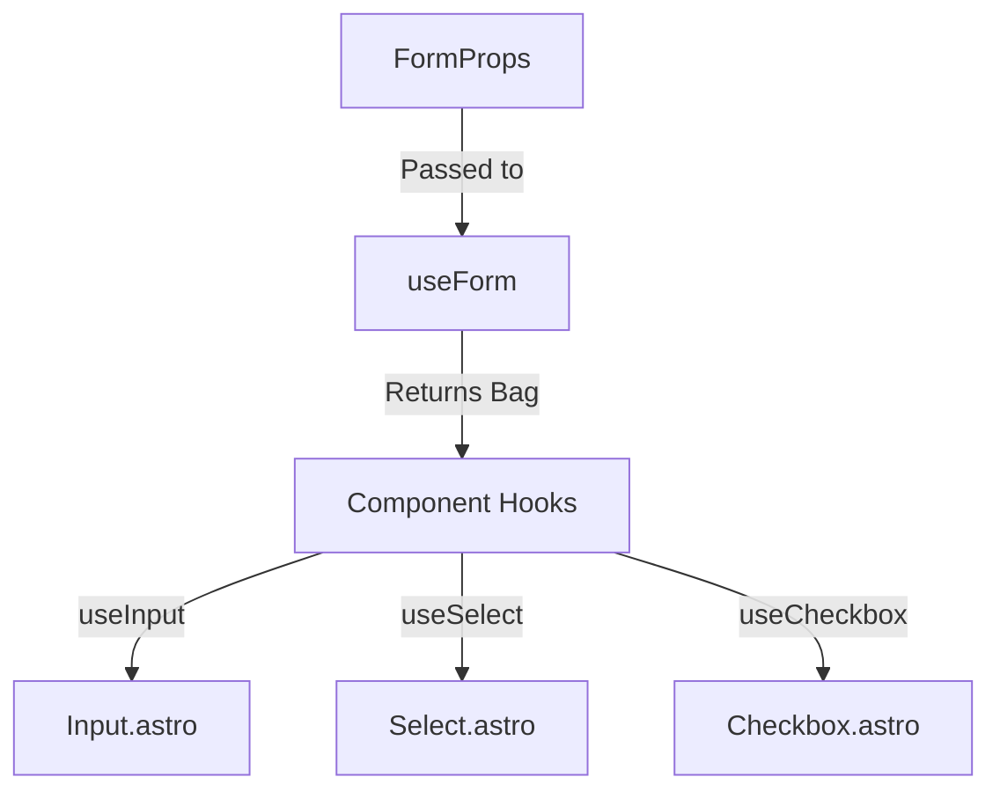

## Overview

The forms component category uses a unified composition model to ensure visual consistency, maintainable CSS, and bulletproof accessibility across all form controls.

This document details the delegation model, prop sharing, and wrapper patterns used to build components like `Input`, `Select`, `Checkbox`, and `Radio`.

---

## 1. The Delegation Model

All form components delegate their category-level prop resolution (size, variant, color, radius) and shared behavior to a single hook: `useForm()`. 

**No component hook calls the token resolver directly.** They all delegate to `useForm`, which acts as the single source of truth for the entire category.



### The "Resolved Bag"

`useForm` does NOT return the final `{ Tag, props }` object that Astro components spread. Instead, it returns a "bag of resolved material":

```ts
{
  formClass: string,           // e.g. "form form--outlined form--primary"
  formStyle: string,           // e.g. "--form--size: …; --form--radius: …"
  formAttrs: Record<…>,        // aria-disabled, aria-invalid, data-*, etc.
  disabled:  boolean,          // passed through for native hook usage
  required:  boolean,          // passed through for native hook usage
  invalid:   boolean,          // passed through for conditional logic
  rest:      Record<…>,        // remaining un-consumed props to forward
}
```

Component hooks compose `formClass` with their own specific classes, spread `formAttrs`, and add native HTML attributes selectively before returning the final `{ Tag, props }`.

---

## 2. Prop Responsibility Split

To keep interfaces clean, props are strictly segregated by their architectural responsibility.

| Category              | Lives in          | Resolved by                       |
|-----------------------|-------------------|-----------------------------------|
| **Token dimensions**  | `FormProps`       | `resolveTokens` via `useForm`     |
| **Shared ARIA**       | `FormProps`       | `useForm` → `formAttrs`           |
| **Values / States**   | component props   | component hook (e.g. `checkState`)|
| **onChange handlers** | component props   | component hook                    |
| **Element-specific**  | component props   | component hook (e.g. `type`)      |

### What is intentionally NOT in FormProps

- `value` — type varies wildly across elements: `string` (Input), `boolean` (Checkbox), `string | string[]` (Select).
- `placeholder` — not valid on Checkbox or Radio.
- `onChange` — event payload varies per element.

---

## 3. Native Attributes vs. ARIA

`useForm` safely emits ARIA and data attributes that are universally applicable to **all** form controls, regardless of their underlying DOM element (e.g. `<input>` vs `<div>` wrapper):

- `aria-disabled="true"` + `data-disabled`
- `aria-required="true"`
- `aria-invalid="true"` + `data-invalid`

However, native HTML attributes like `disabled` and `required` are only strictly valid on elements like `<input>`, `<select>`, and `<textarea>`. For this reason, `useForm` passes `disabled` and `required` booleans back to the component hooks, which are responsible for attaching them to the correct nested native element.

---

## 4. Wrapper Strategy (Slot Composition)

Form elements like `Input` and `Select` often need leading/trailing icons or custom styling that native elements do not support. 

To achieve this, the component root is typically a wrapper element (e.g. a `<div>` or `<label>`), and the native element is visually stripped of borders/backgrounds to appear invisible within the wrapper.

### Input Example
The visual border and background belong to the wrapper `Tag` element. The inner `<input>` is styled to be completely transparent.

```html
<div class="form form--outlined form--md ..."> <!-- Root receives category styles -->
  <div class="input__start"> <!-- Leading slot (e.g. search icon) -->
    <slot name="start" />
  </div>

  <input class="input__control" ... /> <!-- Transparent native input -->

  <div class="input__end"> <!-- Trailing slot (e.g. clear button) -->
    <slot name="end" />
  </div>
</div>
```

---

## 5. Field Coordination Pattern

Complex form layouts require coordination between a label, an input, and validation errors. This is handled by the `Field` component pattern, which connects related elements using `id` and `aria-describedby` automatically.

```astro
<Field id="email" invalid={!isValid}>
  <Label slot="label" for="email" required>Email</Label>
  
  <Input
    id="email"
    name="email"
    type="email"
    invalid={!isValid}
    aria-describedby="email-error"
    fullWidth
  />
  
  <span slot="error" id="email-error">Enter a valid email address.</span>
</Field>
```

By ensuring that `invalid`, `disabled`, and `required` states are exposed cleanly via `FormProps`, wrapper components like `Field` can efficiently coordinate complex visual and accessible states across nested controls.
